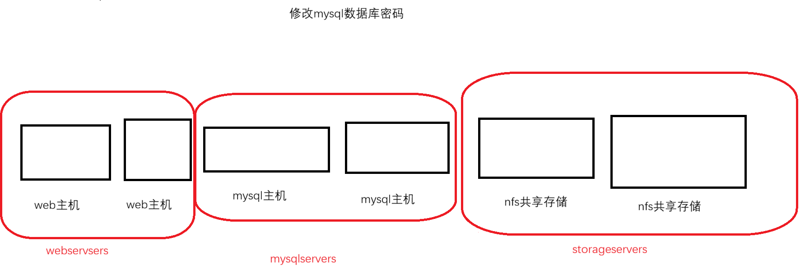

# 1. ansible配置文件
- 配置文件中定义了主机清单位置、角色位置、集合位置、远程连接被控节点执行任务的用户、在被控节点执行任务的时候是否要提权、远程连接被控主机的默认SSH端口
- **配置文件详解** 
	- ```bash
		[root@mubai632 ~]# grep -v ^# /etc/ansible/ansible.cfg  | grep -v ^$
		[defaults]
			inventory : 主机清单位置
			ask_pass : 定义主控连接被控节点的方式, 是基于密码认证还是基于密钥认证, True使用密码登录, False使用密钥登录
			remote_user : 定义连接被控节点的哪个用户. 最终执行任务的用户是谁
			host_key_checking : 是否检查被控节点的主机公钥, 如果是基于密钥认证的话建议关掉
			roles_path : 定义角色的搜索路径
			collection_path : 定义集合的搜索路径(只有ansible-core才会有效果)
		[inventory]
		[privilege_escalation]
			become : 是否提权
			become_method : 提权方式
			become_user : 提权到哪个用户
			become_ask_pass : 提权的时候是否需要验证
		[paramiko_connection]
		[ssh_connection]
		[persistent_connection]
		[accelerate]
		[selinux]
		[colors]
		[diff]
	  ```
- **控制节点的配置文件内容** 
	- ```bash
		[root@mubai632 ~]# cat ansible.cfg
		[defaults]
		inventory      = /etc/ansible/hosts
		ask_pass      = False
		remote_user = user1
		host_key_checking = False
		
		[privilege_escalation]
		become=True
		become_method=sudo
		become_user=root
		become_ask_pass=False
	  ```
- **需要对被控节点进行基本配置** 
	- ```bash
		# 首先创建这个user1用户
		命令 : ansible node1 -m shell -a 'useradd devops' -uroot -k
			-uroot 指定连接被控节点的root身份
			-k 强制使用密码登录
		# 使用源码包安装, 会报错提示需要安装sshpass
		
		# 为创建的用户设置密码
		命令 : ansible node1 -m shell -a 'echo 1 | passwd --stdin user1' -uroot -k
		
		# 为用户设置sudo提权
		命令 : ansible node1 -m shell -a 'echo "user1 ALL=(ALL) NOPASSWD:ALL" >> /etc/sudoers' -uroot -k
		
		# 测试连接
		[root@mubai632 ~]# ansible node1 -m ping
		node1 | SUCCESS => {
		    "ansible_facts": {
		        "discovered_interpreter_python": "/usr/bin/python"
		    },
		    "changed": false,
		    "ping": "pong"
		}
	  ```
# 2. ansible配置文件优先级
- ansible配置文件可以存到不同的地方, 具备优先级的概念
	- 环境变量: ANSIBLE_CONFIG
	- 当前目录下的 ansible.cfg
	- 当前用户家目录下的 ansible.cfg
	- /etc/ansible/ansible.cfg

# 3. 定义主机清单中主机的方式
## 3.1 直接定义主机
- 基于主机名定义, 基于IP地址定义
	- ```bash
		# /etc/ansible/hosts
		node1 
		node2 
		192.168.1.1 
		192.168.1.2
	  ```

## 3.2 定义主机组
- 主机组是多个主机的集合, 在这台主机组上执行任务实际上就相当于在这些主机上执行任务

- ```bash
	[webservers]  # 主机组名
	web1  # 主机
	web2  # 主机
	
	[mysqlservers]  # 主机组名
	mysql1
	mysql2
	
	[nfsservers]  # 主机组名
	nfs1
	nfs2
	
	# 定义主机组和主机的时候, 如果他们同时存在, 一定要保证主机是写主机组的上面的
  ```

## 3.3 定义特殊的主机组(ungroup)
- ungroup 实际上就是不属于任何主机组的主机, 就相当于你**直接定义主机** 
	- ```bash
		[ungroup]  # 特殊主机组
		abc  # 主机
	  ```

## 3.4 批量定义主机
- 批量定义主机组
	- ```bash
		web[1:10].example.com  # 批量定义主机名
		192.168.1.[1:10]  # 批量定义IP地址
	  ```

## 3.5 定义主机组嵌套(重要)
- **特别重要** 定义主机组嵌套
	- ```bash
		[servers:children]  嵌套主机组, 重要的是 :children , 系统才会识别为嵌套主机组
		webservers  # 主机组名
		mysqlservers  # 主机组名
		nfsservers  # 主机组名
	  ```

# 4. 选择主机清单中的主机
- 列出主机清单中的主机
	- ```bash
		命令 : ansible all --list-hosts
	  ```
- 执行任务的时候选择主机清单中的主机
	- ```bash
		命令 : ansible all -m shell -a 'useradd devops'
	  ```
- **选择主机** 
	1. **选择所有的主机** 
		- ```bash
			命令 : ansible all --list-hosts  # all 所有
		  ```
	2. **选择指定主机或者主机组** 
		- ```bash
			命令: 
				ansible 主机名 --list-hosts
				ansible 主机组名 --list-hosts
		  ```
	3. **批量选择主机和主机组** 
		- ```bash
			命令 : 
				ansible 主机名1,主机名2,... --list-hosts
				ansible 主机组名1,主机组名2,... --list-hosts
		  ```
	4. **支持通配符来选择主机** 
		- ```bash
			命令 : 
				ansible '关键字*' --list-hosts
				ansible '关键字1*,关键字2*,...' --list-hosts
		  ```
	5. **择不属于任何主机组的主机** 
		- ```bash
			命令 : ansible ungrouped --list-hosts
		  ```
