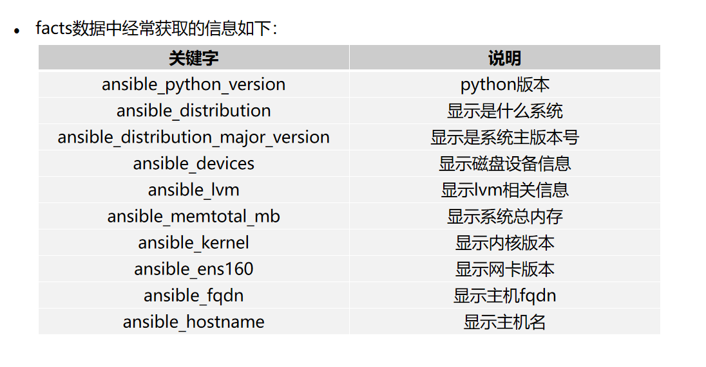
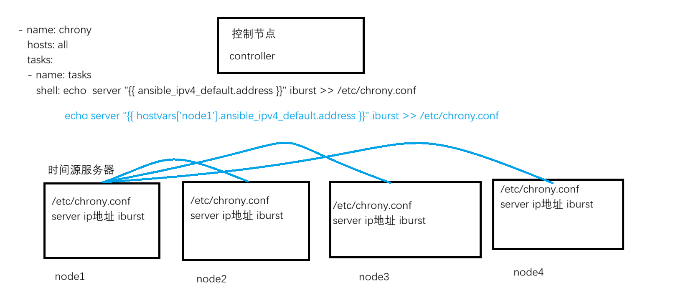

# 1. 定义变量的注意事项
1. **变量名组成是由 数字、下划线、字母组成** 
2. **大小写严格区分** 
3. **变量名必须是字母开头** 
4. **不能以ansible开头作为变量(因为ansible具备内置变量, 内置变量以ansible开头的)** 

# 2. 定义变量和引用变量的方式
## 2.1 测试和引用变量
- 测试变量是否定义成功, 使用 **debug** 模块, 具备两个参数
	- var : 后面直接写变量名. **`var: 变量名`** 
	- msg : 后面写什么, 屏幕就输出什么. **`msg: "{{ 变量名 }}"`** 
	- 这两个参数无法同时使用
- 引用变量使用最多的方式就是: **`"{{ 变量名 }}"`** 

## 2.2 在主机清单中定义变量
- 在主机清单中定义变量
	- 定义主机变量
	- 定义主机组变量
- 一般子啊主机清单中定义变量分两类
	- 用户自定义变量
		- ```bash
			# 定义主机变量, 只有对应的主机才能使用这个变量
			node1 变量名1=变量值 变量名2=变量值 ...
			node2 变量名1=变量值 变量名2=变量值 ...
			
			# 定义主机组变量, 只有对应的主机组才能使用这个变量
			[servers]
			node1
			node2
			[servers:vars]
			变量名1=变量值
			变量名2=变量值
			...
			
			如果主机变量和主机组变量冲突, 则主机变量优先级更高
		  ```
	- ansible 内置变量
		- ```bash
			一般都是ansible_开头的变量, 这些变量是ansible自带的, 他们的作用和ansible.cfg配置文件中的配置参数作用一样
			#关于连接的内置变量
			ansible_host     #用于指定被管理的主机的真实IP
			ansible_port     #用于指定连接到被管理主机的ssh端口号，默认是22
			ansible_user     #ssh连接时默认使用的用户名
			
			# 特权升级
			ansible_become           #相当于ansible_sudo或者ansible_su，允许强制特权升级
			ansible_become_user   #通过特权升级到的用户，相当于ansible_sudo_user或者ansible_su_user
			ansible_become_pass  # 提升特权时，如果需要密码的话，可以通过该变量指定，相当于ansible_sudo_pass或者ansible_su_pass
			ansible_sudo_exec        #如果sudo命令不在默认路径，需要指定sudo命令路径
			
			# 特定ssh连接
			ansible_connection      #SSH连接的类型：local, ssh, paramiko，默认是ssh
			ansible_ssh_pass          #ssh连接时的密码
			ansible_ssh_private_key_file     #秘钥文件路径，如果不想使用ssh-agent管理秘钥文件时可以使用此选项
			ansible_ssh_executable            #如果ssh指令不在默认路径当中，可以使用该变量来定义其路径
		  ```

## 2.3 在 playbook 中定义变量
### 2.3.1 通过 vars 关键字定义变量
- **简单的定义变量** 
	- ```bash
		- name: var
		  hosts: all
		  vars:
		    os1: rhel1
		    os2: rhel2
		    os3: rhel3
		  tasks:
		  - name: use var
		    debug:
		      msg: "{{ os1 }} {{ os2 }} {{ os3 }}"
	  ```
- **定义变量的嵌套, 引用使用`变量名.变量名`** 
	- ```bash
		- name: var
		  hosts: all
		  vars:
		    os1: rhel1
		    os2: rhel2
		    os3: rhel3
		    users:
		      username: memeda001
		      uid: 3000
		      home: /home/memeda001
		      shell: /bin/bash
		  tasks:
		  - name: create user
		    user:
		      name: "{{ users.username }}"
		      uid: "{{ users.uid }}"
		      home: "{{ users.home }}"
		      shell: "{{ users.shell }}"
		      state: present
	  ```
- **play之间定义的变量是不能够通用的** 

### 2.3.2 通过 vars_files 关键字引用外部变量文件
- 引用外部变量文件
	- ```bash
		- name: var
		  hosts: all
		  vars_files:
		  - vars.yaml
		  - vars1.yaml
		  tasks:
		  - name: create user
		    debug:
		      msg: "{{ os1 }}"
		
		
		- name: var2
		  hosts: all
		  tasks:
		  - name: use var
		    debug:
		      msg: "{{ os1 }}"
		      
		# 不需要-，但是不加-的话，只能去引用一个外部变量文件，但是一个playbook的项目，有多个外部变量文件都得引用，那么最好在每个变量文件的前面加上一个-
	  ```

## 2.4 通过命令行来定义变量
- 无论是ansible命令, 还是ansible-playbook命令都可以通过一个 **`-e`** 选项来定义变量
- **通过选项定义的变量是所有变量中优先级最高的** 
	- ```bash
		[root@mubai632 ansible]# ansible all -m debug -a 'msg="{{ os1 }}"'  -e os1=nihao
		[root@mubai632 ansible]# ansible-playbook var1.yaml -e os1=abcd
	  ```

## 2.5 ~~通过hosts_vars和groups_vars目录定义变量 ~~  
- hosts_vars 目录 
- hosts_vars 目录
- 这俩个目录下你创建的文件就是主机或者主机组的名字, 这些文件中定义的变量就是给对应主机或者主机组使用的 
	- 比如 host_vars目录下存在一个叫做node1文件, 你在node1文件中定义的变量最终是给到node1主机使用
	- 比如groups_vars目录下存在一个叫做servers文件, 你在servers文件定义的变量最终是给到servers主机组使用
- 目录要存放到和ansible.cfg配置文件同一个地方
	- 比如/etc/ansible/ansible.cfg, 那么目录就要存储到/etc/ansible 
- ```bash
	/etc/ansible/host_vars:
	total 8
	-rw-r--r--. 1 root root  9 Apr 19 11:47 node1
	-rw-r--r--. 1 root root 10 Apr 19 11:47 node2
	
	[root@adsl-172-10-0-153 host_vars]# cat /etc/ansible/host_vars/node1
	var1: os
	[root@adsl-172-10-0-153 host_vars]# cat /etc/ansible/host_vars/node2
	var1: aaa
  ```

## 2.6 通过 register 关键字注册变量(重要)
- 这个通常是在playbook中使用的, **和模块的层级关系是一样的** 
- register关键字可以将一个task任务的执行结果保存为一个变量—>它都是配合后面的条件判断语句来执行task任务的
- 比如register关键字将前面的一个task任务执行结果保存为变量, 然后后面的task任务如果要执行的话则判断注册变量的rc返回值是不是0
- ```bash
	- name: var
	  hosts: all
	  vars_files:
	  - vars.yaml
	  tasks:
	  - name: install nginx pkg
	    shell: cat /etc/passwd
	    register: user_status
	
	  - name: shuchu 
	    debug:
	      msg: "{{ user_status }}"
  ```
- 通过register配合判断语句实现一个条件判断
	- 当/opt/passwd文件存在的时候，才会输出ok
		- ```bash
			- name: var
			  hosts: all
			  tasks:
			  - name: use shell module
			    shell: ls /opt/passwd
			    register: status
			    ignore_errors: yes
			
			  - name: shuchu 
			    debug:
			      msg: ok
			    when: status.rc == 0
		  ```

# 3. fact 事实变量
- 所谓的fact实时变量, 其实就是收集了被控节点的主机信息, 将其保存到一个叫做ansible_fats变量中, 这个变量我们称之为fact事实变量
- 默认情况下, 只要执行了playbook, 那么play中会存在一个隐藏的任务 \[gathering facts\], 专门去获取节点的主机信息, play在哪些主机上运行, 则获取哪些主机的信息
- ```bash
		# plays will gather facts by default, which contain information about
	# the remote system.
	#
	# smart - gather by default, but don't regather if already gathered
	# implicit - gather by default, turn off with gather_facts: False
	# explicit - do not gather by default, must say gather_facts: True
	gathering = implicit
	
	# This only affects the gathering done by a play's gather_facts directive,
	# by default gathering retrieves all facts subsets
	# all - gather all subsets
	# network - gather min and network facts
	# hardware - gather hardware facts (longest facts to retrieve)
	# virtual - gather min and virtual facts
	# facter - import facts from facter
	# ohai - import facts from ohai
	# You can combine them using comma (ex: network,virtual)
	# You can negate them using ! (ex: !hardware,!facter,!ohai)
	# A minimal set of facts is always gathered.
	gather_subset = all
  ```
	- 这一段定义了fact事实变量的相关信息, 之所以默认就收集是这里来的

- **fact事实变量通常都是配合条件判断使用的** 
- 收集被控节点主机信息, 可以使用 steup 模块, 将信息保存到 ansible_facts 
	- ```bash
		ansible 主机名 -m setup > 文件
		将主机的所有信息保存到文件中, 可以直接去文件中过滤想要的关键字就可以了
	  ```

- 关闭和开启fact变量收集
	- ```bash
		- name: var
		  hosts: all
		  gather_facts: False  # 关闭gather_facts变量收集
		  tasks:
		  - name: debug
		    debug:
		      msg: "{{ ansible_default_ipv4.interface }} {{ ansible_default_ipv4.address }}"
		      
		# 关闭gather_facts变量收集, 但是还是可以在任务中创建任务
		- name: var
		  hosts: all
		  gather_facts: False
		  tasks:
		  - name: setup
		    setup:
		  - name: debug
		    debug:
		      msg: "{{ ansible_default_ipv4.interface }} {{ ansible_default_ipv4.address }}"
	  ```

## 3.1 set_fact模块整合新的变量
- ```bash
	- name: var
	  hosts: all
	  tasks:
	  - name: setfact
	    set_fact:
	      os_version: "{{ ansible_distribution }} {{ ansible_distribution_major_version }}"
	  - name: use debug
	    debug:
	      msg: "{{ os_version }}"
	      
	也可以通过 vars 定义变量
	- name: var
	  hosts: all
	  vars:
	    os_version: "{{ ansible_distribution }} {{ ansible_distribution_major_version }}"
	  tasks:
	  - name: use debug
	    debug:
	      msg: "{{ os_version }}"
  ```

## 3.2 lookup插件, 从外部数据源读取内容作为变量的值
- lookup插件下面存在很多的方法, 这些方式支持通过不同的方式来读取内容作为变量的值, **lookup插件所有的方法全部都是读取的控制节点的信息** 
	- **env 方法 : 读取控制节点上环境变量的值作为变量的值** 
	- **file 方法 : 读取控制节点上文件的内容作为变量的值** 
	- **pipe 方法 : 读取控制节点上命令的执行结果作为变量的值** 
	- ```bash
		变量名: "{{ lookup('方法'),'方法的值' }}"
		env方法: 
		  变量名: "{{ lookup('env'),'PWD' }}"
		file方法: 
		  变量名: "{{ lookup('file'),'/etc/passwd' }}"
		pipe方法: 
		  变量名: "{{ lookup('pipe'),'echo huawei' }}"
	  ```

## 3.3 自定义fact事实变量(了解)
- 自定义的fact事实变量, 最终会保存到ansible_facts.ansible_local中
- 自定义fact事实变量, 是在被控节点上定义的, 不是在控制节点上定义的
- 被控节点会在/etc/ansible/facts.d目录下, 去找以.fact结尾的文件
- 这个文件就是变量文件, 自定义fact变量就是写到这个文件中的, 采用的定义的格式是ini格式
	- ```bash
		[root@mubai632 ansible]# cat node1.fact 
		[node1_var]
		pkg=nginx
		
		[root@mubai632 ansible]# cat node2.fact 
		[node2_var]
		pkg=httpd
		
		[root@mubai632 ansible]# ansible all -m shell -a 'mkdir /etc/ansible/facts.d -p'

		[root@mubai632 ansible]# ansible node1 -m copy -a 'src=node1.fact dest=/etc/ansible/facts.d'
		
		[root@mubai632 ansible]# ansible node2 -m copy -a 'src=node2.fact dest=/etc/ansible/facts.d'
	  ```

# 4. magic 魔法变量 
- 魔法变量是属于特殊的内置变量, 这类内置变量具备特殊的含义
	- 内置变量一般都是和配置文件的配置参数相关的
	- 魔法变量最终是在 playbook 引用的, 具备一些特殊的意义
		- groups 魔法变量的值所有的主机组
		- hostvars 魔法变量
		- group_names 魔法变量
- 常见的魔法变量
	- **hostvars : 获取指定主机的 fact 事实变量**  
		- ```bash
			"{{ hostvars['node1'].ansible_default_ipv4.address }}"
			"{{ hostvars['主机清单中的主机IP或者主机名'].fact事实变量 }}"
		  ```
		
	- **inventory_hostname : 表示执行任务的主机的主机名** 
		- inventory_hostname 魔法变量, 看的是主机清单中的主机名
		- ansible_hostname fact事实变量, 看的被控本身的主机名
		- 配合判断语句来使用: 当主机的主机名是node1的时候, 才会执行这个task任务
			- ```bash
				- name: var
				  hosts: all
				  tasks:
				  - name: use debug
				    debug:
				      msg: ok
				    when: inventory_hostname == 'node1'
			  ```
	- groups : 表示主机清单中所有的主机组 
		- ```bash
			ok: [node1] => {
			    "msg": {
			        "all": [
			            "node1",
			            "node2"
			        ],
			        "servers": [
			            "node1",
			            "node2"
			        ],
			        "ungrouped": []
			    }
			}
			ok: [node2] => {
			    "msg": {
			        "all": [
			            "node1",
			            "node2"
			        ],
			        "servers": [
			            "node1",
			            "node2"
			        ],
			        "ungrouped": []
			    }
			}
		  ```
	- **group_names : 表示运行任务的主机所在的主机组** 
		- ```bash
			- name: var
			  hosts: all
			  tasks:
		      - name: write devlopment to dev
				copy:
				  content: "Devlopment\n"
				  dest: /etc/issue
				when: "'dev' in group_names"
		  ```