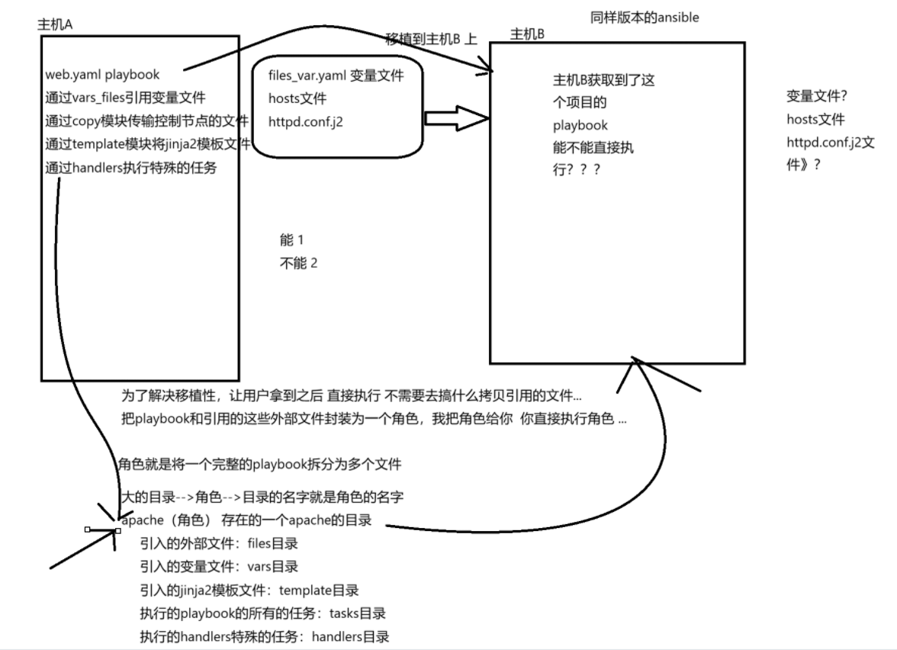
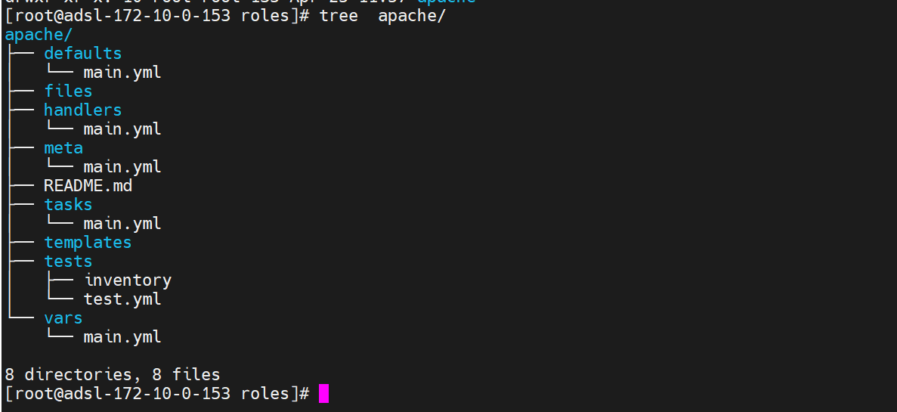

# role 角色
- **roles 角色就是将一个完整的项目的playbook进行的拆分** 
	- 将定义变量的部分拆分出来的一个文件
	- 将执行 task 任务的部分拆分出来为一个文件
	- 将 handlers 特殊任务的部分拆分出来为一个文件
	- 将拷贝到其他节点的引用的这些文件拆分出来保存到一个目录下
	- 将引用的 jinja2 模板文件拆分出来保存到一个目录
- 以上这些文件和这些目录都会存储到一个大的目录下, 这个大的目录的名字就是角色的名字 
- roles 的作用就是为了移植 playbook 


- **vars目录下面存在一个main.yml文件** : 这个文件就是定义变量的, 相当于在playbook中通过vars关键字定义的变量
- **templates** : 目录下应该存放的是要拷贝到被控节点的jinja2模板文件
- **tasks目录下存在一个main.yml文件** : 这个文件中定义的就是playbook中要执行的所有的task任务
- **meta目录下存在一个main.yml** : 这个文件定义角色基本信息
- **handlers目录下存在一个main.yml** : 这个文件定义了handlers触发的特殊任务
- **files目录** : 保存的是拷贝到被控节点的文件, 比如copy模块引用的文件要拷贝走
- **defaults目录下存在一个main.yml文件** : 这个文件作用和vars目录下的文件一样的都是定义变量的, 但是这里定义的变量优先级比vars目录下定义的变量优先级要低

- **设置角色** 
	- 修改 ansible.cfg 配置文件, 定义roles 角色的搜索目录
		- ```bash
			[root@mubai632 roles]# grep roles_path /etc/ansible/ansible.cfg
			roles_path=/etc/ansible/roles
		  ```
	- 初始化角色的目录结构
		- ```bash
			[root@mubai632 roles]# pwd
			/etc/ansible/roles
			[root@mubai632 roles]# ansible-galaxy role init apache
			- Role apache was created successfully
			[root@mubai632 roles]# ll
			total 0
			drwxr-xr-x. 10 root root 135 Apr 25 14:07 apache
		  ```
	- 进入角色的目录下, 将 playbook 中的内容拆分到角色下的不同目录中
		- ```bash
			#将jinja2模板文件放到template目录下
			[root@mubai632 roles]# cp /etc/ansible/index.html.j2 /etc/ansible/roles/apache/templates/
			
			#拆分task任务
			[root@mubai632 roles]# vim /etc/ansible/roles/apache/tasks/main.yml
			
			#拆分handlers任务
			[root@mubai632 roles]# vim /etc/ansible/roles/apache/handlers/main.yml
		  ```
- **执行角色** 
	- ```yaml
			# 编写一个playbook来调用角色
			- name: use apache roles
			  hosts: all
			  roles:
			  - apache  # 角色名, 就是目录文件的名
			    
			# 这里的apache角色, 将会去/etc/ansible/roles目录下查找, 因为ansible配置文件中你定义了角色的搜索路径
	  ```
- **管理角色**  
	- ```markdown
		#初始化角色目录结构
		ansible-galaxy role init 角色名
		
		#列出角色
		ansible-galaxy role list
		
		#搜索角色
		ansible-galaxy search
		
		#安装角色
		ansible-galaxy role install  角色名
		ansible-galaxy role install  url地址
		
		#删除角色
		ansible-galaxy role remove 
		或者直接rm -rf 删除目录
	  ```