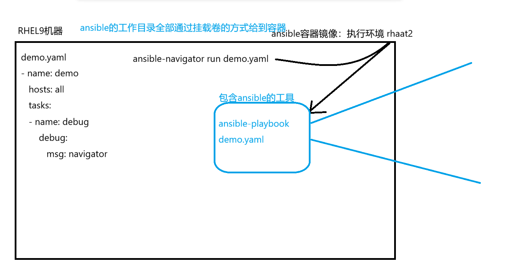
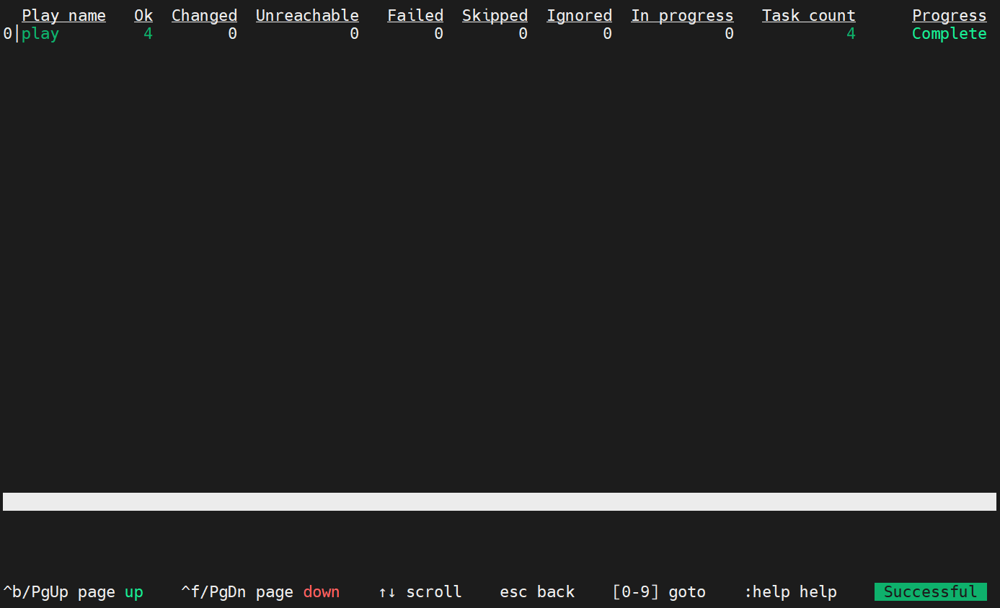

- 所谓的ansible导航器, 其实就是在容器中运行ansible 
- **当你编写了一个playbook, 你不再是通过ansible-playbook去执行了, 而是通过ansible-navigator命令去执行playbook** 
- 当你运行的时候, 系统会基于一个ansible的容器镜像临时运行一个容器, 然后把playbook放到了容器中去执行

- 采用导航器的好处 : 只需要在宿主机上配置ansible-navigator工具即可
- 通过导航器运行的ansible, 可以选择不同的执行环境, 那么就可以选择不同的ansible版本
- **查看导航器的镜像文件** 
	- ```bash
		[root@mubai632 ~]# ansible-navigator images
		--------------------------------------------------------------------------------------------------------------
		Execution environment image and pull policy overview
		--------------------------------------------------------------------------------------------------------------
		Execution environment image name:     registry.redhat.io/ansible-automation-platform-22/ee-supported-rhel8:latest
		Execution environment image tag:      latest
		Execution environment pull arguments: None
		Execution environment pull policy:    tag
		Execution environment pull needed:    True
		--------------------------------------------------------------------------------------------------------------
		Updating the execution environment
		--------------------------------------------------------------------------------------------------------------
		Running the command: podman pull registry.redhat.io/ansible-automation-platform-22/ee-supported-rhel8:latest
		Trying to pull registry.redhat.io/ansible-automation-platform-22/ee-supported-rhel8:latest...
		Error: initializing source docker://registry.redhat.io/ansible-automation-platform-22/ee-supported-rhel8:latest: unable to retrieve auth token: invalid username/password: unauthorized: Please login to the Red Hat Registry using your Customer Portal credentials. Further instructions can be found here: https://access.redhat.com/RegistryAuthentication
		  Error: Execution environment pull failed
		   Hint: Check the execution environment image name, connectivity to and
		         permissions for the registry, and try again
	  ```
- **执行的导航器的每一个命令都是在容器中运行的, 默认情况下它会去红帽的镜像仓库拉取镜像, 而且默认的拉取策略是永远从网络上拉取** 

- 导航器的执行方式
	- **交互式执行** 
		
	- **非交互式执行 `stdout` : 输出的结果和ansible-playbook一样 **
		- ```bash
			ansible-navigator run .yaml文件 --pp missing -m stdout
				--pp 指定拉取方式, missing本地存在则本地拉取, 不存在则网络拉取
				-m 指定交互模式, stdout 非交互式执行
		  ```
- 注意: 
	- 管理 role 和 collection 集合通过 ansible-galaxy 进行管理
	- 只有 playbook 的管理才使用导航器
- **导航器的命令** 
	- ```bash
		#运行playbook
		ansible-navigator run .yaml文件 --pp missing -m stdout
			--pp 指定拉取方式, missing本地存在则本地拉取, 不存在则网络拉取
			-m 指定交互模式, stdout 非交互式执行
	  ```
- **重点 : 执行导航器命令的时候, 一定要保证当前目录下有ansible.cfg, 因为导航器执行的时候只能读取到当前目录下的ansible.cfg配置文件, 一旦切换到了其他的工作目录, 那么导航器就无法读到ansible.cfg配置文件, 那么在配置文件中定义了所有的东西导航器中都无法识别** 
- 使用导航器命令, 每一次执行都会在**当前目录下生成一个json的文件**, 这个文件其实就是执行的反馈信息文件, 但是如果直接通过cat等工具去看的话有一些不是很清楚, 那么这个时候就可以使用 **replay** 重播这个文件
- 设置导航器拉取的方式
	- ```bash
		让导航器永远都是missing的拉取策略
		将导航器的配置文件放到用户家目录下的.ansible-navigator.yml中
		# 生成配置文件, 将内容拷贝到用户家目录下的.ansible-navigator.yml中
		[root@adsl-172-10-0-153 ansible]# ansible-navigator settings --effective  --pp missing
		---
		ansible-navigator:
		  ansible:
		    config:
		      help: false
		    doc:
		      help: false
		      plugin:
		        type: module
		    inventory:
		      entries:
		      - /etc/ansible/hosts
		      help: false
		    playbook:
		      help: false
		  ansible-builder:
		    help: false
		    workdir: /etc/ansible
		  app: settings
		  collection-doc-cache-path: /root/.cache/ansible-navigator/collection_doc_cache.db
		  color:
		    enable: true
		    osc4: true
		  editor:
		    command: vi +{line_number} {filename}
		    console: true
		  exec:
		    command: /bin/bash
		    shell: true
		  execution-environment:
		    container-engine: podman
		    enabled: true
		    image: registry.redhat.io/ansible-automation-platform-22/ee-supported-rhel8:latest
		    pull:
		      policy: missing
		  images:
		    details:
		    - everything
		  logging:
		    append: true
		    file: /etc/ansible/ansible-navigator.log
		    level: warning
		  mode: stdout
		  playbook-artifact:
		    enable: true
		    save-as: '{playbook_dir}/{playbook_name}-artifact-{time_stamp}.json'
		  settings:
		    effective: true
		    sample: false
		    schema: json
		    sources: false
		  time-zone: UTC
	  ```
考试的时候, 所有的题目都要使用导航器来执行一遍, 不然可能会扣分