# 1. IP地址
- IP地址分类: IPV4地址 和 IPV6地址
- IP地址作用: 标识主机网卡在互联网上的位置, **计算机之间通信是通过IP地址找到对方的**
- IP地址还分为: 私网地址 和 公网地址
	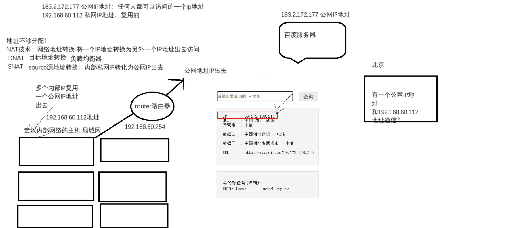

# 2. 子网掩码
- 每一个IP地址组成, 你都会看到后边有一个子网掩码
- 子网掩码也是一个32位的二进制, 当然也可以转换为十进制表示
- 一般有两种表达方式
	- xxx.xxx.xxx.xxx
	- /24
- 子网掩码的作用: 划分主机位和网络位, **就是判断你的ip地址是否在同一个网段中, 这个网段可以划分多少个IP地址**
	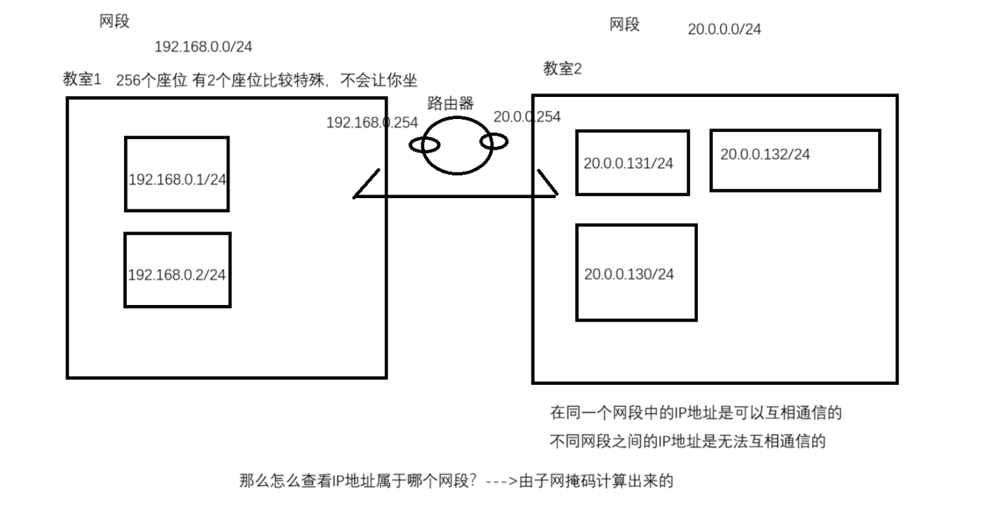
- 计算IP地址所在网段
	1. 将ip地址转化为二进制
	2. 将子网掩码转化为二进制
	3. 两个二进制做**位与**计算(0与1=0, 1与1=1, 0与0=0), 最终得到32为二进制, 然后将其转化为十进制, 就是你的ip地址所在的网段
	- 简单的计算方式: 
		- **块大小 = 256 - 子网掩码**: 得出的数就是每一个网段的大小, 比如256-192=64, 0-63,64-127,128-191,192-255
		- 看IP在哪个范围内: 比如130 ∈ 128 - 191
		- 就可以得出网络位和主机位
- 计算可用IP地址数
	- **32 - 掩码 = 主机位数**
	- **可用主机数 = 2^(主机位数) - 2**

# 3. 网关地址
- 如果不同网段的地址要想通信, 中间会走一个路由器, 一般情况下, 路由器上面的接口就是网关地址
- 网关的作用就是让**不同网段之间的IP地址进行通信的**
	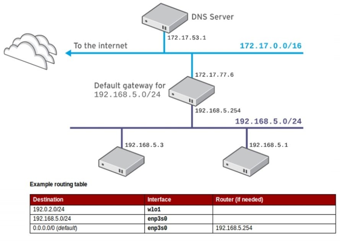

# 4. DNS地址
- 计算机和计算机之间通信是通过IP地址访问的
- 打开浏览器, 访问www.baidu.com , 网址一定对应一个或者一组服务器, 你才能通过浏览器看到网页
- 这是因为DNS做了域名解析: DNS Domain Name System 域名解析系统, 作用就是**将域名/主机名解析为IP地址**
	- 正向解析: **主机名/域名**解析为**IP地址**
	- 反向解析: **IP地址**解析为**主机名/域名**

# 5. 网卡设备命令
- 网卡的命名规则
	- 传统方式命名: ethx
	- 基于设备特性的命名
- lo 网卡属于是本地回环网卡
	- 网卡的IP地址永远都是127.0.0.1, 只有本机能访问, 其他设备无法访问
- virtbr0 虚拟网卡设备
	- 这个网卡设备, 是给KVM虚拟机使用的, KVM虚拟机默认就是NAT模式, 这个网卡也是NAT模式, 专门让Linux系统和NAT模式的KVM虚拟机进行通信的
## 5.1 ethx 传统方式设备命名
- ethx : 其中的 x 是根据系统开机的时候, 加载到设备顺序进行命名的
	- 重启可能会导致IP地址改变, 因为最先加载的设备不是原来的设备
## 5.2 基于设备特性的命名
- 基于设备特性进行命名. 如ens160
- 接口类型
	- **en** : 表示以太网设备
	- **wl** : 表示无线局域网设备
	- **ww** : 表示无线广域网设备
- 固件类型
	- **s** : 表示热插拔
	- **o** : 表示板载设备
	- **p** : 表示pci设备
- **数字N** : 表示**随机端口**(160)

# 6. 修改系统网卡设备名称为传统方式命令
- 9之前版本的做法
	- 修改内核参数, 在开机的时候读取到两个内核参数: biosdevname=0/net.ifnames=0
		- ```bash
			1.打开/etc/default/grub文件
				vim /etc/default/grub
			2.找到LINUX这一行，在末尾处添加俩个内核参数 biosdevname=0 net.ifnames=0
				GRUB_CMDLINE_LINUX="crashkernel=1G-4G:192M,4G-64G:256M,64G-:512M resume=UUID=5f9b2cfb-db3b-4a55-a1f7-ea1ba2d9c292 rhgb quiet biosdevname=0 net.ifnames=0"
			3.重新生成/boot/grub2/grub.cfg配置文件
				grub2-mkconfig -o /boot/grub2/grub.cfg
					Generating grub configuration file ... 
					Adding boot menu entry for UEFI Firmware Settings ... 
					done
				#grub2-mkconfig命令读取/etc/default/grub文件, -o指定生成文件/boot/grub2/grub.cfg
			4.reboot重启系统
			#重启系统后按1就会出现下图内容, 倒数第二行出现添加的内容
		  ```

		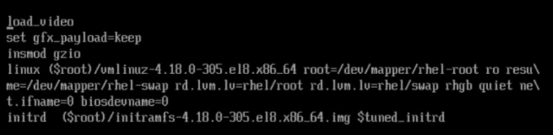

- 9版本的做法
	- ```bash
		1.修改/boot/loader/entries目录下正常内核的.conf配置文件
			vim /boot/loader/entries/7fdfb57739a745c8bfc0d28c9ace7cc3-5.14.0-362.8.1.el9_3.x86_64.conf
		2.在option关键字这一行的最后添加net.ifnames=0 biosdevname=0
			options root=UUID=ef14293b-72e1-4e30-befe-a4a63267dc0f ro crashkernel=1G-4G:192M,4G-64G:256M,64G-:512M resume=UUID=5f9b2cfb-db3b-4a55-a1f7-ea1ba2d9c292 rhgb quiet biosdevname=0 net.ifnames=0
		3.reboot重启系统
	  ```

# 7. 网络相关管理工具
## 7.1 查看网络信息
- 查看网络信息
	- 查看IP地址, 查看子网掩码, 查看MAC地址
		-  ```bash
			[root@mubai632 ~]# ifconfig
			ens160: flags=4163<UP,BROADCAST,RUNNING,MULTICAST>  mtu 1500
			    inet6 fe80::20c:29ff:fe97:6e63  prefixlen 64  scopeid 0x20<link>
		        ether 00:0c:29:97:6e:63  txqueuelen 1000  (Ethernet)
		        RX packets 6342  bytes 487135 (475.7 KiB)
		        RX errors 0  dropped 0  overruns 0  frame 0
		        TX packets 1924  bytes 203499 (198.7 KiB)
		        TX errors 0  dropped 0 overruns 0  carrier 0  collisions 0
		        
			lo: flags=73<UP,LOOPBACK,RUNNING>  mtu 65536
		        inet 127.0.0.1  netmask 255.0.0.0
		        inet6 ::1  prefixlen 128  scopeid 0x10<host>
		        loop  txqueuelen 1000  (Local Loopback)
		        RX packets 28  bytes 3561 (3.4 KiB)
		        RX errors 0  dropped 0  overruns 0  frame 0
	        TX packets 28  bytes 3561 (3.4 KiB)
	        TX errors 0  dropped 0 overruns 0  carrier 0  collisions 0
	        
	        
	        # ether 00:0c:29:97:6e:63 : MAC地址
	        # RX packets 6342  bytes 487135 (475.7 KiB) : 收到多少数据包
	        # TX packets 1924  bytes 203499 (198.7 KiB) : 发送多少数据包
	        # 看网卡状态是不是激活就看是不是RUNNING状态
	        # 当使用 ifconfig 网卡名称 down 这个命令是禁用网卡, 使用 ifconfig 无法查看到网卡信息
	        # 禁用网卡, 只能通过 ifconfig -a 才能看到相应的网卡, 就能看到网卡信息中无RUNNING状态
	        
	        
	        [root@mubai632 ~]# ip a (ip addr show)
			1: lo: <LOOPBACK,UP,LOWER_UP> mtu 65536 qdisc noqueue state UNKNOWN group default qlen 1000
			    link/loopback 00:00:00:00:00:00 brd 00:00:00:00:00:00
			    inet 127.0.0.1/8 scope host lo
				    valid_lft forever preferred_lft forever
			    inet6 ::1/128 scope host
				    valid_lft forever preferred_lft forever
			2: ens160: <BROADCAST,MULTICAST,UP,LOWER_UP> mtu 1500 qdisc mq state UP group default qlen 1000
			    link/ether 00:0c:29:97:6e:63 brd ff:ff:ff:ff:ff:ff
			    altname enp3s0
			    inet 192.168.23.128/24 brd 192.168.23.255 scope global dynamic noprefixroute ens160
			       valid_lft 1182sec preferred_lft 1182sec
			    inet6 fe80::20c:29ff:fe97:6e63/64 scope link noprefixroute
			       valid_lft forever preferred_lft forever
		  ```
		- 当克隆虚拟机的时候会出现网卡以及MAC地址完全一样的情况, 需要对克隆的虚拟机更改MAC地址
		- ```markdown
			# 自己做虚拟机的时候, 需要注意以下几点
			1. 清理虚拟机的machine-id 机器ID
			2. 清理虚拟机的网卡配置文件, 将UUID个性化信息全部删除
			3. 清理虚拟机的ssh公钥
			4. 重新生成MAC地址
		  ```
	- 查看dns地址
		- ```bash
			[root@mubai632 ~]# cat /etc/resolv.conf
			# Generated by NetworkManager  # 通过NetworkManager生成, 修改这个文件仅是临时生效
			search localdomain  # search 搜索域
			nameserver 192.168.23.2
		  ```
	- 查看网关地址
		- ```bash
			[root@mubai632 ~]# route -n
			Kernel IP routing table
			Destination     Gateway         Genmask         Flags Metric Ref    Use Iface
			0.0.0.0         192.168.23.2    0.0.0.0         UG    100    0        0 ens160
			192.168.23.0    0.0.0.0         255.255.255.0   U     100    0        0 ens160
			
			[root@mubai632 ~]# ip route (常用)
			default via 192.168.23.2 dev ens160 proto dhcp src 192.168.23.128 metric 100
			192.168.23.0/24 dev ens160 proto kernel scope link src 192.168.23.128 metric 100
		  ```

## 7.2 配置网络
- linux 上的管理网络的服务: 
	- network: 7版本以及之前版本使用的网络服务, 每一次修改网络配置之后, 都需要重启network服务, 配置才会生效 (systemctl restart network)
	- NetworkManager: 从8版本开始, 默认使用此服务, 而且8版本里面没有带network软件包
- **配置网络的工具: ifconfig / ip / nmtui / nmcli**
	- nmtui / nmcli是NetworkManager网络服务提供的, 当你的网络服务可以使用NetworkManager的时候, 就可以使用这俩工具来配置网络

### 7.2.1 ifconfig-配置网络地址
- 管理网卡设备的IP地址
	- ```bash
		ifconfig 网卡名称 IP地址/子网掩码
		#设置网卡的IP地址, 临时生效
	  ```
- 管理网卡设备(**激活/禁用/查看**)
	- ```bash
		ifconfig : 查看所有已经激活的设备
		ifconfig -a : 查看所有网卡设备
		ifconfig 设备名称 : 查看指定的网卡设备
		
		ifconfig 设备名称 down/up : 禁用/激活网卡
	  ```

### 7.2.2 ip-配置网络地址
- 管理网卡设备的IP地址
	- ```bash
		ip addr add ip地址/掩码 dev 设备名称 # 新增IP地址
		ip addr del IP地址/掩码 dev 设备名称 # 删除IP地址
	  ```
- 管理网卡设备(**激活/禁用/查看**)
	- ```bash
		ip addr show # 查看地址
		ip link set 网卡名称 dwon/up # 禁用/激活网卡
	  ```

### 7.2.3 dns 地址配置(临时生效)
- 配置dns地址
	- ```bash
		[root@mubai632 ~]# vim /etc/resolv.conf
		# Generated by NetworkManager
		search localdomain
		nameserver 192.168.23.2
		nameserver xxx.xxx.xxx.xxx ......
	  ```

### 7.2.4 路由添加/删除
- 默认路由(默认网关)
- 主机路由: 前往一个指定的主机IP, 通过哪个网关地址出去
- 子网路由(网段路由): 前往一个指定的网段, 通过哪个网关地址出去
- 注意
	- **你设置的网关地址, 你当前系统必须要和这个网关地址通信, 所以不可以设置一个不存在的无法通信的网关地址**
	- **一个系统上不要设置多个默认路由, 保持一个默认路由即可**
- route 管理路由
	- ```bash
		# 默认路由
		route add 目的地(default) dev 网卡设备名称 gw 网关地址 #新增
		route del 目的地(default) dev 网卡设备名称 gw 网关地址 #删除
			
		# 主机路由
		route add -host 主机IP地址 dev 网卡设备名称 gw 网关地址 # 新增
		route del -host 主机IP地址 dev 网卡设备名称 gw 网关地址 # 删除
		
		# 子网路由
		route add -net 网段/掩码 dev 网卡设备名称 gw 网关地址 # 新增
		route del -net 网段/掩码 dev 网卡设备名称 gw 网关地址 # 删除
	  ```
- ip route 管理路由
	- ```bash
		ip route add/del default dev 网卡设备名称 via 网关地址 
		ip route add/del 主机IP地址 dev 网卡设备名称 via 网关地址 
		ip route add/del 网段/掩码 dev 网卡设备名称 via 网关地址
	  ```

### 7.2.5 nmtui/nmcil-配置网络地址(永久生效)
- 一定要写到配置文件中, 才可以实现永久生效
- 而nmtui/nmcli, 其实就是通过它的语法, 直接修改的底层的网卡配置文件
- nmtui是一个伪图形化的网络管理工具，不依赖桌面图形化
	

	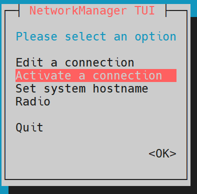
	
	- connection: 连接-->网卡设备对应的配置文件
		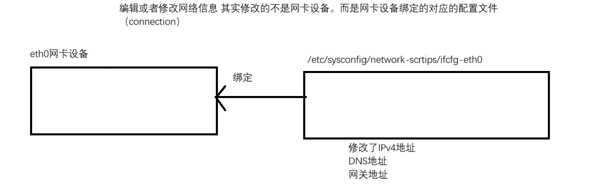
- **重点掌握nmcli工具都使用, ip地址/dns地址/网关地址, 还有什么网络bond、网桥等都可以通过nmcli实现**
- **nmcli工具** 
	- 管理 device 设备: 禁用/激活/查看设备信息
		- ```bash
			#查看网卡状态
			[root@mubai632 ~]# nmcli device status
			DEVICE  TYPE      STATE                   CONNECTION
			ens160  ethernet  connected               ens160
			lo      loopback  connected (externally)  lo
			
			#设置网卡设备和connection的连接/断开连接
			nmcli device connect/disconnect 网卡设备名称
		  ```
		对于vmware软件来说, 如果你将虚拟机进行了挂起的操作, 那么很有可能会导致虚拟机的网卡无法被NetworkManager服务进行接管, 你会看到显示 unmanager的字眼
		解决方式: 
		- ```bash
			[root@rhel9 ~]# systemctl restart NetworkManager 
			[root@rhel9 ~]# nmcli networking off 
			[root@rhel9 ~]# nmcli networking on 
		  ```
		- 问题: 如果删除了所有的connection, 通过命令nmcli device connect 设备名，是成功还是执行失败？
		- 答案: 会成功, 会自动创建一个和设备名同名的connection做绑定
		- 也有可能出现以下情况
			- ```bash
				[root@rhel9 ~]# nmcli device status 
				DEVICE TYPE STATE CONNECTION 
				eth0 ethernet connected eth0 
				lo loopback connected (externally) lo 
				eth1 ethernet connecting (getting IP configuration) eth1 --->问题所在地
				
				#这是因为, 成功的前提是存在并开启了dhcp服务器, 能让系统获取到IP地址, 如果dhcp无法使用, 就会导致系统无法获取IP地址, 就会出现上述情况
			  ```
		- **如果以后你要给网卡设备一个IP地址, 无论是手动分类或者自动分配, 你可以直接将其对应网卡的connection直接删除掉, 然后使用nmcli device connect 设备名, 这样的话系统会自动创建connection绑定他, 而且会自动获取到IP地址**

	- 管理 connection 连接: 新增/删除/修改/查看
		- 例子1: 系统的网卡没有任何的connection配置文件, 你现在要给网卡配置一个网络地址, 那么这个时候你应该是采用新增connection方式
			- connection名字叫做con-ens160
			- 手动分配IPv4地址
			- ipv4地址为192.168.23.128/24
			- dns地址为114.114.114.114
			- 网关地址为192.168.23.2
			- 要求开机, 网卡自动和配置文件绑定
				- ```bash
					[root@mubai632 ~]# nmcli connection add type ethernet con-name con-eth0 ifname eth0 ipv4.method manual ipv4.addresses 20.0.0.100/24 ipv4.dns 223.5.5.5 ipv4.gateway 20.0.0.2 autoconnect yes
					
					nmcli connection add type ethernet : 添加一个ethernet类型的connection
					con-name 名字 : 指定connection的名字
					ifname 网卡设备名称 : 指定connection绑定哪个网卡设备
					ipv4.method manual : 获取IPV4地址的方式, manual手动分配-->后面一定要指定ipv4地址等网络信息; auto, 通过dhcp自动分配
					ipv4.addresses 192.168.23.128/24 : 设置ipv4地址
					ipv4.dns 114.114.114.114 : 设置dns地址
					ipv4.gateway 192.168.23.2 : 设置网关地址
					autoconnect yes : 开机连接, connection和设备之间自动关联; 不写的话默认就是开机自启动
				  ```
		- 例子2: 系统的网卡已经绑定了对应的connection配置文件, 但是你要修改网卡的配置信息, 比如将其修改为手动分配IP地址, ip地址为xxxxx, dns地址为xxxx
			- ```bash
				[root@mubai632 ~]# nmcli connection modify con-ens160 ipv4.method manual ipv4.addresses 192.168.23.128/24 ipv4.dns 114.114.114.114
				[root@mubai632 ~]# nmcli connection up con-ens160
				
				nmcli connection modify con-ens160 : 修改配置
				
				
				# 如果是在原有的基础上添加
				[root@mubai632 ~]# nmcli connection modify con-ens160 +ipv4.addresses 192.168.23.128/24
				可以使用 + 在原有基础上增加地址
				可以使用 - 减少地址, 但是需要 up 
			  ```
	- **总结** : 
		- add : 新增
		- modify : 修改存在的 connection
		- down : 禁用 connection
		- up : 激活 connection , 如果通过modify修改了connection配置信息, 记得 up(如果不行就先 down 再 up )
		- show :  查看列出 connection
		- delete : 删除 connection 

### 7.2.6 直接通过修改网卡对应的配置文件
- 在9之前的版本, 网卡的配置文件的存放路径: /etc/sysconfig/network-scripts/
	- ```bash
		[root@mubai632 ~]# ls /etc/sysconfig/network-scripts/
		ifcfg-ens160 ifcfg-eth0
		
		ifcfg- 是网卡配置文件开头的, 必须是这样写 
		后面的ens160/eth0是随便写
	  ```
	- ```bash
		[root@nodeb network-scripts]# cat ifcfg-eth0 
		TYPE=Ethernet BOOTPROTO=dhcp 
		# DEFROUTE=yes
		NAME=eth01231231876312367182312 
		# UUID=bca866b0-4815-4d47-abdb-6fd74dc1c29d
		DEVICE=eth0 
		ONBOOT=yes 
		
		nmcli命令-->自动的创建配置文件 
		BOOTPROTO=dhcp dhcp, 表示通过dhcp自动获取; none/static, 表示手动分配 
		DEFROUTE=yes 是否将网关地址作为默认路由 
		NAME=eth01231231876312367182312 connection的名字 
		UUID=bca866b0-4815-4d47-abdb-6fd74dc1c29d 唯一标识符, 标识这个网卡配置文件的 
		DEVICE=eth0 网卡配置文件绑定给eth0网卡设备 
		ONBOOT=yes 激活这个网卡配置文件, 同时也是表示开机自动激活
	  ```
- 从9版本开始, 网卡的配置文件的存放路径: /etc/NetworkManager/system-connections
	- ```bash
		[root@mubai632 ~]# ls /etc/NetworkManager/system-connections
		ens160.nmconnection
		
		配置文件后缀必须是.nmconnection, 前面无所谓
	  ```
	- ```bash
		[root@rhel9 ~]# cat /etc/NetworkManager/system-connections/con-eth1.nmconnection 
		[connection] 
		id=con-eth1 
		uuid=bff3f94e-4fd7-442b-b70b-7a5341c24e7e 
		type=ethernet interface-name=eth1 
		[ethernet] 
		[ipv4] 
		address1=10.0.0.100/24,1.1.1.1 
		dns=114.114.114.114;
		method=manual 
		[ipv6] 
		addr-gen-mode=default 
		method=auto 
		[proxy] 
		
		
		
		id=con-eth1 真正的connection的名字 
		uuid=bff3f94e-4fd7-442b-b70b-7a5341c24e7e 唯一标识符 
		type=ethernet 类型 
		interface-name=eth1 当前这个网卡配置文件要绑定给eth1网卡设备 
		address1=10.0.0.100/24,1.1.1.1 前面是ipv4地址, 后面的是网关地址 
		dns=114.114.114.114; dns地址, 要以;结尾
		method=manual 手动分配ip地址
	  ```
- 例题
	- 要求: 直接修改网卡的配置文件, 手动分配地址, 将其IP地址修改为192.168.100.100/24, DNS地址223.5.5.5,223.6.6.6, 网关地址192.168.100.254
		- 9之前的版本
			- ```bash
				[root@mubai632 ~]# vim /etc/sysconfig/network-scripts/ifcfg-eth0
				添加
				IPADDR=IP地址
				PREFIX=24
				DNS1=第1个dns地址
				DNS2=第2个dns地址
				GATEWAY=网关地址
				
				# 修改之后重启
			  ```
		- 9之后的版本正常修改配置文件
	- 修改之后重启可能不会生效
		- 如果是 network 服务管理网络, 修改配置文件, 直接重启就会生效
		- 如果是 NetworkManager 服务管理网络, 修改配置文件之后, 直接重启服务是不会生效的, 有两种方式使其生效: 
			- 先重启 NetworkManager 服务, 再进行 up 操作
				- ```bash
					systemctl restart NetworkManager
					nmcli connection up connection名称
				  ```
			- 先 reload 重新加载这个 connection , 然后再 up 操作
				- ```bash
					nmcli connection reload
					nmcli connection up connection名称
				  ```

# 8. 网络bond技术
- 常见的网络高可用技术: 
	- 双网卡绑定 : 网络 bond 技术
	- team
- team和bond作用是一样的
	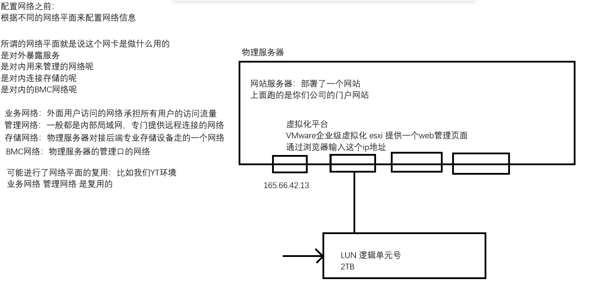
- 网络 bond 针对的是**业务网络**
	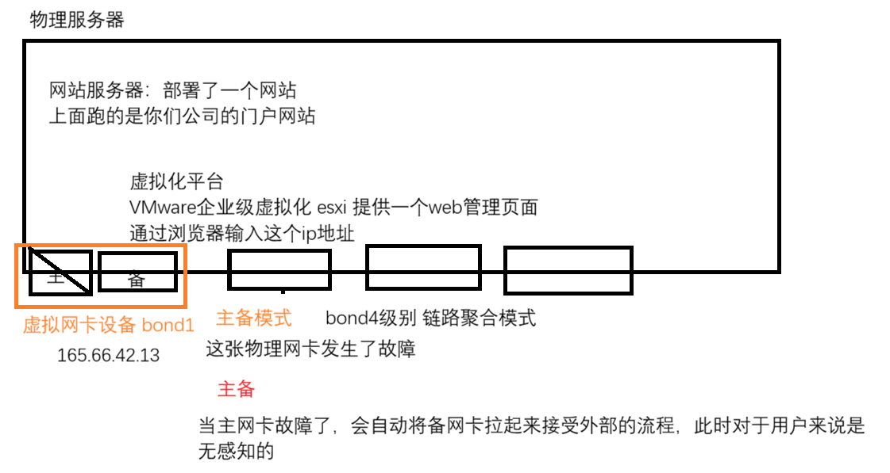
- 网络bond可以实现**网络高可用**和**提高网络性能**: 通过不同的bond级别实现不同的功能
	
	- 常用的bond级别
		- bond 0 级别 : 轮询模式
		- bond 1 级别 : 主备模式
		- bond 4 级别 : 链路聚合模式
- **配置网络 bond (采用主备模式)**
	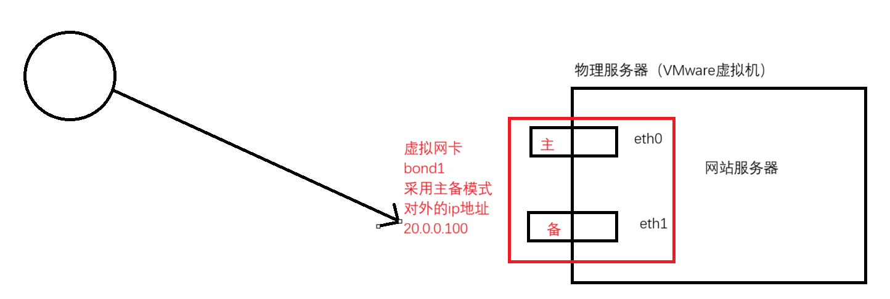
	实现的目的: 访问bond1对应的IP地址, 即使物理网卡发生了故障, 我依旧可以通过这个IP地址来访问, 准备工作
	- 准备俩张物理网卡
	- 如果是VMware虚拟机的话, 你必须保证俩张物理网卡的网络模式都是一样的
	配置步骤:
	1. 备份并删除物理服务器的俩张物理网卡的connection配置文件
	2. 创建虚拟网卡设备bond1, 指定对应的connection配置文件, 类型是bond, connection名字叫做con-bond1, bond模式为主备模式
		- ```bash
			[root@mubai632 NetworkManager]# cp -r system-connections system-connections.bak #备份
			[root@mubai632 ~]# nmcli connection delete ens256
			[root@mubai632 ~]# nmcli connection delete ens224
			[root@mubai632 ~]# nmcli connection add type bond con-name con-bond1 ifname bond1 mode 1
			[root@mubai632 ~]# cat /proc/net/bonding/bond1 #查看bond信息
		  ```
	3. 将俩张物理网卡加入到bond1中, 作为bond1的子接口 
		- ```bash
			# 创建一个bond子接口, 绑定设备, 指定master, 先加哪个哪个就是主网卡
			[root@mubai632 ~]# nmcli connection add type bond-slave con-name bond1-ens224 ifname ens224 master bond1
			[root@mubai632 ~]# nmcli connection add type bond-slave con-name bond1-ens256 ifname ens256 master bond1
			
			
			# 在VMware中，做网络bond的实验，会有BUG，是显示上的BUG
			# 真实环境下, 虚拟网卡设备会使用主网卡设备的MAC地址作为自己的地址. 当虚拟网卡设备中的主网卡设备故障, 此时虚拟网卡设备的MAC地址会变成备网卡的MAC地址
			#但是! VMware中, 你会发现三张网卡的MAC地址全部都是一样的. 即使主备网卡切换了, 虚拟网卡设备的MAC地址依旧不会变化
		  ```
	4. 修改虚拟网卡设备bond1的网络信息, 要求IP地址是192.168.23.200/24, dns 223.5.55，网关 192.168.23.2
		- ```bash
			[root@mubai632 ~]# nmcli connection modify con-bond1 ipv4.method manual ipv4.addresses 20.0.0.100/24 ipv4.dns 223.5.5.5 ipv4.gateway 20.0.0.2 autoconnect yes
			[root@mubai632 ~]# nmcli connection up con-bond1
		  ```

- 查看网络 bond 的状态
	- ```bash
		[root@mubai632 ~]# cat /proc/net/bonding/bond1
		Ethernet Channel Bonding Driver: v5.14.0-362.8.1.el9_3.x86_64

		Bonding Mode: fault-tolerance (active-backup)
		Primary Slave: None
		Currently Active Slave: ens224
		MII Status: up
		MII Polling Interval (ms): 100
		Up Delay (ms): 0
		Down Delay (ms): 0
		Peer Notification Delay (ms): 0

		Slave Interface: ens224
		MII Status: up
		Speed: 10000 Mbps
		Duplex: full
		Link Failure Count: 0
		Permanent HW addr: 00:0c:29:97:6e:6d
		Slave queue ID: 0

		Slave Interface: ens256
		MII Status: up
		Speed: 10000 Mbps
		Duplex: full
		Link Failure Count: 0
		Permanent HW addr: 00:0c:29:97:6e:77
		Slave queue ID: 0
	  ```
	做测试的时候, 不要直接断开connection和设备, 这样的话系统会认为这是人为操作的, 所以它的网络bond不会生效
	你要做的是, 直接在虚拟机上→设置→断开网卡设备的连接
	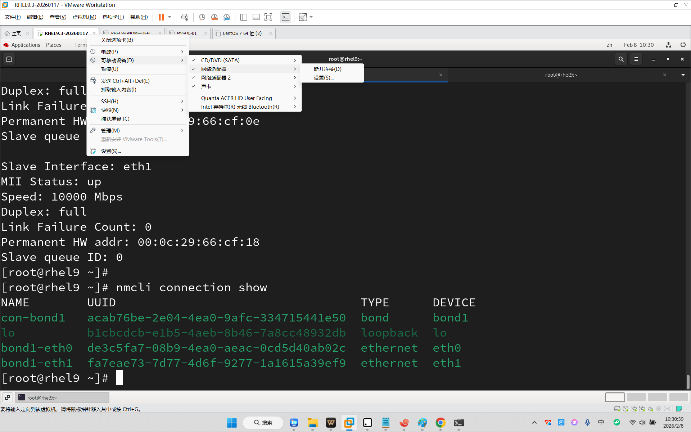

# 9. 虚拟化的网络模式
- 有三类网络模式
	- NAT模式
	- 仅主机模式
	- 桥接模式

## 9.1 NAT 模式
- NAT模式下: 具备上行链路的
	- 上行链路, 连接到外部的物理网络, 是可以出去上网的
	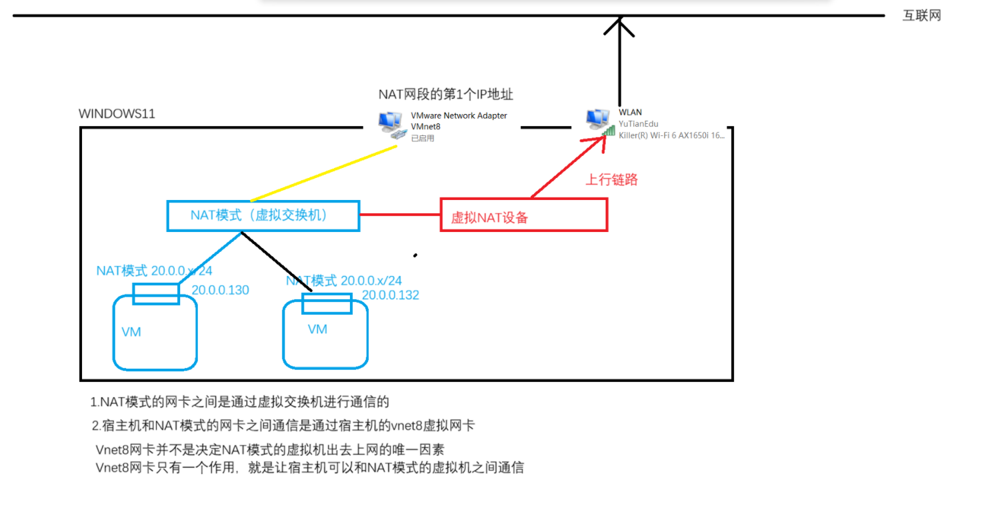
	- 在NAT模式下, 网段会保留2个IP地址
		- 网段的第1个地址是给宿主机的Vnet8网卡使用的
		- 网段的第2个地址是NAT模式的网关地址

## 9.2 仅主机模式
- 仅主机模式, 就是一个纯内部局域网, 没有上行链路的网络模式
	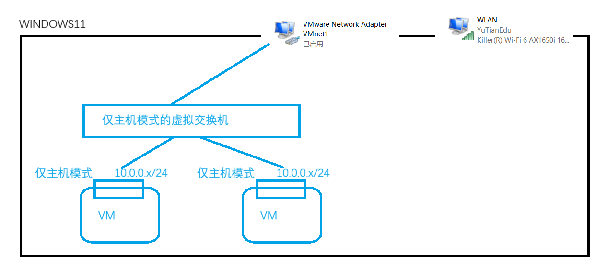
	- 仅主机模式下, 是没有网关地址的. 网段会有1个保留地址: 网段的第1个地址是给到宿主机的Vnet1虚拟网卡使用的
	- Vnet1虚拟网卡只用来和仅主机模式的虚拟机之间通信

## 9.3 桥接模式
- 桥接模式: 把物理服务器的物理网卡当做一个虚拟交换机
- 所有选择桥接模式的网卡, 都是直接接入到这个虚拟交换机上的(物理网卡)
	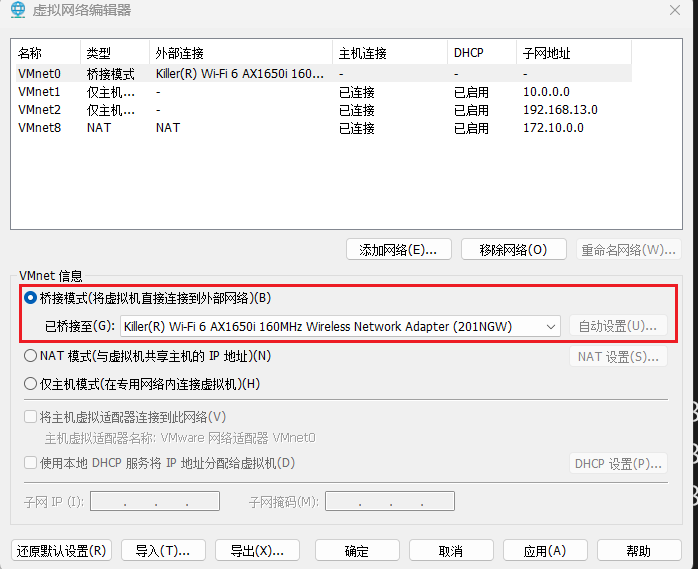

	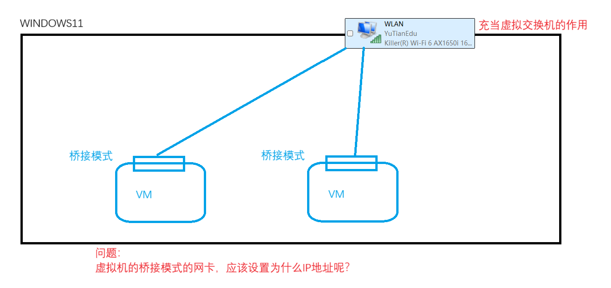
- 配置你桥接到的物理网卡所在的网段的地址, 一定不要和网段中的地址冲突
- **桥接模式和NAT模式的区别是: 桥接模式的地址是能被外部访问的, NAT模式的地址无法被外部访问**
	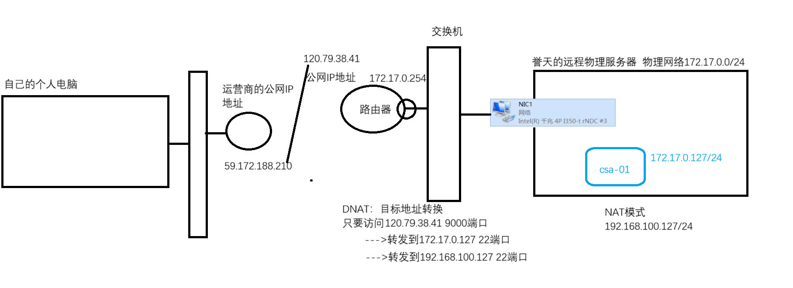


# 10. KVM虚拟化配置桥接网络
## 10.1 配置软件包仓库
### 10.1.1 挂载对应的IOS文件
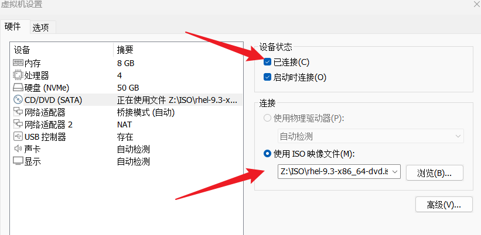

### 10.1.2 在操作系统上挂载对应的IOS文件到指定目录
```bash
[root@mubai632 ~]# lsblk  # 列出块设备(磁盘设备)
NAME    MAJ:MIN RM  SIZE RO TYPE MOUNTPOINTS
sr0      11:0    1  9.8G  0 rom  /run/media/mubai/RHEL-9-3-0-BaseOS-x86_64
nvme0n1 259:0    0   50G  0 disk
├─nvme0n1p1
│       259:1    0    1G  0 part /boot
├─nvme0n1p2
│       259:2    0    2G  0 part [SWAP]
└─nvme0n1p3
        259:3    0   47G  0 part /
[root@mubai632 ~]# mount /dev/sr0 /opt/rhel  # 将设备挂载
mount: /opt/rhel: WARNING: source write-protected, mounted read-only.
[root@mubai632 ~]# ls /opt/rhel/
AppStream  EULA              images      RPM-GPG-KEY-redhat-beta
BaseOS     extra_files.json  isolinux    RPM-GPG-KEY-redhat-release
EFI        GPL               media.repo
```
### 10.1.3 配置本地yum仓库
```bash
[root@rhel9 ~]# rm -rf /etc/yum.repos.d/*  # 删除目录下所有文件
[root@rhel9 ~]# cat > /etc/yum.repos.d/dvd.repo <<EOF
[BaseOS] 
name=BaseOS 
baseurl=file:///opt/rhel/BaseOS
gpgcheck=0 
enabled=1 
[AppStream] 
name=AppStream 
baseurl=file:///opt/rhel/AppStream 
gpgcheck=0 
enabled=1 
EOF

[root@mubai632 ~]# yum clear all  # 清空yum缓存
[root@mubai632 ~]# yum makecache  # 生成yum缓存
[root@mubai632 ~]# yum repolist  # 查看仓库
```

### 10.1.4 安装软件包和软件包组
```bash
[root@mubai632 ~]# yum groupinstall "Virtualization Host" -y # 安装软件包组
[root@mubai632 ~]# yum install virt-manager -y # 安装软件包
```

### 10.1.5 启动服务
```bash
[root@mubai632 ~]# systemctl start libvirtd.service
```
### 10.1.6 关机-开启CPU虚拟化
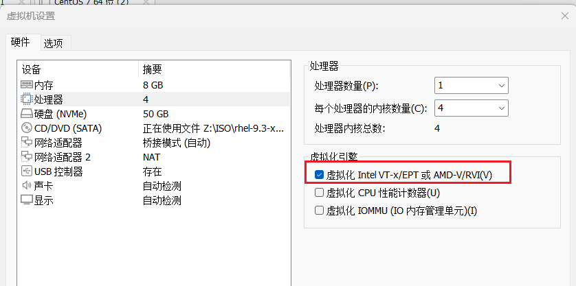


### 10.1.7 桥接网络的创建
- KVM虚拟化的桥接网络创建步骤: 
	1. 创建一个虚拟网卡设备br0
	2. 将br0虚拟网卡设备和真实的物理网卡设备桥接(绑定)
		- ```bash
			[root@mubai632 ~]# nmcli connection add type bridge con-name con-br0 ifname br0
			[root@mubai632 ~]# nmcli connection add type bridge-slave con-name br0-eth0 ifname eth0 master br0
		  ```
		
		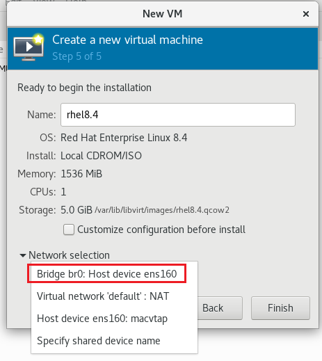

# 11. 主机名本地映射
主机名/域名和IP地址的解析的话, 必须要配置DNS地址, 由DNS服务器去帮助我们解析对应的主机名
- 操作系统是一个内网环境, 不能上外网. 类似于公共DNS地址 8.8.8.8 114.114.114.114 223.5.5.5这类, 那么是无法实现解析的
- 服务器都是一个局域网环境, 即使要做主机名解析, 也应该是解析这个局域网中的主机名
**所谓的本地映射 就是通过修改系统的本地hosts文件, 达到本地解析**
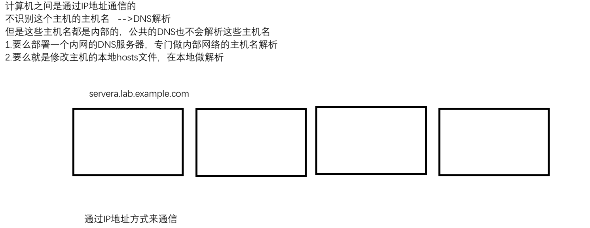

```bash
[root@mubai632 ~]# cat /etc/hosts 
127.0.0.1 localhost localhost.localdomain localhost4 localhost4.localdomain4 
::1 localhost localhost.localdomain localhost6 localhost6.localdomain6
```
- 如果配置了本地hosts文件解析, 也配置了DNS服务器做解析, **本地hosts文件优先级更高**

# 12. 网络服务端口
操作系统上, 每运行一个应用程序, 都会开启一个端口进行监听

举例：Linux系统上安装了一个httpd软件, 并且启动了httpd服务, 那么在系统上一定会有这个服务的监听端口

为什么需要监听到不同的端口上呢？
- 计算机是通过IP地址找到对端计算机的, 如果没有端口划分, 所有的应用程序都是通过一个IP地址对外服务的, 不同的应用程序监听的端口是不一样的, 其他的主机通过访问IP地址+端口的方式来访问到这台主机的某个应用程序服务

监听端口如果是1024以下的, 则这个服务必须是root用户启动. 1024以下监听端口我们称之为**特权端口**(0-1023)
监听端口是1024及以上的, 这个服务可以是普通用户启动页可以是root用户启动. 1024及以上的监听端口我们称之为**非特权端口**(1024-65535)
- **可以通过 `vim /etc/services` 来查看哪些服务对应的哪些端口**

监听端口之外, 还有协议: **tcp/udp**

**查看网络服务监听端口的命令工具**
- **ss** 命令
- **netstat** 命令
两个命令的使用和功能是相同的, 但查询网络监听效率不同. 对于操作系统上, 如果有大量的监听情况, 用 **ss** 的性能远远超过 **netstat**
- 命令的常用选项(两个命令相同)
	- ```bash
		-tunlp / -tulp / -tnlp
		-t 查看tcp监听端口
		-u 查看udp监听端口
		-n 显示端口号，不加n显示的是程序名
		-l 显示监听中的端口
		-p 显示进程信息
		
		ss -an : 查看监听的状态和建立连接的状态
	  ```
当你启动服务的时候是在后台持续运行, 那么这个服务的监听端口一定是listen也就是监听的状态