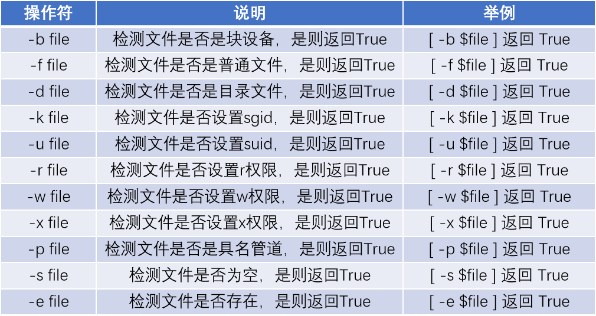
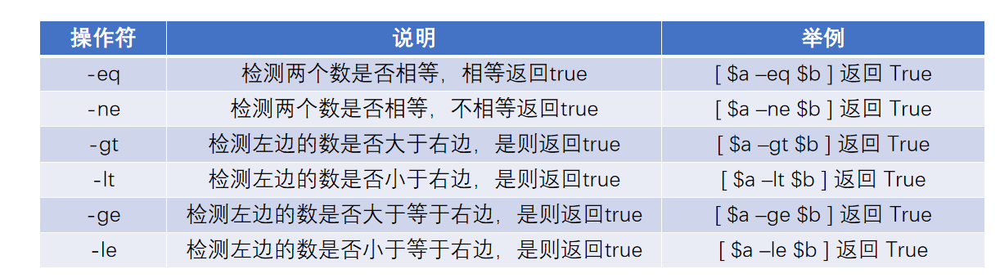

# 1. 什么是 shell 脚本
- 所谓的shell脚本, 本质上就是一个包含很多Linux命令的, 带有逻辑性的文件
- 将Linux命令封装到一个文件中，这个文件就可以称之为shell脚本文件

# 2. 如何学习 shell 脚本
- 需要掌握文本处理工具以及文本编辑工具
- 需要掌握Linux系统上常用的一些软件和配置文件内容
- shell脚本中具备一些特殊的功能: 
	1. 变量定义和使用：预定义变量..
	2. 具备逻辑的: 判断语句if、case, 循环语句for、until、while
	3. 函数: 将shell脚本中的命令封装为一个函数, 后续调用这个函数就是调用这些Linux命令
- 编程语言分为解释型和编译型, shell脚本就是典型的解释型语言, python也是属于解释型语言, go、c 这些属于编译型
	- 编译型: 源码不可见, 必须要先编译为二进制文件才能够执行
	- 编译型: 源码不可见, 必须要先编译为二进制文件才

# 3. shell脚本编写规范
- 脚本文件的名称一定要以 `.sh` 结尾, 目的是为了别人知道这就是一个shell脚本
- 脚本文件的第一行内容要写上声明, 声明用什么解释器去执行这脚本的内容
	- ```bash
		[root@mubai632 ~]# cat shell.sh
		
		# 不写 #!/bin/bash 一般都会以系统的shell执行, echo $SHELL 看系统是什么shell
	  ```
- 脚本中每一个命令要写上注释, 表示这个命令是干什么使用的
	- 单行注释: `#`
	- 多行注释 `<<字符...字符` 以字符开头, 就要以字符结尾
		- ```bash
			[root@mubai632 ~]# ./shell.sh
			123
			789
			[root@mubai632 ~]# cat shell.sh
			#!/bin/bash
			echo 123
			<<aaa
			被注释掉的内容
			echo 456
			aaa
			echo 789
		  ```
- 脚本内容一定要有缩进(美观)

编写一个脚本案例/opt/demo1.sh, 要求如下: 
1. 创建zhangsandemo111用户, 设置密码为redhat
2. 在对应用户的家目录下创建三个测试文件, 分别是demo1 demo2 demo3
3. 在demo1文件中, 写入name=zhangsandemo111
4. 在demo2文件中, 写入age=18
5. 在demo3文件中, 写入sex=girl
6. 将/etc/passwd文件备份到用户家目录下, 并且将备份后的文件中zhangsandemo111关键字修改为zhangsan
- ```bash
	[root@mubai632 opt]# ./demo1.sh
	Changing password for user zhangsandemo111.
	passwd: all authentication tokens updated successfully.
	[root@mubai632 opt]# cat demo1.sh
	#!/bin/bash
	useradd zhangsandemo111
	echo redhat | passwd --stdin zhangsandemo111
	touch ~zhangsandemo111/demo{1..3}
	echo name=zhangsandemo111 > ~zhangsandemo111/demo1
	echo age=18 > ~zhangsandemo111/demo2
	echo sex=girl >  ~zhangsandemo111/demo3
	cp /etc/passwd ~zhangsandemo111
	sed -i 's/zhangsandemo111/zhangsan/' ~zhangsandemo111/passwd
  ```

# 4. 执行脚本的四种方式
- 相对路径执行
	- ```bash
		# 脚本文件必须要有x权限才可以执行脚本
		# 保证当前目录下有这个脚本文件
		命令 : ./文件名
	  ```
- 绝对路径执行
	- ```bash
		# 脚本文件必须要有x权限才可以执行脚本
		# 系统上任意位置都可以执行
		命令 : 目录/脚本文件
	  ```
- 使用 bash 或者 sh 执行脚本
	- ```bash
		命令 : bash 脚本文件 
		命令 : sh 脚本文件
		# 执行的时候不需要要脚本有 x 权限, 进需要有 r 的权限即可
	  ```
- source 或者 . 来执行脚本
	- ```bash
		# 执行的时候不需要要脚本有 x 权限, 进需要有 r 的权限即可
		source 或者 . 执行脚本, 是在当前shell中执行的
		其他的方式都是在子shell中执行的
	  ```

# 5. 位置化变量
- 脚本在执行的时候, 里面是可以传入变量的, 这些变量我们就称之为位置化变量
	- 创建useradd.sh脚本文件, 实现zhangsan用户和密码的自动创建和设置
		- ```bash
			[root@mubai632 ~]# cat useradd.sh 
			#!/bin/bash
			useradd zhangsan
			echo 1 | passwd --stdin zhangsan 
			# 无论怎么执行, 创建的用户都是zhangsan, 设置的密码都是1
		  ```
	- 编写一个脚本文件, 里面是创建用户的一个框架, 基于这个脚本创建任何的用户以及设置任意的密码
		- ```bash
			[root@mubai632 ~]# cat useradd.sh
			#!/bin/bash
			useradd $1
			echo $2 | passwd --stdin $1
			[root@mubai632 ~]# ./useradd.sh lisi redhat 
			
			##相当于执行的是
			useradd lisi
			echo redhat | passwd --stdin lisi
		  ```


# 6. 脚本结合read命令实现提示信息
- **read命令, 从键盘上接受输入作为变量的值来进行存储** 
	- ```bash
		命令 : read -p "显示的内容" 变量名
			read -p "请输入用户名" username
			echo $username
	  ```
- 常用选项
	- ```bash
		-p 输出信息, 在显示屏终端上显示信息
		-t 超时时间, 单位是s. 超过了这个时间就会跳过这条read命令
		-s 隐藏输入, 从键盘上输入的信息不会显示出来
	  ```

# 7. exit退出和退出码
- 程序执行后会携带一个退出码
	- 0代表成功, 1-255代表失败
	- Shell 程序的退出码储存在系统变量 **`$?`** 中
	- 通过 **`exit num`** 指定退出码是多少

# 8. 多条命令执行
- 默认情况下, 在终端上一次性只能执行一条Linux命令, 如果要执行多条Linux命令, 使用以下的方式
	- ```bash
		&& : 逻辑与. 当前面命令的返回值为0的时候才可以执行后面的命令(前面命令执行成功才会执行后面的命令)
			命令1 && 命令2 && 命令3...
		|| : 逻辑或. 只有当前面命令的返回值为非0的时候才可以执行后面的命令(前面命令执行失败才会执行后面的命令)
			命令1 || 命令2 || 命令3...
		! : 逻辑非. 对其取反, 返回值为0的则变成非0, 返回值为非0的则变成0
	  ```
- 逻辑与 和 逻辑或 的简单判断语句
	- ```bash
		当用户存在,修改密码, 当用户不存在创建用户
		id 用户 &> /dev/null && echo 密码 | passwd --stdin 用户 || useradd 用户
	  ```
- 复合指令: 可以接多个Linux命令, 只要你写了不管是对是错都会执行命令
	- ```bash
		格式 :
			命令 ; 命令 ; 命令 ...  # 在当前shell中执行
			{空格 命令; 命令; 命令; ...}  # 在当前shell中执行
			(命令; 命令; 命令; ...)  # 在子shell中执行
	  ```

# 9. 条件测试语句和条件表达式以及运算符
## 9.1 条件测试语句
- 条件测试语句是用来判断条件是否为真或者为假
	- 条件为**真**, 返回值为 **0** 
	- 条件为**假**, 返回值为 **非0** 
		- ```bash
			# 格式1 : 通过 test 条件表达式
			[root@server ~]# test 1 = 1
			[root@server ~]# echo $?
			0
			[root@server ~]# test 1 = 2
			[root@server ~]# echo $?
			1
			
			# 格式2 : 通过[条件表达式]
			[root@server ~]# [ 1 -eq 1 ]
			[root@server ~]# echo $?
			0
			[root@server ~]# [ 1 -eq 2 ]
			[root@server ~]# echo $?
			1
			
			# 格式3 : 通过[[ 条件表达式 ]]
			[root@server ~]# [[ -f /etc/passwd && -d /etc/ ]] # -f 判断是普通文件, -d 判断是目录文件
			[root@server ~]# echo $?
			0
		  ```

## 9.2 条件表达式中的运算符
### 9.2.1 文件属性运算符
- 判断文件的属性
	- 是不是普通文件、是不是目录文件、是不是链接文件、有没有r权限、有没有w权限、有没有x权限、有没有其他的特殊权限
	
	- -g file 检测文件是否设置sgid
	- -k file 检测文件是否设置sbit
	- ```bash
		格式1 : [ -b file ]
		格式2 : test -b file
	  ```
	- 如果/opt/useradd.sh脚本文件没有x权限, 则赋予x权限, 如果有x权限则不管
		- ```bash
			[ -x /opt/useradd.sh ] || chmod +x /opt/useradd.sh
			test -x /opt/useradd.sh || chmod +x /opt/useradd.sh
		  ```
	- 判断/etc/passwd文件是否存在, 如果存在则备份文件到/opt/passwd.bak
		- ```bash
			[ -e /etc/passwd ] && cp -a /etc/passwd /opt/passwd.bak
		  ```

### 9.2.2 数字比较运算符
- 判断运算符左右两边的数字是否相等
	- ```bash
		INTEGER1 -eq INTEGER2
	          INTEGER1 is equal to INTEGER2

	    INTEGER1 -ge INTEGER2
	          INTEGER1 is greater than or equal to INTEGER2

	    INTEGER1 -gt INTEGER2
	          INTEGER1 is greater than INTEGER2

	    INTEGER1 -le INTEGER2
              INTEGER1 is less than or equal to INTEGER2

	    INTEGER1 -lt INTEGER2
	          INTEGER1 is less than INTEGER2

	    INTEGER1 -ne INTEGER2
	          INTEGER1 is not equal to INTEGER2
	  ```

- 案例: 判断根文件系统使用情况是否超过了5%, 如果超过了则输出  disk 
	- ```bash
		[root@server ~]# df | grep -w '/' | cut -d " " -f 8 | cut -d "%" -f 1
		[root@server ~]# [ $(df | grep -w '/' | cut -d " " -f 8 | cut -d "%" -f 1) -gt 5 ] && echo disk
	  ```

### 9.2.3 字符串比较运算符

- ```bash
	-n STRING : 判断字符串是否不为空, 如果不为空, 返回值为0
	-z STRING : 判断字符串是否为空, 如果为空, 则返回值为0
	STRING1 = STRING2 : 判断两个字符串是否相等
	STRING1 != STRING2 : 判断两个字符串是否不相同
  ```

### 9.2.4 布尔运算符

- ```bash
	EXPRESSION1 -a EXPRESSION2 : 两个都为 true 才返回 true
	EXPRESSION1 -o EXPRESSION2 : 有一个是 true 就返回 true
	# 如果条件测试语句中具备多个条件表达式, 要对多个条件做判断的时候就可以使用
  ```
- 案例: 如果/etc/passwd是一个普通文件并且/tmp目录存在, 则输出ok
	- ```bash
		# 拆分出俩个条件表达式: 一个是判断是否是普通文件, 一个是判断是否是目录文件
		[root@server ~]# [ -f /etc/passwd -a -e /tmp ] && echo ok
	  ```

# 10. 判断语句、循环语句、中断语句
## 10.1 判断语句
### 10.1.1 if判断
- **if 单分支结构** : 条件表达式返回值**为0**则**执行if语句**中的内容. 如果返回值**不为0** 则**跳过if语句** 
	- ```bash
		格式1: 常用格式
		if 条件表达式;then
			执行语句1
			执行语句2
			...
		fi
		
		格式2: 
		if 条件表达式
		then
			执行语句1
			执行语句2
			...
		fi
	  ```
	- 例题
		- ```bash
			判断/opt/passwd文件是否存在, 如果不存在的话则创建这个文件. 如果存在的话就不管
			[root@server ~]# cat shell.sh
			#!/bin/bash
			if [ ! -e /etc/passwd ];then
			        touch /etc/passwd
			fi
		  ```
- **if 双分支结构** 
	- ```bash
		格式: 常用格式
		if 条件表达式;then
			执行语句
			...
		else 
			执行语句
			...
		fi
	  ```
	- 例题
		- ```bash
			判断zhangsan用户, 如果用户存在则修改密码为redhat, 如果用户不存在则创建用户, 并且修改用户密码, 用户的密码是从键盘上接受输入的
			#!/bin/bash
			username=zhangsan
			id $username &> /dev/null
			if [ $? -eq 0 ];then
			        echo "redhat" | passwd --stdin $username
			else
			        useradd $username
			        read -p "请输入密码: " userpasswd
			        echo $userpasswd | passwd --stdin $username
			fi
		  ```
- **if 多分支结构** 
	- ```bash
		格式: 常用格式
		if 条件表达式;then
			执行语句
			...
		elif 条件表达式;then
			执行语句
			...
		elif 条件表达式;then
			执行语句
			...
		...
		else
			执行语句
			...
		fi
	  ```
	- **对于多分支结构来说, 条件表达式的判断顺序是从上往下以此做判断, 只有有一个满足条件则后面的条件表达式不会继续判断了** 
	- 例题
		- ```bash
			判断/opt/passwd文件是不是具备r权限, 如果具备则输出r, 如果不具备则判断/opt/passwd文件是否具备w权限, 如果具备则输出w, 如果不具备则判断/opt/passwd文件是否具备x权限, 如果具备则输出x, 如果前面所有的条件判断都不成立则输出error
			#!/bin/bash
			if [ -r /etc/passwd ];then
			        echo "r"
			elif [ -w /etc/passwd ];then
			        echo "w"
			elif [ -x /etc/passwd ];then
			        echo "x"
			else
			        echo "error"
			fi
		  ```

### 10.1.2 case判断
- 从使用上来说, case判断和if判断 语法格式不一样, 实现的效果是一样. if能够实现的case也能实现, case能够实现的if也能实现
- **case判断语句更加倾向于, 知道判断的结果是什么** 
- 语法格式
	- ```bash
		case $变量 in
		  值1)
		    执行语句
		    ...
		  ;;
		  值2)
		    执行语句
		    ...
		  ;;
		  值3)
		    执行语句
		    ...
		  ;;
		  *)
		    执行语句
		    ...
		  ;;
		esac
	  ```
	- 例题
		- ```bash
			编写一个脚本, 执行之后会在显示屏上输出下面的信息, 当用户从键盘上输入1的时候, 则执行创建用户的命令. 当用户从键盘上输入2的时候, 则执行修改用户密码的命令...
			#!/bin/bash
cat << EOF
-------- Menu --------
1. 创建用户
2. 修改用户密码
3. 删除用户
4. 退出
----------------------
EOF

read -p "输入数字: 1/2/3/4" number
case $number in
        1)
                read -p "输入创建的用户名: " username
                id $username &> /dev/null
                if [ $? -eq 1 ];then
                        useradd $username
                else
                        exit
                fi
                ;;
        2)
                read -p "输入需要修改的用户名: " username
                id $username &> /dev/null
                if [ $? -eq 0 ];then
                        read -p "输入需要修改的密码: " userpasswd
                        echo $userpasswd | passwd --stdin $username
                else
                        exit
                fi
                ;;
        3)
                read -p "输入需要删除的用户名: " username
                id $username &> /dev/null
                if [ $? -eq 0 ];then
                        userdel -r $username
                fi
                ;;
        4)
                exit
                ;;
esac
		  ```

## 10.2 循环语句
### 10.2.1 for循环
- ```bash
	for 变量名 in 循环的值;do
	  循环体（循环执行的内容）
	done
  ```
- **for循环, 在循环的时候是有次数的. 而循环多少次是由循环的值的数量决定的** 
- **如果要输出循环的值, 则在循环体中使用变量代替** 
	- ```bash
		#!/bin/bash
		for users in user1 user2 user3 user4 user5;do
		  echo $users
		done
		
		[root@mubai632 ~]# ./for.sh 
		user1
		user2
		user3
		user4
		user5
	  ```
- **如果要重复执行某些命令, 不需要使用变量代替** 
	- ```bash
		#!/bin/bash
		for users in user1 user2 user3 user4 user5;do
		  echo huawei123
		done
		[root@mubai632 ~]# ./for.sh 
		huawei123
		huawei123
		huawei123
		huawei123
		huawei123
	  ```
- **循环的值的多种表达方式** 
	- 直接编写要循环的值 
	- 通过{ }方式来循环 {1..10} {1..100}
	- \$(seq 1 5), 通过\$()以及seq命令来指定循环的次数 
	- $ (命令) 引用命令的执行结果 
	- 例题
		- ```bash
			测试当前主机所在网段的所有的IP地址是否可以通信, 可以通信的主机, 将其ip地址以ok的方式进行输出到显示屏上, 并且存放到/opt/ip-ok文件中. 不可以通信的主机ip, 将其ip地址以error的方式进行输出到显示屏上, 并且存放到/opt/ip-error文件中
			[root@server ~]# cat shell3.sh
			#!/bin/bash
			for ip in 172.10.0.{1..254};do
			        ping -c 1 $ip &> /dev/null
			        if [ $? -eq 0 ];then
			                echo "$ip ok" | tee -a /opt/ip-ok
			        else
			                echo "$ip error" | tee -a /opt/ip-error
			        fi
			done
		  ```

### 10.2.2 while循环
- while循环是有条件的, 当条件成立结果为真则进行while循环, 只有当条件为假的时候才会退出while循环
	- ```bash
		格式: 
		while 条件表达式/命令 (返回值为0, 结果都为真);do
			循环体
		done
		
		例子:
		while id root &> /dev/null;do
			循环体
		done
	  ```
- while循环语句的话, 先进行一次判断，结果为真则进行循环体执行命令, 循环体结束之后, 会反过来再进行一次判断
- 例题
	- ```bash
		创建while.sh脚本文件, 作用是创建用户, 并且指定用户的UID. 如果指定的UID存在, 则重新要求用户输入. 只有当输入的UID不存在的时候才进行用户的创建
		#!/bin/bash
		read -p "输入创建的用户名称：" Username
		read -p "输入UID： " Uid
		while id $Uid &> /dev/null;do
			read -p "输入UID： " Uid
		done
		useradd -u $Uid $Username
	  ```
- 每天实时收集主机硬件信息, 每5分钟实时收集主机文件系统使用情况
	- ```bash
		#!/bin/bash
		while id root &> /dev/null;do
			disk_status=$( df | grep -w "/" | cut -d " " -f 8 )
			echo 根文件系统使用百分比：$disk_status
			sleep 5m
		done
		while循环本身是无法实现间隔多少时间去执行, 但是可以配合sleep命令来实现, sleep默认单位是秒
	  ```
- **while循环也可以指定循环的次数, 但是需要通过读取第三方外部文件来实现, 文件中有多少行, 就可以循环多少次** 
	- ```bash
		while循环读取文件
		方法一：采用exec读取文件，然后进入while循环处理 
		exec < File ; while read line # line 是变量
		do 
		  statement1 
		done
		
		方法二：使用cat读文件，然后通过管道进入while循环处理 
		cat File | while read line 
		do 
		  statement1 
		done 
		
		方法三：通过在while循环结尾，使用输入重定向方式
		while read line 
		do 
		  statement1 
		done < File
	  ```

### 10.2.3 until循环
- 语法格式和while循环一模一样, 区别在于:
	- while循环: 条件**成立进入循环**, 条件不成立退出循环
	- until循环: 条件**不成立进入循环**, 条件成立退出循环
- **监控系统的各种服务的启动情况, 可以使用until循环** 
	- ```bash
		until 条件表达式/命令;do
		  循环体
		done
		
		until $( systemctl status sshd );do
			echo 服务已停止
		done
	  ```

## 10.3 中断语句
- **continue** 和 **break** 都是循环语句中常见的关键字, 只有在循环语句中才经常去使用
### 10.3.1 continue
- continue : **跳过此次循环, 进行下一次的循环** 
	- ```bash
		# 使用循环输出内容
		#!/bin/bash
		for i in user{1..5};do
		        echo $i
		done  
		
		# 修改脚本, 当值为user3的时候跳过此次循环
		for i in user{1..5};do
			if [ $i = "user3" ];then
				continue
			fi
			echo $i
		done
	  ```

### 10.3.2 break
- **break : 中断当前整个循环体** 
	- ```bash
		#!/bin/bash 
		for i in user{1..5};do 
			for k in pass{1..5};do 
				if [ $k = 'pass3' ];then 
					break 
				fi 
				echo $i $k 
			done 
		done
	  ```
