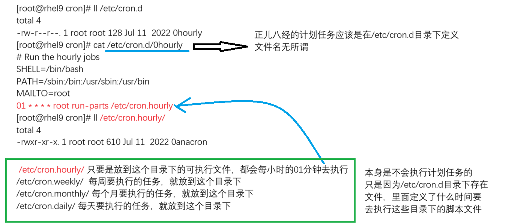

# 1. at-一次性计划任务
- 开机执行那些命令
	- ```bash
		[root@mubai632 ~]# vim /etc/rc.local # 开机读取的文件, 需要给执行权限
	  ```
- 所谓的一次性计划任务: 就是在未来的某个时间点执行一次任务
- 对于Linux系统来说, 管理一次性计划任务的工具是 **at** 工具
- 查看计划任务
	- ```bash
		# 列出系统的所有at计划任务(root可以列出所有用户的，普通用户只能列出自己的)
		[root@mubai632 ~]# at -l  
		1 Sun Mar 8 15:00:00 2026 a root 
		2 Mon Mar 9 08:00:00 2026 a root 
		3 Tue Mar 10 09:00:00 2026 a root 
		4 Sun Mar 8 16:00:00 2026 a root 
		5 Sun Mar 8 16:00:00 2026 a root
		
		# 查看计划任务的详细信息, 执行哪些命令
		[root@rhel9 ~]# at -c 6  
		
		
		# 计划有没有执行, 就看文件有没有消失, 如果消失了就是没有执行
	  ```
- 编辑计划任务
	- 具备2种定义方式: 交互式定义、非交互式定义
		- 交互式定义
			- ```bash
				at 时间
				时间表达方式, 未来的具体时间 2026-3-8 15:50 
				[root@mubai632 ~]# at "15:00"  # 如果时间已经过去了，则言顺到第二天的时间点
				warning: commands will be executed using /bin/sh 
				at> touch /opt/15.file 
				at> rm -rf /tmp/* 
				at> 按ctrl d 保存退出
				job 1 at Sun Mar 8 15:00:00 2026
				
				[root@mubai632 ~]# at "09:00 2026-3-10" # 指定年月日，时分 
				warning: commands will be executed using /bin/sh 
				at> ls /etc/passwd 
				at> 按ctrl d 保存退出
				job 3 at Tue Mar 10 09:00:00 202
			  ```
		- 非交互式定义
			- ```bash
				at 时间 < 文件
				[root@mubai632 ~]# at "16:00" < at.sh 
				warning: commands will be executed using /bin/sh 
				job 5 at Sun Mar 8 16:00:00 2026
			  ```
	- 修改已经存在的计划任务, 可以直接去编辑底层的 at 文件 `/var/spool/at/` 目录下, 找到对应任务生成的可执行文件进行修改(计划任务其实就是时间到了自动执行对应的可执行文件)

- 删除计划任务
	- ```bash
		# 可以通过 at -d 
		[root@mubai632 ~]# at -d 任务号
		
		# 可以通过 atrm 
		[root@mubai632 ~]# atrm 任务号
		
		# 删除底层任务文件
	  ```

- 特殊情况 : 你定义的at任务可能会失效, 可能执行的时间不对
	- 定义at任务执行的时间是 2026年3月8号的10点钟, 但是你的系统在9点59分的时候不小心关机了, 然后再次开机的时候, 已经到了10点01分, 已经超过了at定义的时间, **任务还是会执行, 即使时间过去了, 在你开机的时候就会立即执行 at 任务**
	- 原因: 定义的at任务, 真正执行的程序是一个叫做atd服务. at工具只是用来查看、删除、编辑at任务的, 到了对应的时间点, 真正执行at任务的程序是atd(atd开机自启)

- **at 黑白名单**, **默认情况下系统只存在黑名单文件**
	- 黑名单文件/etc/at.deny: **处于文件**中的用户**无法使用at工具**
	- 白名单文件/etc/at.allow: **除了文件**中的用户**可以使用at工具**, **其他用户都不可以使用**(root除外)
	- **同时存在黑白名单, 则黑名单文件无效**

# 2. crontab：周期性计划任务
- 周期性计划任务: 在一个时间范围之内重复性的去执行任务
- 定义 **crontab** 计划任务
	- **通过 crontab 工具定义计划任务**
		- ```bash
			crontab 选项
			[root@rhel9 ~]# crontab -e 
			no crontab for root - using an empty one 
			crontab: installing new crontab 
			* * * * * /bin/echo root 
			  
			* * * * *: 时间 
			时间的表达方式： 
				* 分钟 0-59 
				* 小时 0-23 
				* 日期 1-31 
				* 月份 1-12 
				* 周 1-7（0-6） 
				只需要记住 分 时 日 月 周 
			/bin/echo root：要执行的任务 
			
			*/x: 表示每隔x个时间执行任务 
			x,y: 表示在x时间和y时间执行任务 
			x-y: 表示在x时间和y时间范围内执行
			
			常用选项
				-e : 表示编辑当前用户的计划任务
				-u 用户名 : 编辑指定用户任务
		  ```
- 查看 **crontab** 计划任务
	- ```bash
		[root@rhel9 ~]# crontab -l  # 查看当前用户任务
		59 23 * * * /bin/echo root 
		[root@rhel9 ~]# crontab -l -u zhangsan  # 查看指定用户任务
		* * * * * echo zhangsan
	  ```
	- 定义的计划任务实际上是一个文件, 这个文件会存储到 **`/var/spool/cron`** 目录下, 目录下会生成对应用户名的文件, 表示这个文件中的计划任务是由这个用户执行的
- 删除 **crontab** 计划任务
	- ```bash
		[root@rhel9 cron]# crontab -r  # 删除当前用户任务
		[root@rhel9 cron]# crontab -r -u lisi  # 删除指定用户任务
	  ```

例题: 备份/etc/passwd文件, 每天晚上11点将其/etc/passwd备份到/opt/passwd-年月日
```bash
0 23 * * * cp -a /etc/passwd /opt/passwd-$(date +'\%F')
```

- **crontab 日志文件**
	- 日志文件 **`/var/log/cron`** 所有的操作都记录在这个文件中, 并且所有的输出信息也在这个文件中
- **其他定义 crontab 任务的位置**
	- crontab -e : 实际上就是将计划任务定义到 **`/var/spool/cron`** 目录下
	- /etc/crontab: 直接通过编辑这个文件定义计划任务; 这个文件中的任务无法通过 crontab -l 命令查看
	- 系统自带的计划任务
		
		- 其中的 run-parts 是依次执行某个目录中的所有可执行文件
		- 格式是 run-parts 目录
- crontab 黑白名单
	- 黑名单文件: `/etc/cron.deny` 处于黑名单文件的用户无法使用crontab工具(默认存在)
	- 白名单文件: `/etc/cron.allow` 只有处于白名单文件的用户才可以使用crontab工具, 除此之外其他用户都无法使用(root除外)
	- 同时存在黑白名单, 则黑名单文件无效
