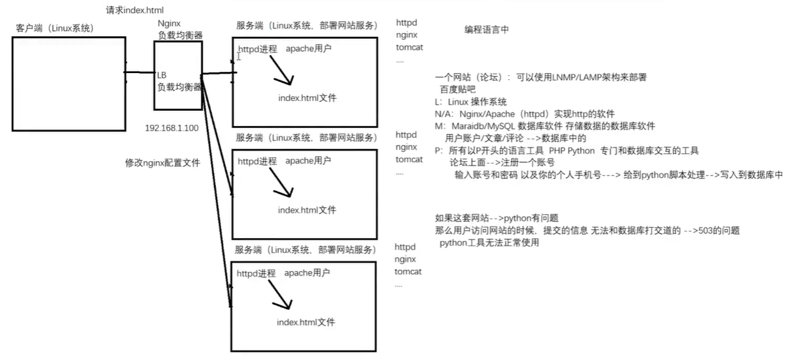
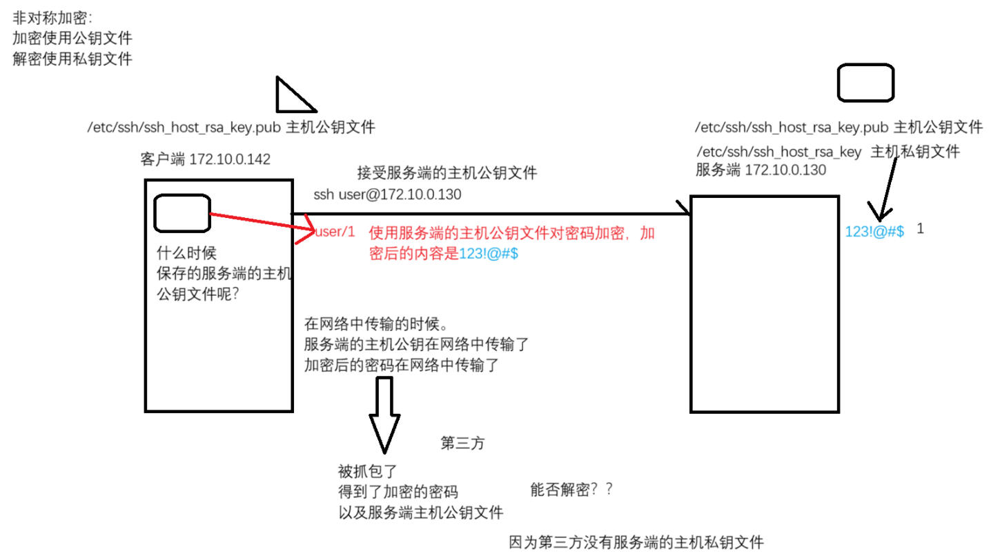
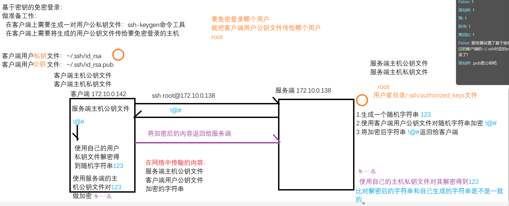
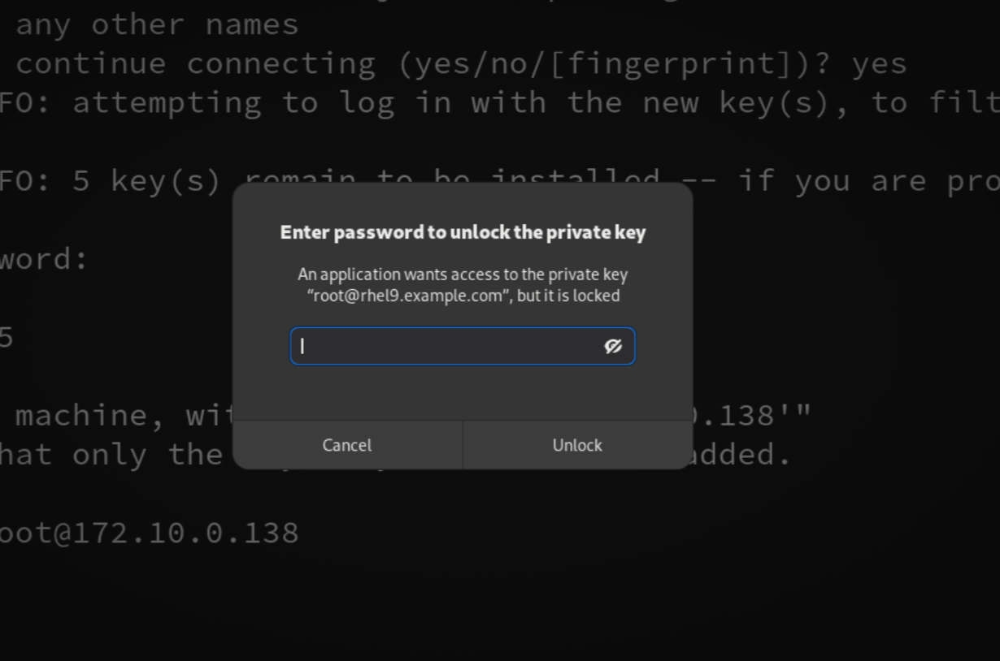
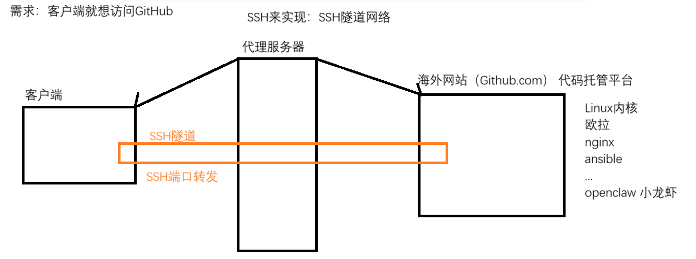
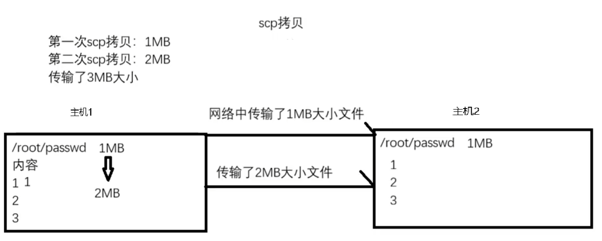
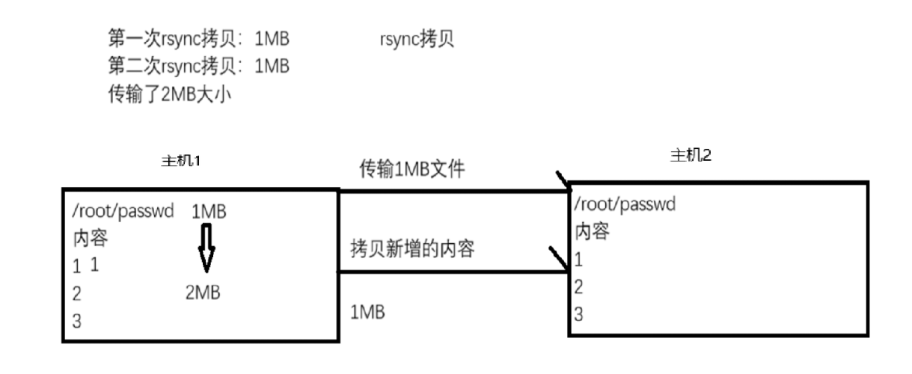

# 1. curl 工具
- curl是一个综合工具, 可以查看网站的源码内容, 还可以实现文件的**上传**和**下载** 
	- ```markdown
		[root@rhel9 ~]# curl www.baidu.com  # 看的就是网站源码
		<!DOCTYPE html>
		<!--STATUS OK--><html> <head><meta http-equiv=content-type content=text/html;charset=utf-8><meta http-equiv=X-UA-Compatible content=IE=Edge><meta content=always name=referrer><link rel=stylesheet type=text/css href=http://s1.bdstatic.com/r/www/cache/bdorz/baidu.min.css><title>百度一下，你就知道</title></head> <body link=#0000cc> <div id=wrapper> <div id=head> <div class=head_wrapper> <div class=s_form> <div class=s_form_wrapper> <div id=lg>  </div> <form id=form name=f action=//www.baidu.com/s class=fm> <input type=hidden name=bdorz_come value=1> <input type=hidden name=ie value=utf-8> <input type=hidden name=f value=8> <input type=hidden name=rsv_bp value=1> <input type=hidden name=rsv_idx value=1> <input type=hidden name=tn value=baidu><span class="bg s_ipt_wr"><input id=kw name=wd class=s_ipt value maxlength=255 autocomplete=off autofocus></span><span class="bg s_btn_wr"><input type=submit id=su value=百度一下 class="bg s_btn"></span> </form> </div> </div> <div id=u1> <a href=http://news.baidu.com name=tj_trnews class=mnav>新闻</a> <a href=http://www.hao123.com name=tj_trhao123 class=mnav>hao123</a> <a href=http://map.baidu.com name=tj_trmap class=mnav>地图</a> <a href=http://v.baidu.com name=tj_trvideo class=mnav>视频</a> <a href=http://tieba.baidu.com name=tj_trtieba class=mnav>贴吧</a> <noscript> <a href=http://www.baidu.com/bdorz/login.gif?login&amp;tpl=mn&amp;u=http%3A%2F%2Fwww.baidu.com%2f%3fbdorz_come%3d1 name=tj_login class=lb>登录</a> </noscript> <script>document.write('<a href="http://www.baidu.com/bdorz/login.gif?login&tpl=mn&u='+ encodeURIComponent(window.location.href+ (window.location.search === "" ? "?" : "&")+ "bdorz_come=1")+ '" name="tj_login" class="lb">登录</a>');</script> <a href=//www.baidu.com/more/ name=tj_briicon class=bri style="display: block;">更多产品</a> </div> </div> </div> <div id=ftCon> <div id=ftConw> <p id=lh> <a href=http://home.baidu.com>关于百度</a> <a href=http://ir.baidu.com>About Baidu</a> </p> <p id=cp>&copy;2017&nbsp;Baidu&nbsp;<a href=http://www.baidu.com/duty/>使用百度前必读</a>&nbsp; <a href=http://jianyi.baidu.com/ class=cp-feedback>意见反馈</a>&nbsp;京ICP证030173号&nbsp;  </p> </div> </div> </div> </body> </html>
	  ```
- 常用选项: 
	- **-I** 选项 : 查看头部信息
		- ```bash
			[root@mubai632 ~]# curl -I 127.0.0.1 
			HTTP/1.1 200 OK 
			Date: Sun, 08 Mar 2026 07:53:33 GMT 
			Server: Apache/2.4.57 (Red Hat Enterprise Linux) 
			Last-Modified: Sun, 08 Mar 2026 07:52:40 
			GMT ETag: "1-64c7e9210bb1e" 
			Accept-Ranges: bytes 
			Content-Length: 1 
			Content-Type: text/html; charset=UTF-8
			
			200是http的状态码, 可以根据状态码来判断访问是否成功还是失败 
			常见的状态码: 
				200: 资源正常访问, 访问成功 
				404: 资源找不到, 说明你访问的这个内容在对端的物理服务器上没有 
				403: Forbidden 权限拒绝, 访问的文件没有权限 
				304: 读取的是缓存数据 
				301: 永久重定向 
				302: 临时重定向 
				502: bad gateway错误的网关 
				503: 服务不可达
		  ```
		
		
	- **-O** 选项, 下载文件
		- ```bash
			curl -O 下载链接地址 : 直接下载文件到当前目录下
			# -O 选项后无法接参数
			[root@mubai632 ~]# curl -O https://releases.ansible.com/ansible/ansible-1.1.tar.gz
		  ```
	- **-o** 选项, 下载文件
		- ```bash
			curl -o 文件路径 下载链接地址 : 下载文件到指定目录并且改名
			[root@mubai632 ~]# curl -o /opt/ansible https://releases.ansible.com/ansible/ansible-1.1.tar.gz
		  ```
	- **-u** 选项, 用户认证
		- ```bash
			# 一台物理服务器安装了FTP的软件, 实现了文件的上传和下载的功能. 但是要求客户端必须输入用户名和密码才可以进行下载
			curl -O -u 用户名:密码 ftp://www.linux.com/dodo1.JPG
			curl -O ftp://用户名:密码@www.linux.com/dodo1.JPG
		  ```
	- **-x** 选项, 通过代理访问网站
		- ```bash
			curl -x 192.168.100.100:1080 http://www.linux.com
		  ```

# 2. wget 工具
- curl不仅仅是一个文件下载和上传工具, 同时也是一个网站访问的工具
- wget工具才是专注于文件下载的工具
	- 下载的时候是可以放入到后台下载的, 不会占据前端页面(对于下载大文件特别合适)
	- 更加的直观，可以明确的看到下载的信息以及进度条
		- ```bash
			[root@rhel9 ~]# wget https://releases.ansible.com/ansible/ansible-1.1.tar.gz
			--2026-03-14 20:56:21--  https://releases.ansible.com/ansible/ansible-1.1.tar.gz
			正在解析主机 releases.ansible.com (releases.ansible.com)... 104.26.0.234, 104.26.1.234, 172.67.68.251, ...
			正在连接 releases.ansible.com (releases.ansible.com)|104.26.0.234|:443... 已连接。
			已发出 HTTP 请求，正在等待回应... 200 OK
			长度：301377 (294K) [application/x-gzip]
			正在保存至: “ansible-1.1.tar.gz”
			
			ansible-1.1.tar.g 100%[===========>] 294.31K   172KB/s  用时 1.7s
			
			2026-03-14 20:56:24 (172 KB/s) - 已保存 “ansible-1.1.tar.gz” [301377/301377])
		  ```
	- 将下载放到后台执行
		- ```bash
			wget -b 下载地址
			[root@rhel9 ~]# wget -b https://mirrors.cloud.tencent.com/centos/8-stream/isos/x86_64/CentOS-Stream-8-20240527.0-x86_64-dvd1.iso
		  ```
	- 下载文件并且重命名
		- ```bash
			wget -O 文件名 下载地址  # 指定目录并修改文件名
			[root@rhel9 ~]# wget -O /opt/ansible.tar.gz  https://releases.ansible.com/ansible/ansible-1.1.tar.gz
		  ```
	- 下载文件并且放到指定目录下
		- ```bash
			wget -P 目录 下载地址  # 仅指定下载目录
			[root@rhel9 ~]# wget -P /opt/  https://releases.ansible.com/ansible/ansible-1.1.tar.gz
		  ```
	- 测试下载
		- ```bash
			wget --spider 下载地址  # 看返回状态码, 判断是否能下载
		  ```

# 3. SSH 协议和工具
- SSH既是一个协议, 也是一个工具
	- 如果是协议的话, 需要通过抓数据包的软件才能看到, SSH协议会对数据包进行加密, 较为安全
	- 如果是工具的话, 你可以直接在系统上执行SSH命令

- 如果想要系统被远程登录, 那么这个系统必须要运行一个叫做 **sshd.service** 的后台服务. 而这个服务是由 **openssh** 套件得到的
	- openssh套件
		- openssh-server: 提供的是服务端的软件, **sshd.service** 服务, 以及ssh的服务端配置文件
		- openssh-client: 提供的是客户端的软件
		- ```bash
		  # 通过rpm命令查看安装包中的内容
		  [user@rhel9 ~]$ rpm -qa| grep openssh 
		  openssh-8.7p1-34.el9.x86_64  # 这个软件包提供的是/etc/ssh这个配置目录以及帮助文档, 如果还是要想得到SSH命令工具, 还是需要安装openssh-clients 
		  openssh-clients-8.7p1-34.el9.x86_64 
		  openssh-server-8.7p1-34.el9.x86_64
		  ```

- openssh 是一个典型的C/S架构
	- 常见系统架构: 客户端/服务端(C/S), 浏览器/服务器(B/S)
	- 如果只是系统能够被远程使用SSH登录, 仅需安装openssh-server包
	- Linux系统无论最小化安装还是图形化安装, 都会默认安装openssh套件(全部安装)

## 3.1 SSH 远程登录
- 能登录服务器的前提
	- 客户端和服务端之间的网路必须要通信
	- 服务端 sshd.service 服务必须开启, 服务端会开启一个监听端口 tcp 22
	- 防火墙没有阻挡 ssh服务或者没有阻挡22端口的流量

- windows 如何远程登录Linux系统:
	- windows必须要有ssh的客户端工具

- SSH 远程登录命令
	- windows 本地解析文件位置: C:\Windows\System32\drivers\etc
		- ```bash
			ssh 远程登录用户@远程登录IP地址/远程主机名 # 正常登录用户
			ssh -p 端口 远程登录用户@远程登录IP地址/远程主机名 
			ssh -X 远程登录用户@远程登录IP地址/远程主机名 # ssh登录图形化界面
		  ```
	- 远程执行命令, 不需要登录服务器
		- ```bash
			ssh 远程登录用户@远程登录IP地址/远程主机名 执行的命令
		  ```

## 3.2 SSH 认证方式
- SSH认证方式有两种
	- 基于密码的认证: 输入用户名和用户的密码才能登录
	- 基于秘钥的认证: 所谓的免密登录, 不需要输入用户和密码, 直接通过密钥文件实现免密登录

- SSH 是加密的, 采用的加密方式是**非对称加密**
	- **对称加密**: **加密和解密使用的密钥文件是同一个**
	- **非对称加密**: **加密和解密使用不同的密钥文件, 加密采用公钥文件, 解密采用私钥文件**

- linux中安装系统后因为 openssh 套件会自动生成各种加密算法的公钥文件和私钥文件, 并存放在 **`/etc/ssh`** 目录下, **`*key.pub` 是公钥文件, `*key` 是私钥文件**
	- ```bash
		  [root@mubai632 ssh]# ls
			moduli        sshd_config.d           ssh_host_ed25519_key.pub
			ssh_config    ssh_host_ecdsa_key      ssh_host_rsa_key
			ssh_config.d  ssh_host_ecdsa_key.pub  ssh_host_rsa_key.pub
			sshd_config   ssh_host_ed25519_key
	  ```

- 当客户端首次以ssh方式连接服务器的时候会提示是否保存服务端的公钥文件, 如果不保存, 系统会自动断开ssh连接
	- ```bash
		[root@mubai632 ~]# ssh mubai632@192.168.234.128
		The authenticity of host '192.168.234.128 (192.168.234.128)' can't be established.
		ED25519 key fingerprint is SHA256:c/4PhO04f9dp2cqrzWuSEzdjePhhfFh8ccXgoLAfzLY.
		This key is not known by any other names
		Are you sure you want to continue connecting (yes/no/[fingerprint])?
	  ```
	- 客户端会将服务端的公钥文件保存到用户家目录下的 **`.ssh/known_hosts`** 文件中, **这个文件中的每一行都是一个服务端的公钥**
		
- **SSH 免密登录的原理**
	
	
	- 首先客户端需要**生成一对自己的公钥文件和私钥文件** , 生成命令 **`ssh-keygen`** , 生成的默认采用 rsa 加密算法, 私钥文件
		- ```bash
			[root@mubai632 ~]# ssh-keygen
			Generating public/private rsa key pair.
			Enter file in which to save the key (/root/.ssh/id_rsa):
			# 指定秘钥文件保存位置, 默认是家目录下.ssh/id_rsa
			Enter passphrase (empty for no passphrase):
			# 是否为秘钥文件进行加密, 默认是不加密, 如果加密直接输入密码
			Enter same passphrase again:
			# 确认秘钥文件加密密码, 默认是不加密
			Your identification has been saved in /root/.ssh/id_rsa
			# 生成私钥文件, 在家目录下.ssh/id_rsa的文件中
			Your public key has been saved in /root/.ssh/id_rsa.pub
			# 生成公钥文件, 在家目录下.ssh/id_rsa.pub的文件中
			The key fingerprint is:
			SHA256:W0+THWJ9WwFaUiL6yv8u3XLDrDiWlPe7CKeHWOJ627s root@mubai632
			The key's randomart image is:
			+---[RSA 3072]----+
			|         . o.+.. |
			|        . . =.  .|
			|       .   .o o o|
			|        .  . + oo|
			|        S.o + .. |
			|      ...* + .   |
			|      .o*.=.*    |
			|       +o*=+.B   |
			|     .o.oEO=+o+  |
			+----[SHA256]-----+
		  ```
	
	- 客户端需要将其生成的用户公钥文件传给服务端的用户(传给服务端的哪个用户, 就可以免密登录哪个用户)
		- 老版本可以使用 [SCP 工具](#scp%20工具的使用) 来实现跨系统的文件传输
		- 常用的命令是 **`ssh-copy-id`** , 将公钥文件传输给服务端
			- ```bash
				ssh-copy-id 用户@服务端IP地址
			  ```

## 3.3 SSH 问题
- 客户端用户的私钥文件如果泄露了, 其他人能否免密登录到服务端主机
	- 是可以的, 在网络中传输的内容是公钥文件, 但公钥文件只是进行加密的, 只有私钥文件是用来解密的

- 如果通过密钥免密登录, 出现了错误怎么办
	- 如果私钥文件权限过大, 也无法使用私钥文件进行免密登录, 官方推荐私钥文件权限是 **600** , 也就是说只有私钥文件的拥有人对其才有读和写权限
		- ```bash
			[root@mubai632 .ssh]$ ssh zhangsan@172.10.0.142
			@@@@@@@@@@@@@@@@@@@@@@@@@@@@@@@@@@@@@@@@@@@@@@@@@@@@@@@@@@@
			@         WARNING: UNPROTECTED PRIVATE KEY FILE!          @
			@@@@@@@@@@@@@@@@@@@@@@@@@@@@@@@@@@@@@@@@@@@@@@@@@@@@@@@@@@@
			Permissions 0604 for '/home/user/.ssh/id_rsa' are too open.
			It is required that your private key files are NOT accessible by others.
			This private key will be ignored.
			Load key "/home/user/.ssh/id_rsa": bad permissions
			zhangsan@172.10.0.142's password: 
		  ```
	- 还有其他SSH登录的时候会出现 **warning** 警告(**解决办法就是删除本机上保存的known_hosts文件**)
		如果一个局域网内部, 出现了IP地址冲突, 则会警告
		如果对端的主机, 重置过了主机公钥文件, 也会告警
		- ```bash
			[user@rhel9 .ssh]$ ssh zhangsan@172.10.0.138
			@@@@@@@@@@@@@@@@@@@@@@@@@@@@@@@@@@@@@@@@@@@@@@@@@@@@@@@@@@@
			@    WARNING: REMOTE HOST IDENTIFICATION HAS CHANGED!     @
			@@@@@@@@@@@@@@@@@@@@@@@@@@@@@@@@@@@@@@@@@@@@@@@@@@@@@@@@@@@
			IT IS POSSIBLE THAT SOMEONE IS DOING SOMETHING NASTY!
			Someone could be eavesdropping on you right now (man-in-the-middle attack)!
			It is also possible that a host key has just been changed.
			The fingerprint for the ED25519 key sent by the remote host is
			SHA256:vtDH0KT2bqVnaj+6aRlQX5CcMA7rbv6iLenw53GzOVE.
			Please contact your system administrator.
			Add correct host key in /home/user/.ssh/known_hosts to get rid of this message.
			Offending ED25519 key in /home/user/.ssh/known_hosts:1
			Host key for 172.10.0.138 has changed and you have requested strict checking.
			Host key verification failed.
		  ```

## 3.4 SSH 私钥加密和代理
在基于密钥登录的情况下, 如果客户端的私钥文件泄露了, 则会导致其他人通过这把私钥文件实现服务端的免密登录, 对此情况, 出现了SSH私钥文件加密
对SSH私钥文件加密了, 依旧是可以通过文本查看工具查看到里面的内容, 但是使用这把私钥文件免密登录的时候, 要求你输入私钥文件的密码
- **私钥文件的加密只有在生成的时候才可以加密** , 下图就是在使用私钥时需要你输入的密码
	
	- 第一次输入后, 后续登录就无需再次输入, 原因是客户端的系统后台会运行一个 **ssh-agent** 代理进程, 这个进程里面保存了私钥文件的密码
		- ```bash
			root 5503 2315 0 10:48 ? 00:00:00 /usr/bin/ssh-agent -D -a /run/user/0/keyring/.ssh
		  ```

- SSH 代理: 就是为例保存SSH私钥密码
	- 例子:
		- ```bash
			一台Linux系统, 你是超管, 对私钥文件加密了, 可以免密登录到其他的服务端. 这个时候你们团队其他人想要借用你的免密登录, 你不想告诉它私钥文件密码是什么, 你可以这么做
			在客户端上开启一个SSH代理shell进程, 然后将私钥文件和密码以环境变量的方式加载到这个shell进程中, 这样的话, 它在这个ssh代理的shell进程中, 就可以免密登录其他主机了. 虽然它可以看到私钥文件的内容, 但是没有作用
			
			[root@rhel9 ~]# ssh-agent  bash 
			[root@rhel9 ~]# ssh-add .ssh/id_rsa
			Enter passphrase for .ssh/id_rsa: 
			Identity added: .ssh/id_rsa (root@rhel9.example.com)
			
			[root@rhel9 ~]# ssh-agent 
			SSH_AUTH_SOCK=/tmp/ssh-XXXXXXDkN2CG/agent.7140; export SSH_AUTH_SOCK;
			SSH_AGENT_PID=7141; export SSH_AGENT_PID;
			echo Agent pid 7141;
		  ```

# 4. SSH 配置文件
- SSH分为客户端配置文件和服务端配置文件: 一般来说修改的最多的是服务端配置文件, 比如SSHD服务监听端口、允许或者拒绝哪些客户端访问、开启或者禁用密码登录、是否允许root登录......
	- ```bash
		[root@mubai632 ~]# ls /etc/ssh/*config
		/etc/ssh/ssh_config  /etc/ssh/sshd_config
	  ```

- 关闭selinux
	- 临时关闭
		- ```bash
			[root@mubai632 ~]# setenforce 0
			setenforce: SELinux is disabled
		  ```

	- 永久关闭(重启后生效)
		- ```bash
			[root@mubai632 ~]# cat /etc/selinux/config | grep -w 'SELINUX'
			SELINUX=disabled
			# 修改为disabled就是永久关闭
		  ```
- 配置文件中的参数
	- | 配置文件参数 | 默认值 | 作用 |
	  | --- | --- | --- |
	  | Prot 22 | 22 | sshd.service默认监听端口 |
	  | ListenAddress 0.0.0.0 | 0.0.0.0 | 让服务监听到对应的IP地址 |
	  | PermitRootLogin | prohibit-password | 决定能否SSH登录到root用户 |
	  | MaxAuthTries | 6 | 登录失败之后重试的次数, 超过之后, 服务端会主动断开SSH的连接 |
	  | MaxSessions | 10 | 最大支持的会话数量 |
	  | PasswordAuthentication | yse | 是否开启密码认证(对于Linux的ssh工具来说默认是基于密码认证登录, 如果关闭的话, 主机上又没有配置密钥, 那么SSH直接会报错) |
	  | PubkeyAuthentication | yes | 是否开启密钥认证 |
	  | PermitEmptyPasswords | no | 是否允许空密码SSH登录(但是要配置/etc/passwd文件中的密码占位符) |
	  | UseDNS | no | 使用DNS做解析. 因为大部分情况下客户端是没有服务端的解析记录, 如果开启的话会导致性能下降, 建议关闭 |

- 只要修改了配置文件, 一定要**重启服务**才会生效
	- ```bash
		  [root@rhel9 ssh]# systemctl restart sshd.service
		  [root@rhel9 ssh]# systemctl restart sshd
		  # 两个都行 
	  ```
- SSH配置的黑白名单, 在配置文件中是没有的, 可以参考man手册
	- 黑名单**优先级大于**白名单
	- 白名单: 允许哪些客户端登录服务端主机
		- ```bash
			AllowUsers 允许登录的用户@允许来源客户端地址
		  ```
	- 黑名单: 禁止哪些客户端登录服务端主机
		- ```bash
			DenyUsers 禁止登录的用户@禁止来源客户端地址
		  ```

# 5. SSH 隧道
- SSH 隧道: SSH 端口转发
	

- **SSH 远程端口转发** : **将远程主机的端口流量转发到本机某个端口上** **(远程访问本地服务)**
	- ```bash
		ssh -N -f -R 远程端口:本地IP地址:本地端口 用户@服务地址
			
			-R : 远程端口转发, -R 远程端口:本地IP:本地端口
			-N : 不执行远程命令, 只建立隧道
			-f : SSH 连接建立后在后台运行
	  ```

- **SSH本地端口转发** : **将本机的端口流量转发到远程主机上某个端口(本地访问远程服务)**
	- ```bash
		ssh -N -f -L 本地端口:目标IP:目标端口 用户@服务器地址
			
			-L : 本地端口转发, -L 本地端口:目标IP:目标端口
			-N : 不执行远程命令, 只建立隧道
			-f : SSH 连接建立后在后台运行
	  ```

- 动态端口转发 : 帮助你访问海外的网站
	- ```bash
		ssh -N -f -D 本地端口 用户@服务器地址
	  ```

# 6. 跨系统实现文件传输
- scp
- sftp
- rsync
以上三个工具都可以实现跨系统文件传输, 都是通过ssh协议

## 6.1 scp 工具的使用
注: scp 命令工具存在BUG, 如果变量文件中存在输出信息的命令, 就会失败
- scp 命令是文件传输的工具: scp 命令拷贝的时候, 是将源文件进行拷贝. 如果拷贝的目录中有快捷方式的文件, 实际上scp是将这个快捷方式对应的源文件也拷贝过去
	- 支持把本机的文件拷贝到其他主机
		- ```bash
			拷贝文件到远程主机; scp [选项] 本机的文件 远程主机用户@远程主机IP地址:远程主机目录 
			[root@mubai632 ~]# scp file.txt root@172.10.0.142:/opt
		  ```

	- 支持把其他主机的文件拷贝到本机
		- ```bash
			从远程主机拉取文件：scp [选项] 远程主机用户@远程主机IP地址:远程主机文件 当前主机的目录 
			[root@mubai632 ~]# scp root@172.10.0.142:/opt/passwd file.txt
		  ```

	- 常用选项
		- ```bash
			scp -r: 拷贝目录的时候使用 
			scp -P: 指定远程主机的SSH监听端口 
			scp -p: 保留文件属性信息 
			scp -C: 压缩数据, 增加传输性能; 但是压缩的话会消耗主机的CPU性能
		  ```

## 6.2 sftp 工具使用
sftp 底层是ssh协议, 命令与ftp相同
- ```bash
	[root@rhel9 ~]# sftp root@172.10.0.142
	root@172.10.0.142's password: 
	Connected to 172.10.0.142.
	sftp>
  ```

## 6.3 rsync 工具使用
- rsync和scp一样, 都是ssh协议, 而且也可以实现文件的上传和下载, 但是和scp命令工具有一些区别. 比如scp工具是全量拷贝, 而rsync是增量拷贝
	- 全量拷贝: 指的是将文件的所有内容都进行拷贝
		
	- 增量拷贝: 指的是拷贝新增的内容, 
		
- 第一次拷贝文件, 对端主机没有的话, 使用scp或者rsync没有什么区别
- 如果对这个文件需要进行多次拷贝, 建议是rsync工具, 因为rsync属于增量拷贝, **只会拷贝文件多出来的内容** 

- 如果传输过程被中断
	- **scp工具传输的时候如果中断了, 对端主机是可以看到这个文件的, 但是不可用**
	- **rsync工具传输的时候如果中断了, 对端主机是看不到这个文件的, 只有完全传输成功, 对端主机才会生成这个文件**

- 语法格式
	- 上传文件: 将本机的文件传输给远程主机
		- ```bash
			rsync 本机文件 远程主机用户@远程主机IP:远程主机目录
		  ```
	- 拉取文件: 将远程主机的文件传输给本机
		- ```bash
			rsync 远程主机用户@远程主机IP:远程主机目录 本机文件
		  ```

- 常用选项
	- ```bash
		rsync 工具传输的时候常用选项 -avz
		
		-v : 显示详细输出
		-r : 拷贝目录
		-a : 等价于全部选项, 文件权限,目录拷贝......
		-z : 压缩文件传输
		  
		--delete : 以源目录路径为主, 会删除对端主机多出来的文件(会同步更新已存在文件的内容)
			做备份服务器的时候, 要想备份服务器目录下的文件和业务服务器目录下的文件保持一致, 推荐使用--delete
		--existing : 只会更新目标端存在的文件内容, 目标端文件不存在也不传输
			如果只想要同步对端主机已经存在的文件内容, 使用--existing
		--ignore-existing : 只会更新目标端不存在的文件, 已经存在的文件不更新
		--ignore-existing 和 --existing 结合起来使用: 匹配对端主机不存在的文件, 如果此时加上--delete, 意思是说删除对端主机多出来的文件(已经存在的文件内容我也不会更新)
		--remove-source-files : 删除已经传输成功的文件. 理解为跨系统的mv移动文件
		
		
		[root@rhel9 ~]# rsync -v /etc/ root@centos7:/opt 
		root@centos7 password: 
		skipping directory . 
		  
		sent 16 bytes received 12 bytes 8.00 bytes/sec 
		total size is 0 speedup is 0.00
		# 拷贝的是目录文件, 没有加-r选项, 就会出现上述信息
	  ```

- **rsync 工具拷贝目录的话, 需要加上-r选项, 对于目录的路径是有讲究的** 
	- 目录路径后面带上 **`/`** 的话, 表示拷贝的是目录下的所有文件
	- 目录路径后面不带 **`/`** 的话, 表示拷贝的是整个目录
		- ```bash
			[root@rhel9 ~]# rsync -vr /etc/ root@centos7:/opt 
			[root@rhel9 ~]# rsync -vr /etc root@centos7:/opt
		  ```


