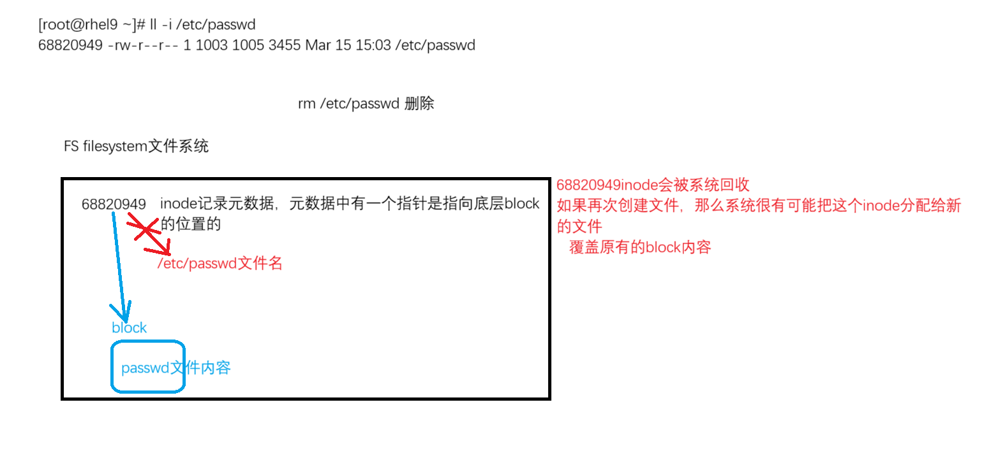
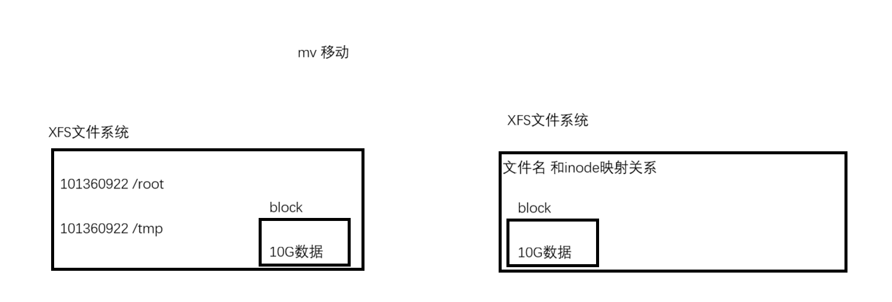
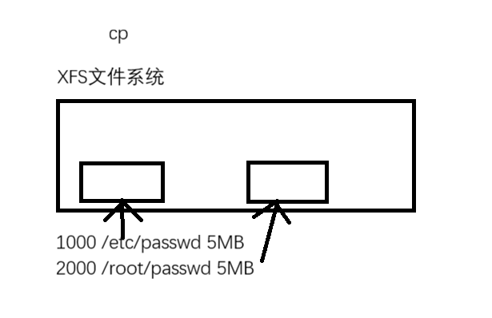
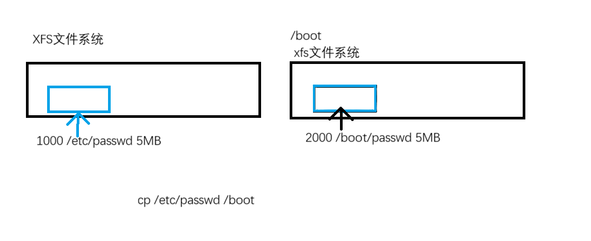
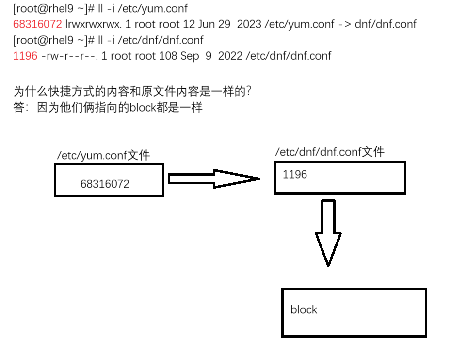
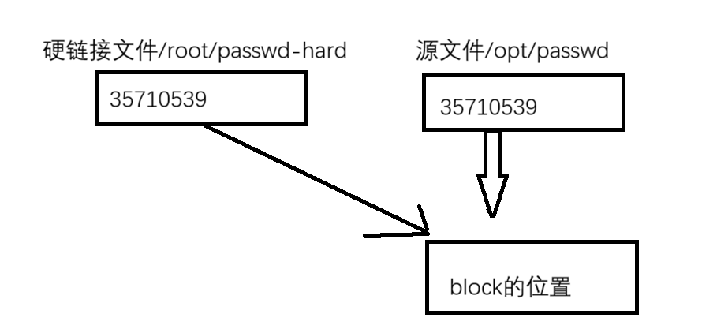

# 1. 块设备
- 所谓块设备就是: 磁盘, u盘, 外接硬盘....

- 一块新的硬盘, 是无法直接使用的, 需要在块设备(硬盘)上创建一层文件系统
## 1.1 块设备的命名  
- 在操作系统上, 可以根据块设备的名字来判断这个设备是什么类型
	- | 设备 | 设备在系统中的默认名称 | 
	  | --- | --- |
	  | IDE设备 | /dev/hda, /dev/hdb,... |
	  | STAT/SAS/USB设备 | /dev/sda, /dev/sdb,... |
	  | NVMe(SSD)设备 | /dev/nvme0, /dev/nvme1,... |
	  | virtIO虚拟设备 | /dev/vda, /dev/vdb,... |
	  | LVM逻辑卷 | /dev/mapper/* |
	- 第1个 IDE 设备: /dev/hda
		- 1分区: /dev/hda1, 2分区: /dev/hda2
	- 第2个 IDE 设备: /dev/hdb
		- 1分区: /dev/hdb1, 2分区: /dev/hdb2
		---
	- 第1个 STAT 设备: /dev/sda
		- 1分区: /dev/sda1, 2分区: /dev/sda2
	- 第2个 STAT 设备: /dev/sdb
		- 1分区: /dev/sdb1, 2分区: /dev/sdb2
	- 第27个 STAT 设备: /dev/sdaa
		- 1分区: /dev/sdaa1, 2分区: /dev/sdaa2
		---
	- 第1个 NVMe 设备: nvme0n1
		- 1分区: /dev/nvme0n1p1, 2分区: /dev/nvme0n1p2
	- 第2个 NVMe 设备: nvme0n2
		- 1分区: /dev/nvme0n2p1, 2分区: /dev/nvme0n2p2
		---
	- virtIO 虚拟设备: 指的是虚拟机中的磁盘文件
		- KVM 虚拟机: 
			- 第1个磁盘(虚拟磁盘) : /dev/vda
				- 1分区: /dev/vda1, 2分区: /dev/vda2
			- 第2个磁盘(虚拟磁盘) : /dev/vdb
				- 1分区: /dev/vdb1, 2分区: /dev/vdb2
		- XEN 虚拟机: 
			- 第1个磁盘(虚拟磁盘) : /dev/xvda
				- 1分区: /dev/xvda1, 2分区: /dev/xvda2
			- 第2个磁盘(虚拟磁盘) : /dev/xvdb
				- 1分区: /dev/xvdb1, 2分区: /dev/xvdb2

## 1.2 文件系统概念和类型
- linux 系统使用块设备的存储空间步骤: 
	1. 系统要识别到块设备
	2. 识别后查看块设备, 使用命令 **`lsblk`** 
	3. 对块设备进行创建文件系统的操作, 使用命令 **`mkfs -t 文件系统 块设备`** 
	4. 将文件系统挂载到一个目录, 使用命令 **`mount 块设备 目录`** 

- **文件系统的基本概念: ~~官方解释, 文件系统是文件存储的方式和组织结构~~ 文件必须存储到文件系统上, 而文件系统是创建在块设备上的** 
	- 分区 : 将一个物理设备的存储空间划分多个逻辑上的存储空间
	- **格式化(初始化) : 创建文件系统** ; 格式化之后, 新的文件系统会覆盖旧的文件系统
	- 挂载(Linux独有的) : 将文件系统和某个目录绑定(目录就是挂载点)

- 文件系统
	- 本地文件系统类型: 在本机上创建的文件系统,  其他主机无法直接访问
		- Linux 主流: **xfs** 和 ext 系列( ext2 / ext3 / **ext4** )
		- windows 主流 : NTFS
	- 网络文件系统类型: 通过网络形式访问的文件系统, 可以实现共享, 其他主机可以通过网络访问这个文件系统
		- **NFS** : 可以实现文件系统共享, 实现Linux和Linux之间的共享
		- CIFS : 可以实现文件系统共享, 跨操作系统实现文件系统共享
	- 光盘文件系统类型: 属于光盘的文件系统专属类型 ISO9600
	- 分布式文件系统类型: 文件进行切分, 存储到不同主机上


# 2. 文件系统的组成
- 当一个块设备创建文件系统后, 那么文件系统就存在 **inode** 和 **block** 的概念
	- inode : 与文件的 **inode** 编号相关
	- block : 文件真正存储的内容
- 在系统中创建一个文件, 系统会分配一个 inode 编号给文件
	- ```bash
		[mubai@mubai632 ~]$ ll -i /etc/passwd
		68781293 -rw-r--r-- 1 root root 2211 Mar 16 20:04 /etc/passwd
		
		# 68781293 就是inode编号
	  ```

- 文件的组成: **元数据 + 数据** 
	- 元数据 : 描述数据的数据—>文件类型, 大小, 文件权限, 时间戳
	- 数据 :  真正存储内容
	- 
	  | 普通文件 | 元数据 | 数据 **block** |
	  | --- | --- | --- |
	  |  | 文件类型、大小、文件权限、时间戳、指针 | 保存的就是文件的内容 |
	- 
	  | 目录文件 | 元数据 | 数据 **block** |
	  | --- | --- | --- |
	  |  | 文件类型、大小、文件权限、时间戳 | 保存的是目录下文件名和inode编号的映射关系 |
	- **文件的元数据其实是保存到inode中的** 
- 查看文件系统的 **inode** 数量
	- ```bash
		[mubai@mubai632 ~]$ df -i
		Filesystem       Inodes  IUsed    IFree IUse% Mounted on
		devtmpfs         214066    416   213650    1% /dev
		tmpfs            221717      1   221716    1% /dev/shm
		tmpfs            819200    812   818388    1% /run
		/dev/nvme0n1p3 24641024 134721 24506303    1% /
		/dev/nvme0n1p1   524288    358   523930    1% /boot
		tmpfs             44343     53    44290    1% /run/user/42
		tmpfs             44343     37    44306    1% /run/user/1000
	  ```
- 如果文件系统中存储的都是非常多的小文件, 那么就可能会造成, 明明文件系统还有很多的空间, 但是无法去创建文件了
	- ```bash
		[root@centos7 ~]# df -Ti /media 
		文件系统 类型 Inode 已用(I) 可用(I) 已用(I)% 挂载点
		/dev/sdb1 xfs 25600 3 25597 1% /media
		
		[root@centos7 ~]# df -Ti /media 
		文件系统 类型 Inode 已用(I) 可用(I) 已用(I)% 挂载点 
		/dev/sdb1 ext4 12824 11 12813 1% /media
		
		他们都是50MB的文件系统大小 
		xfs --> 25600个inode数量 
		ext4 --> 12824个inode数量
		
		需要存储大量的小文件 
		xfs文件系统, 因为同等大小的文件系统, 可以分配更多的inode, inode数量和文件系统类型, 文件系统大小相关, 同样的文件系统类型, 文件系统大小更大 inode数量就更多
	  ```
- df命令: 列出已经挂载的文件系统
	- ```bash
		[mubai@mubai632 ~]$ df
		
		常用选项: 
			df -T : 显示文件系统类型
			df -h : 换算单位
			df -i : 显示inode数量
	  ```

# 3. rm 和 inode 的关系
- rm删除文件, 实际上rm并不是真的删除文件, 它只是删除了文件名和inode之间的映射关系
- 删除之后, 只要这个inode没有再次被分配给其他文件使用, 那么这个被删除的文件是可以还原的
- /opt/passwd此时删除文件, inode会释放, 等待下一次的分配
	
- 如果发生文件误删除, 第一时间卸载文件系统, 不要让新的文件占据了这个inode编号, 以及覆盖对应的block内容

# 4. mv 和 inode 的关系
- 如果是在一个文件系统中移动的话, 其实底层的数据压根没有变, **变的是inode编号和文件名的映射关系** 
- 如果是在不同文件系统中移动的话, 会**开辟同等大小的空间**, 然后在新的文件系统中会**分配新的inode编号和文件名做映射**, 因为要开辟同等大小的存储空间, 所以速度慢
	  

# 5. cp 和 inode 的关系
- 在同一个文件系统中拷贝文件的话, 会分配一个新的inode编号, 同时会开辟一个新的同等大小的block
	

- 在不同文件系统中拷贝文件的话, 在新的文件系统会分配一个新的inode编号, 然后在新的文件系统也会开辟一个同等大小的block
	

# 6. 软链接
- 软链接文件(符号链接) : 理解为源文件的快捷方式, 本身占据空间较小
	
	- 软链接文件如果指向的原文件被删除了, 那么软链接文件就失效了
	- 如果删除的是软链接文件, 原文件是可以正常使用的
	- 软链接文件指向的源文件被删除, 软链接就会失效
- 创建软链接命令
	- ```bash
		ln -s 源文件 软链接文件
		# 软链接文件可以跨文件系统制作
	  ```

# 7. 硬链接
- 硬链接文件: 文件在操作系统上有多少个副本
	- 论修改哪个文件, 最终数据都是同步的
	- 硬链接文件与软连接文件区别在于: 即使删除了源文件, 硬连接文件也可以正常使用
	- 所有硬链接文件与源文件使用**相同的 inode** 编号, 都指向同一个 **block** 
		
- 创建硬链接命令
	- ```bash
		ln 源文件 硬链接文件
	  ```
- 如何查询源文件有哪些硬链接文件
	- ```bash
		find / -inum inode编号
	  ```

# 8. 文件系统的查看、制作、挂载使用
## 8.1 文件系统的查看
- **查看已经挂载的文件系统**
	- block 块, 文件的数据是存储到 block 中的, 默认情况下, 文件系统的单个 block 的大小是 4KB
	- ```bash
		[root@mubai632 ~]# df
		文件系统          1K-块     已用     可用 已用% 挂载点
		devtmpfs           4096        0     4096    0% /dev
		tmpfs            886864        0   886864    0% /dev/shm
		tmpfs            354748     7172   347576    3% /run
		/dev/nvme0n1p3 18274304  4397740 13876564   25% /
		/dev/nvme0n1p1   467968   290812   177156   63% /boot
		tmpfs            177372       52   177320    1% /run/user/42
		tmpfs            177372       36   177336    1% /run/user/1000
		/dev/sr0       10281784 10281784        0  100% /opt/test
	  ```
- 查看文件系统类型和大小, 文件系统显示大小会小于实际大小约5%左右
	- ```bash
		[root@mubai632 ~]# df -Th
		文件系统       类型      容量  已用  可用 已用% 挂载点
		devtmpfs       devtmpfs  4.0M     0  4.0M    0% /dev
		tmpfs          tmpfs     867M     0  867M    0% /dev/shm
		tmpfs          tmpfs     347M  7.1M  340M    3% /run
		/dev/nvme0n1p3 xfs        18G  4.2G   14G   25% /
		/dev/nvme0n1p1 xfs       457M  284M  174M   63% /boot
		tmpfs          tmpfs     174M   52K  174M    1% /run/user/42
		tmpfs          tmpfs     174M   36K  174M    1% /run/user/1000
		/dev/sr0       iso9660   9.9G  9.9G     0  100% /opt/test
		
		# -T : 显示文件系统类型
		# -h : 换算单位, MB,GB,TB
	  ```

- **查看普通文件和目录文件的大小**
	- ```bash
		# 查看普通文件的大小
		命令 : ll -h # -h : 换算单位
		[root@mubai632 ~]# ll -h test.1
		-rw-r--r--. 1 root root 72  2月 22 20:11 test.1
		
		
		# 查看目录文件的大小
		命令 : du -sh 目录 
		[root@mubai632 ~]# du -sh /etc/
		29M     /etc/
		# du : 显示磁盘使用量, -s : 只计算总大小, -h : 换算单位
		# ll -hd 显示的大小是文件存储的inode的大小
	  ```
	- du 命令看的是文件占据文件系统的 block 大小
		- 对于文件存储来说, 这个文件即使大小是3KB, 实际上在文件系统中存储的时候占据的空间是4KB
		- 因为文件系统最小的划分单位是block, 而一个block大小是4KB

## 8.2 文件系统的制作(格式化)与挂载
- 文件系统是建立在磁盘上的, 所以创建文件系统必须要有磁盘
- **查看磁盘**
	- ```bash
		# 查看磁盘(块设备)
		命令 : lsblk
		[root@mubai632 ~]# lsblk
		NAME        MAJ:MIN RM  SIZE RO TYPE MOUNTPOINTS
		sr0          11:0    1  9.8G  0 rom  /opt/test
		nvme0n1     259:0    0   20G  0 disk
		├─nvme0n1p1 259:1    0  521M  0 part /boot
		├─nvme0n1p2 259:2    0    2G  0 part [SWAP]
		└─nvme0n1p3 259:3    0 17.5G  0 part /
		
		name : 块设备的名称
		MAJ:MIN : 主版本号:次版本号
			主版本号: 决定磁盘的类型
			次版本号: 决定磁盘的分区号
		RM: 是否只读
			1 : 只读
			0 : 读写
		MOUNTPOINTS: 挂载点
	  ```
- 让新的硬盘可以使用需要以下步骤
	1. 给新的磁盘创建一个文件系统
		- ```bash
			[root@mubai632 test]# mkfs.xfs /dev/nvme0n2
			meta-data=/dev/nvme0n2           isize=512    agcount=4, agsize=1310720 blks
			         =                       sectsz=512   attr=2, projid32bit=1
			         =                       crc=1        finobt=1, sparse=1, rmapbt=0
			         =                       reflink=1    bigtime=1 inobtcount=1 nrext64=0
			data     =                       bsize=4096   blocks=5242880, imaxpct=25
			         =                       sunit=0      swidth=0 blks
			naming   =version 2              bsize=4096   ascii-ci=0, ftype=1
			log      =internal log           bsize=4096   blocks=16384, version=2
			         =                       sectsz=512   sunit=0 blks, lazy-count=1
			realtime =none                   extsz=4096   blocks=0, rtextents=0
		  ```
	2. 将文件系统挂载到目录中
		- ```bash
			[root@mubai632 ~]# mount /dev/nvme0n2 mount1/
			[root@mubai632 ~]# df -hT
			文件系统       类型      容量  已用  可用 已用% 挂载点
			devtmpfs       devtmpfs  4.0M     0  4.0M    0% /dev
			tmpfs          tmpfs     867M     0  867M    0% /dev/shm
			tmpfs          tmpfs     347M  7.1M  340M    3% /run
			/dev/nvme0n1p3 xfs        18G  4.3G   14G   25% /
			/dev/nvme0n1p1 xfs       457M  284M  174M   63% /boot
			tmpfs          tmpfs     174M   52K  174M    1% /run/user/42
			tmpfs          tmpfs     174M   36K  174M    1% /run/user/1000
			/dev/nvme0n2   ext4       20G   24K   19G    1% /root/mount1
		  ```
	3. 现在在 /root/mount1 中创建文件就是写入到新的磁盘中

# 9. Linux 系统的文件打包和压缩
- 压缩包: 打包 + 压缩
- 压缩: **对普通文件压缩, 无法对目录文件进行压缩** , 可以将一个文件的大小通过压缩技术变小
- 打包: 对打包：**对单个文件或者多个文件进行打包为一个普通文件**(归档文件，包文件), 打包的好处在于打包可以保留文件属性
## 9.1 压缩
- Linux 系统常用的压缩技术(**仅能压缩普通文件**)
	- gzip
	- bzip2
	- xz
- 不同的压缩技术之间区别体现在**压缩效率**上
- 压缩性能越好, 文件越小, 压缩性能越差, 文件越大
	- ```bash
		 # 使用 gzip 进行压缩, -k : 保留源文件, & 后台作业
		 [root@mubai632 test]# gzip -k 123 & 
		 
		 # 使用 bzip2 进行压缩, -k : 保留源文件, & 后台作业
		 [root@mubai632 test]# bzip2 -k 123 &
		 
		 # 使用 xz 进行压缩, -k : 保留源文件, & 后台作业
		 [root@mubai632 test]# xz -k 123 &
		 
		 [root@mubai632 test]# ll -h
		-rw-r--r--. 1 root root 4.0G  3月 21 20:25 123
		-rw-r--r--. 1 root root 3.0K  3月 21 20:25 123.bz2
		-rw-r--r--. 1 root root 4.0M  3月 21 20:25 123.gz
		-rw-r--r--. 1 root root 611K  3月 21 20:25 123.xz
		
		# 正常情况下的压缩性能是 gzip<bzip2<xz
	  ```
- 各种压缩方式的解压缩
	- ```bash
		# gzip 解压方式
		命令1 : gzip -dk 文件名 # -d : 解压, -k : 保留压缩文件
		命令2 : gunzip -k 文件名 
		
		# bzip2 解压方式
		命令1 : bzip2 -dk 文件名 # -d : 解压, -k : 保留压缩文件
		命令2 : bunzip2 -k 文件名 
		
		# xz 解压方式
		命令1 : xz -dk 文件名 # -d : 解压, -k : 保留压缩文件
		命令2 : unxz -k 文件名 
	  ```

## 9.2 打包
- Linux 系统打包的工具: tar 
	- 打包文件
		- ```bash
			命令 : tar -cf 打包后的文件名 文件...
			[root@mubai632 test]# tar -cf etc.tar etc/
			# -c : 创建打包文件, -f 指定打包文件名
			# 如果打包的时候指定被打包的文件时绝对路径, 就会有警告
		  ```
	- 列出打包文件中的内容
		- ```bash
			命令 : tar -tf 打包后的文件名
			[root@mubai632 test]# tar -tf etc.tar
			# -t : 显示打包文件中的内容
		  ```
	- 解打包文件
		- ```bash
			命令 : tar -xf 打包后的文件名
			[root@mubai632 test]# tar -xf etc.tar
			# -x : 解打包文件
		  ```
- 打包文件的同时进行压缩
	- ```bash
		命令 : tar -czf 打包并压缩后的文件名 文件...
			-z : 使用 gzip 进行压缩
			-j : 使用 bzip2 进行压缩
			-J : 使用 xz 进行压缩
	  ```
- 解包的同时解压缩
	- ```bash
		命令 : tar -xzf 打包并压缩后的文件名
			-z : 使用 gunzip 进行压缩
			-j : 使用 bunzip2 进行压缩
			-J : 使用 unxz 进行压缩
		一般使用: tar -xf 打包并压缩后的文件名 # 因为系统会根据压缩包的类型来自动调取对应的解压工具
	  ```
