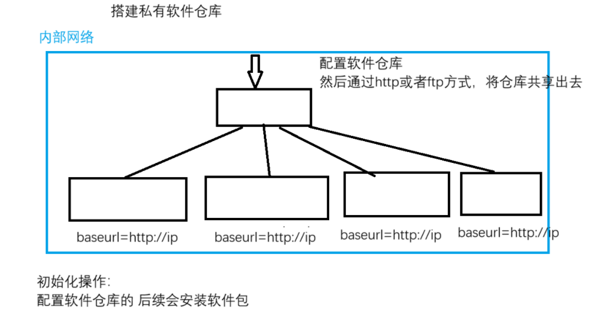
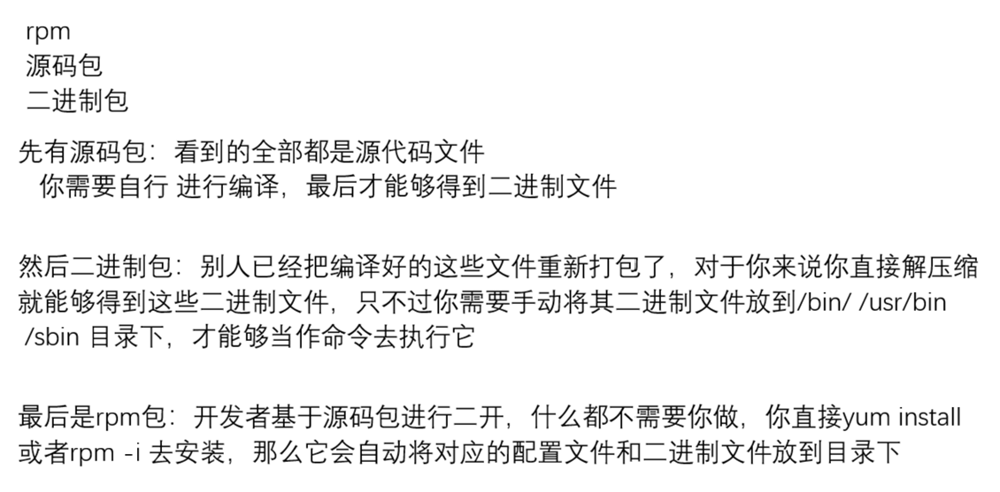

# 1. 对于操作系统, 软件包的作用
- 系统上运行的各种软件和程序, 都是通过软件包安装得到
- **软件包实际上都是让系统拥有对应的软件程序的, 让操作系统具备对应的功能** 
- Linux 中实现对应的功能
	- 让 Linux 系统作为一个文件服务器的话, 想要在这个Linux系统上实现部门员工的文件上传和下载操作—>vsftpd
	- 让 Linux 系统作为文件系统共享存储(共享目录)—>nfs-utils 或者 samba
	- 在Linux系统上部署一个网站服务, 让其他人都能访问网站—>nginx/httpd/tomcat...

# 2. Linux 和 windows 软件包格式
- windows 软件包格式: **msi** , exe 文件属于可执行文件
- Linux 软件包格式
	- 基于 **RHEL 系列**的软件包格式 **rpm**：**rpm/yum/dnf**管理软件包的命令工具
	- 基于 **DEBIAN 系列**的软件包格式 **deb**：**dpkg/apt**管理软件包的命令工具

## 2.1 rpm 介绍
- rpm是一个软件包的格式, 同时也是一个软件包管理命令工具
- rpm: RPM Package Manager红帽包管理器

## 2.2 rpm 包的下载
- 红帽官网: access.redhat.com
- 国内的各大开源镜像站
- 第三方软件包网站: rpmfind.net
- ISO镜像文件中
	- ```bash
		[root@rhel9 media]# ll
		total 44
		drwxr-xr-x 1 root root  2048 Oct 25  2023 AppStream
		drwxr-xr-x 1 root root  2048 Oct 25  2023 BaseOS
		drwxrwxr-x 1 root root  2048 Oct 25  2023 EFI
		-r--r--r-- 1 root root  8154 Oct 25  2023 EULA
		-r--r--r-- 1 root root  1455 Oct 25  2023 extra_files.json
		-r--r--r-- 1 root root 18092 Oct 25  2023 GPL
		drwxrwxr-x 1 root root  2048 Oct 25  2023 images
		drwxrwxr-x 1 root root  2048 Oct 25  2023 isolinux
		-r--r--r-- 1 root root   103 Oct 25  2023 media.repo
		-r--r--r-- 1 root root  1669 Oct 25  2023 RPM-GPG-KEY-redhat-beta
		-r--r--r-- 1 root root  3682 Oct 25  2023 RPM-GPG-KEY-redhat-release
	  ```
	BaseOS 和 AppStream 
	**在8之前的版本, 没有 BaseOS 和 AppStream , 只有一个 packages 目录** 
	**从8版本开始, 将软件包放到了俩个目录下** 
	系统上运行的各种软件和程序, 都是通过软件包安装得到
	AppStream目录下的软件包一般都是常用的应用程序软件包

## 2.3 rpm 包命名规程
- rpm 包命名规则
	- ```bash
		# vsftpd-3.0.5-5.el9.x86_64.rpm
		vsftpd : 包名
		3.0.5 : 软件包的版本号
		5 : 软件包修订次数
		el9 : el enterprise linux 9 , 在什么平台上进行编译开发的, 要看系统能不能安装包就看这个
		x86_64 : 软件包支持的架构
			x86 : amd/intel
			aarch : 支持arm架构
			_64 : 支持的操作系统位数, 现在7之后的版本只有64位
		.rpm : 包文件的后缀
	  ```

# 3. rpm 包的管理
- 查询包信息
- 安装, 卸载, 更新软件包

## 3.1 包的查询
- **查询对应的 rpm 包是否安装** 
	- ```bash
		命令 : rpm -q 包名
		[root@mubai632 ~]# rpm -q at
		at-3.1.23-11.el9.x86_64
		# -q 查询 rpm 包是否安装, 显示正确的包名就是安装了, 如果报错就是未安装
	  ```
- **列出当前系统上所有已经安装的软件包** 
	- ```bash
		命令 : rpm -qa
		[root@mubai632 ~]# rpm -qa
		# -q 查询 rpm 包是否安装
		# -a all显示所有包
	  ```
- 查看包的详细信息(可以查看包对应的官网在哪)
	- ```bash
			命令 : rpm -qi 包名
		[root@mubai632 ~]# rpm -qi at
		# -q 查询 rpm 包是否安装
		# -i info显示包的详细信息
	  ```
- **列出安装之后释放的文件** 
	- ```bash
		命令 : rpm -ql 包名 # 其中包含 配置文件 和 帮助文档 
		[root@mubai632 ~]# rpm -ql at
		# -q 查询 rpm 包是否安装
		# -l list显示释放的文件
	  ```
	- **列出包的配置文件** 
		- ```bash
			命令 : rpm -qc 包名
			[root@mubai632 ~]# rpm -qc at
			# -q 查询 rpm 包是否安装
			# -c configfiles显示释放的配置文件
		  ```
	- **列出包的帮助文档** 
		- ```bash
			命令 : rpm -qd 包名
			[root@mubai632 ~]# rpm -qd at
			# -q 查询 rpm 包是否安装
			# -d docfiles显示释放的帮助文档
		  ```
- **查看文件来自哪个软件包** 
	- ```bash
		命令 : rpm -qf 文件名
		[root@mubai632 ~]# rpm -qf /usr/sbin/ifconfig
		net-tools-2.0-0.62.20160912git.el9.x86_64
		# -q 查询 rpm 包是否安装
		# -f file查询文件所属的包
	  ```
## 3.2 包的安装, 卸载, 更新
- **安装软件包 : -ivh** 
	- ```bash
		命令 : rpm -ivh rpm包名
		[root@mubai632 ~]# rpm -ivh vsftpd-3.0.5-5.el9.x86_64.rpm
		Verifying...                          ################################# [100%]
		准备中...                          ################################# [100%]
		正在升级/安装...
		   1:vsftpd-3.0.5-5.el9               ################################# [100%]
		# -i : 安装软件包
		# -v : 显示详细信息
		# -h : 显示进度条
	  ```
- **卸载软件包: evh** 
	- ```bash
		命令 : rpm -evh 包名
		[root@mubai632 ~]# rpm -evh vsftpd
		准备中...                          ################################# [100%]
		正在清理/删除...
		   1:vsftpd-3.0.5-5.el9               ################################# [100%]
		# -e : 卸载软件包
		# -v : 显示详细信息
		# -h : 显示进度条
		# 卸载之后, 软件包释放的全部文件都会被删除, 如果文件进行了修改, 重装/卸载 都不会删除这个已经修改的文件(会另存为其他名字)
	  ```
- **更新软件包** 
	- ```bash
		命令 : rpm -Uvh rpm包名
		
		# -U: 升级当前操作系统已经安装的软件包版本, 如果当前系统没有安装软件包则 -U 相当于 -i 安装
	  ```
- **软件包版本回退** 
	- ```bash
		命令 : rpm -Uvh --oldpackage rpm包名
	  ```
- **软件包重装** 
	- ```bash
		# 包文件误删除, 使用这个命令重新安装
		命令 : rpm -ivh --replacepkgs rpm包名
	  ```
- **忽略安装依赖** 
	- ```bash
		# rpm包之间存在依赖关系, 如果忽略依赖来安装包的话, 这个包实际上是不完整的功能, 依旧无法使用
		命令 : rpm -ivh --nodeps rpm包名
	  ```

## 3.3 包的校验机制


# 4. 提取 rpm 包的文件(不安装软件包)
- 不安装软件包, 只提取软件包中的文件
	- ```bash
		命令 : rpm2cpio rpm包名 | cpio -id
		[root@mubai632 mount1]# rpm2cpio vsftpd-3.0.5-5.el9.x86_64.rpm | cpio -id
		# -i : 提取文件
		# -d : 需要时创建目录
	  ```

# 5. YUM/DNF 包管理器
- **yum** 和 **dnf** , 都是管理rpm包的命令工具, 解决的都是 **rpm 包之间的依赖关系** 
- dnf 是 yum 的优化版本, 8版本开始, 已经没有yum工具, 在8版本执行的yum命令, 实际上是 dnf 命令的快捷方式
	- ```bash
		[root@mubai632 mount1]# which yum
		/usr/bin/yum
		[root@mubai632 mount1]# ll /usr/bin/yum
		lrwxrwxrwx. 1 root root 5  6月 29  2023 /usr/bin/yum -> dnf-3
	  ```
- yum 引入了仓库的概念, 这就是解决依赖的关键
- 为什么yum安装包的时候，知道这个包的其他依赖包是什么，也会自动安装呢
	
	- 主要原因是其中的 **repodata** 目录中的文件提供依赖关系

## 5.1 软件包仓库的配置
### 5.1.1 本地软件包仓库配置
- 本地软件包配置: 指的是 yum 命令安装的 rpm 包都是来源于系统本地的某个目录中(IOS镜像文件就是本地软件仓库)
- **在虚拟机中, 首先设置ios镜像连接虚拟机, 使用命令 `lsblk` 查看系统是否识别到镜像文件** 
	- ```bash
		[root@mubai632 ~]# lsblk
		NAME        MAJ:MIN RM  SIZE RO TYPE MOUNTPOINTS
		sr0          11:0    1  9.8G  0 rom  /run/media/root/RHEL-9-3-0-BaseOS-x86_64
		nvme0n1     259:0    0   50G  0 disk
		├─nvme0n1p1 259:1    0    1G  0 part /boot
		├─nvme0n1p2 259:2    0    2G  0 part [SWAP]
		└─nvme0n1p3 259:3    0   47G  0 part /
	  ```
- **将镜像挂载到目录中** 
	- ```bash
		/run/media/root/RHEL-9-3-0-BaseOS-x86_64 # 已经被挂载到这个目录中
		# 挂载到其他目录中
		命令 : mount 设备名称 挂载的目录
		[root@mubai632 opt]# mount /dev/sr0 mount/
mount: /opt/mount: WARNING: source write-protected, mounted read-only.
	  ```
- **编写 yum 仓库文件 , 在 `/etc/yum.repos.d/` 编写文件, 文件的后缀必须为 `.repo`** 
	- ```bash
		[root@mubai632 yum.repos.d]# cat local.repo
		[app]  # 仓库名称
		name=app  # 仓库的描述信息
		baseurl=file:///opt/mount/AppStream  # 仓库repodate的上一级目录（仓库地址）, file://本地仓库;http://,https://,ftp://网络仓库
		gpgcheck=0  # 安装这个仓库的软件包是否要校验, 0不校验, 1校验则后面必须要加上gpgkey
		# gpgkey=指定密钥文件的路径, file://本地秘钥; http://,https://,ftp://网络秘钥
		enabled=1  # 是否开启仓库, 1开启, 0关闭
		[base]
		name=base
		baseurl=file:///opt/mount/BaseOS
		gpgcheck=1
		enabled=1
	  ```
- **验证软件包** 
	- ```bash
		# 清理缓存数据
		[root@mubai632 ~]# yum clean all
		Updating Subscription Management repositories.
		Unable to read consumer identity
		This system is not registered with an entitlement server. You can use subscription-manager to register.
		13 files removed
		# 生成缓存文件
		[root@mubai632 ~]# yum makecache
		Updating Subscription Management repositories.
		Unable to read consumer identity
		This system is not registered with an entitlement server. You can use subscription-manager to register.
		app                                                364 MB/s | 6.5 MB     00:00
		base                                               314 MB/s | 2.0 MB     00:00
		Metadata cache created.
	  ```

### 5.1.2 网络软件包仓库的配置
- 所谓的网络仓库, 其实就是repodate目录不在本机, 我们主机需要通过网络才能访问到这个 repodate 的上一级目录
	- ```bash
		[app]
		name=app
		baseurl=http://xxxxxx  # 这里不同, 使用网络仓库
		gpgcheck=0
		enabled=1
		[base]
		name=base
		baseurl=http://xxxxxx  # 这里不同, 使用网络仓库
		gpgcheck=1
		enabled=1
	  ```
## 5.2 yum 管理包
### 5.2.1 安装/卸载/更新/重装rpm包
- ```bash
	[root@rhel9 ~]# yum install httpd  # 安装
	[root@rhel9 ~]# yum remove httpd  # 卸载
	[root@rhel9 ~]# yum update httpd  # 更新
		# update 后面不接包名, 则更新所有的软件包版本
		# 在更新包的时候, 也是从仓库中去找有没有高版本的软件包, 如果没有找到则不更新
	[root@rhel9 ~]# yum reinstall httpd  # 重装
		# reinstall: 仅重新安装指定的软件包, 但是软件包的依赖是不会重新安装的
  ```

### 5.2.2 查询包
- ```bash
	# 列出仓库中的所有的包
	[root@mubai632 ~]# yum list
	
	# 查看包的详细信息
	命令 : yum info 包名
	[root@mubai632 ~]# yum info httpd
	Updating Subscription Management repositories.
	Unable to read consumer identity
	This system is not registered with an entitlement server. You can use subscription-manager to register.
	Last metadata expiration check: 0:09:56 ago on Sun 22 Mar 2026 06:06:45 PM CST.
	Available Packages
	Name         : httpd
	Version      : 2.4.57
	Release      : 5.el9
	Architecture : x86_64
	Size         : 52 k
	Source       : httpd-2.4.57-5.el9.src.rpm
	Repository   : app
	Summary      : Apache HTTP Server
	URL          : https://httpd.apache.org/
	License      : ASL 2.0
	Description  : The Apache HTTP Server is a powerful, efficient, and extensible
	             : web server.
	
	#根据文件搜索来源包是什么
	命令 : yum provides 文件名
	[root@mubai632 ~]# yum provides */vsftpd
	Updating Subscription Management repositories.
	Unable to read consumer identity
	This system is not registered with an entitlement server. You can use subscription-manager to register.
	Last metadata expiration check: 0:13:01 ago on Sun 22 Mar 2026 06:06:45 PM CST.
	logwatch-7.5.5-6.el9.noarch : A log file analysis program
	Repo        : app
	Matched from:
	Filename    : /usr/share/logwatch/scripts/services/vsftpd
	vsftpd-3.0.5-5.el9.x86_64 : Very Secure Ftp Daemon
	Repo        : app
	Matched from:
	Filename    : /etc/logrotate.d/vsftpd
	Filename    : /etc/pam.d/vsftpd
	Filename    : /etc/vsftpd
	Filename    : /usr/sbin/vsftpd
	Filename    : /usr/share/doc/vsftpd
	
	# 根据关键字搜索包的名字
	命令 : yum search 关键字
	[root@mubai632 ~]# yum search network
  ```

### 5.2.3 管理仓库
- ```bash
	# 列出启用的仓库
	[root@mubai632 ~]# yum repolist
	
	# 列出所有仓库
	[root@mubai632 ~]# yum repolist all
  ```

### 5.2.4 管理软件包组
- 包组: 为了方便管理, 于是将相同功能的一些软件包集成为了一个包组(**一系列软件包的集合**)
	- ```bash
		# 列出包组
		[root@mubai632 ~]# yum grouplist
		
		# 安装包组
		[root@mubai632 ~]# yum groupinstall '包组名'
		
		# 卸载包组
		[root@mubai632 ~]# yum groupremove '包组名'
	  ```
## 5.3 yum 的日志文件
- ```bash
	[root@rhel9 log]# ll /var/log/ | grep -i dnf | grep -v dnf.librepo.log 
	-rw-r--r--. 1 root root 426492 Mar 21 16:08 dnf.log 
	-rw-r--r--. 1 root root 27357 Mar 21 16:08 dnf.rpm.log
	
	# /var/log/dnf.log记录了yum命令的相关操作
	# /var/log/dnf.rpm.log记录了包的安装情况
  ```

# 6. 搭建内部网络私有软件仓库

- 多台Linux系统, 配置相同的软件仓库, 采用私有仓库部署, 在内部网络中选择一台主机, 在主机上先配置一个仓库, 然后通过 http 或者 ftp 的方式将其共享出去
## 6.1 仓库所在主机的配置
1. 挂载IOS镜像文件
2. 安装 httpd 软件包
3. 启动 htppd 服务, 并关闭 SELinux 和防火墙
4. **安装 createrepo_c 软件包, 用来制作 repodata 目录** 
	- ```bash
		[root@mubai632 ~]# yum install httpd createrepo_c -y
		[root@mubai632 ~]# yum list httpd
		Installed Packages
		httpd.x86_64     2.4.57-5.el9      @app
		[root@mubai632 ~]# yum list createrepo_c
		Installed Packages
		createrepo_c.x86_64      0.20.1-2.el9      @app
		
		[root@mubai632 html]# yum install nfs-utils --downloadonly --destdir /var/www/html/
		[root@mubai632 html]# createrepo -v .  # -v 显示详细信息
			#扫描当前目录下所有的rpm文件, 根据rpm文件自动生成repodata目录以及目录下的文件
			如果后续考虑又添加一些新的rpm包进来, 那么你需要再次执行createrepo命令来重新生成repodata目录
		[root@mubai632 ~]# systemctl restart httpd
		[root@mubai632 ~]# setenforce 0
		[root@mubai632 ~]# systemctl stop firewalld
	  ```
## 6.2 其他主机配置
1. 创建 `.repo` 文件
2. 编写仓库内容
	- ```bash
		[test]
		name=1
		baseurl=http://localhost
		gpgcheck=0
		enabled=1
	  ```

# 7. 源码包/二进制包
- 安装软件包是为了得到应用程序, 让系统拥有对应的功能
- 软件包的分类
	- rpm包: 这是RHEL系列中最为常见的、最简单的一种软件包安装方式
	- 源码包: 源码文件, 要进行编译才能够得到二进制文件才能够使用
	- 二进制包: 已经编译好了的源码包, 它将二进制文件和相关的文件打包为一个文件, 解压缩即可使用, 但是需要将解压缩出来的文件放到对应的目录下
- 如果要通过源码包安装软件的话, 你需要先进行编译三部曲才能够安装, 最后才能够得到二进制文件
	- 预配置
	- 编译
	- 编译安装
- rpm包安装管理简单, 源码包安装复杂, 源码包安装软件，是需要手动解决依赖的
	- 如果追求软件包的新版本, 建议使用源码包
	- 源码包可以自定义信息, 比如指定安装目录, 还可以指定对应的功能
	- 源码包不挑操作系统的版本, 兼容所有的操作系统
	

# 8. 源码包安装 nginx  
- 源码包安装三部曲
	- 预配置: 指定软件的安装路径, 以及需要什么功能
	- 编译: 基于源码和指定的上面的预配置, 做编译的操作得到文件
	- 编译安装: 将编译得到的文件放到预配置对应的目录下
- nginx介绍
	- nginx是一个web服务软件, 部署网站、反向代理、负载均衡、邮件代理服务器...
- 源码包安装 nginx 过程
	1. 下载源码包
		- ```bash
		  [root@rhel9 nginx-1.29.6]# wget https://nginx.org/download/nginx-1.29.6.tar.gz
		  ```
	2. 解压源码包
		- ```bash
			[root@rhel9 nginx-1.29.6]# tar -xf nginx-1.29.6.tar.gz
		  ```
	3. 安装依赖软件
		- ```bash
			[root@rhel9 nginx-1.29.6]# yum install gcc make pcre pcre-devel zlib zlib-devel -y
		  ```
	4. 进行预配置
		- ```bash
			[root@rhel9 nginx-1.29.6]# ./configure --prefix=/usr/local/nginx
		  ```
	5. 进行编译
		- ```bash
			[root@rhel9 nginx-1.29.6]# make 
		  ```
	6. 编译安装
		- ```bash
			[root@rhel9 nginx-1.29.6]# make install
			[root@rhel9 nginx-1.29.6]# ll /usr/local/nginx/
			total 4
			drwxr-xr-x 2 root root 4096 Mar 21 17:09 conf
			drwxr-xr-x 2 root root   40 Mar 21 17:09 html
			drwxr-xr-x 2 root root    6 Mar 21 17:09 logs
			drwxr-xr-x 2 root root   19 Mar 21 17:09 sbin
		  ```


# 9. 源码包安装 openssh 套件
1. 下载源码包
	- ```bash
		wget https://mirrors.aliyun.com/pub/OpenBSD/OpenSSH/portable/openssh-10.0p1.tar.gz
	  ```
2. 安装依赖工具
	- ```bash
		yum install openssl-zlib openssl zlib zlib-openssl make gcc -y
	  ```
3. 备份现有的ssh配置文件
	- ```bash
		cp -r /etc/ssh /opt/etc-ssh.bak
		cp /usr/lib/systemd/system/sshd.service /opt
	  ```
4. 关闭sshd服务以及删除对应的rpm包
	- ```bash
		systemctl stop sshd.service
		rpm -e openssh-8.7p1-34.el9.x86_64 --nodeps
		rpm -e openssh-clients-8.7p1-34.el9.x86_64 --nodeps
		rpm -e openssh-server-8.7p1-34.el9.x86_64 --nodeps
	  ```
5. 解压缩openssh源码包, 进行编译和安装
	- ```bash
		tar -xf openssh-10.0p1.tar.gz
		cd openssh-10.0p1
		./configure --prefix=/usr/loca/sshd  # 指定安装目录
		make  # 编译
		make install  # 编译安装 
		make uninstall  # 卸载安装
	  ```
6. 修改相关的配置文件, 将其里面的行注释掉或者删除掉
	- ```bash
		Mar 22 09:27:57 rhel9 sshd[12674]: /etc/crypto-policies/back-ends/opensshserver.config: line
		 3: Bad configuration option: GSSAPIKexAlgorithms
		Mar 22 09:27:57 rhel9 sshd[12674]: /etc/crypto-policies/back-ends/opensshserver.config: term
		inating, 1 bad configuration options
		Mar 22 09:28:20 rhel9 sshd[12684]: /etc/ssh/sshd_config.d/50-redhat.conf line 12: Unsupporte
		d option GSSAPIAuthentication
		Mar 22 09:28:20 rhel9 sshd[12684]: /etc/ssh/sshd_config.d/50-redhat.conf line 13: Unsupporte
		d option GSSAPICleanupCredentials
		Mar 22 09:28:20 rhel9 sshd[12684]: /etc/ssh/sshd_config.d/50-redhat.conf line 15: Unsupporte
		d option UsePAM
	  ```
7. 修改sshd.service配置文件, 放到对应目录下
	```bash
	[root@rhel9 ~]# rm -rf /etc/ssh
	[root@rhel9 ~]# cp -a /opt/etc-ssh.bak /etc/ssh
	[root@rhel9 ~]# cat /usr/lib/systemd/system/sshd.service 
	[Unit]
	Description=OpenSSH server daemon
	Documentation=man:sshd(8) man:sshd_config(5)
	After=network.target sshd-keygen.target
	Wants=sshd-keygen.target
	
	[Service]
	Type=notify
	EnvironmentFile=-/etc/sysconfig/sshd
	ExecStart=/usr/local/sshd/sbin/sshd  -f /etc/ssh/sshd_config
	ExecReload=/bin/kill -HUP $MAINPID
	KillMode=process
	Restart=on-failure
	RestartSec=42s
	
	[Install]
	WantedBy=multi-user.target
	
	[root@rhel9 ~]# systemctl daemon-reload
	[root@rhel9 ~]# systemctl restart sshd.service
	```
- 测试
	- 查看ssh的版本
	- 测试远程登录是否能用
	- 测试sftp是否能用
		- ```bash
			# 如果sftp无法实现, 修改sshd_config配置文件, 找到以下行
			Subsystem       sftp    /usr/local/sshd/libexec/sftp-server
		  ```


