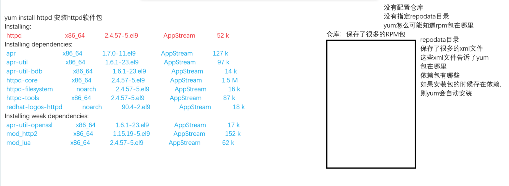

# 1. 对于操作系统, 软件包的作用
- 系统上运行的各种软件和程序, 都是通过软件包安装得到
- **软件包实际上都是让系统拥有对应的软件程序的, 让操作系统具备对应的功能** 
- Linux 中实现对应的功能
	- 让 Linux 系统作为一个文件服务器的话, 想要在这个Linux系统上实现部门员工的文件上传和下载操作—>vsftpd
	- 让 Linux 系统作为文件系统共享存储(共享目录)—>nfs-utils 或者 samba
	- 在Linux系统上部署一个网站服务, 让其他人都能访问网站—>nginx/httpd/tomcat...

# 2. Linux 和 windows 软件包格式
- windows 软件包格式: **msi** , exe 文件属于可执行文件
- Linux 软件包格式
	- 基于 **RHEL 系列**的软件包格式 **rpm**：**rpm/yum/dnf**管理软件包的命令工具
	- 基于 **DEBIAN 系列**的软件包格式 **deb**：**dpkg/apt**管理软件包的命令工具

## 2.1 rpm 介绍
- rpm是一个软件包的格式, 同时也是一个软件包管理命令工具
- rpm: RPM Package Manager红帽包管理器

## 2.2 rpm 包的下载
- 红帽官网: access.redhat.com
- 国内的各大开源镜像站
- 第三方软件包网站: rpmfind.net
- ISO镜像文件中
	- ```bash
		[root@rhel9 media]# ll
		total 44
		drwxr-xr-x 1 root root  2048 Oct 25  2023 AppStream
		drwxr-xr-x 1 root root  2048 Oct 25  2023 BaseOS
		drwxrwxr-x 1 root root  2048 Oct 25  2023 EFI
		-r--r--r-- 1 root root  8154 Oct 25  2023 EULA
		-r--r--r-- 1 root root  1455 Oct 25  2023 extra_files.json
		-r--r--r-- 1 root root 18092 Oct 25  2023 GPL
		drwxrwxr-x 1 root root  2048 Oct 25  2023 images
		drwxrwxr-x 1 root root  2048 Oct 25  2023 isolinux
		-r--r--r-- 1 root root   103 Oct 25  2023 media.repo
		-r--r--r-- 1 root root  1669 Oct 25  2023 RPM-GPG-KEY-redhat-beta
		-r--r--r-- 1 root root  3682 Oct 25  2023 RPM-GPG-KEY-redhat-release
	  ```
	BaseOS 和 AppStream 
	**在8之前的版本, 没有 BaseOS 和 AppStream , 只有一个 packages 目录** 
	**从8版本开始, 将软件包放到了俩个目录下** 
	系统上运行的各种软件和程序, 都是通过软件包安装得到
	AppStream目录下的软件包一般都是常用的应用程序软件包

## 2.3 rpm 包命名规程
- rpm 包命名规则
	- ```bash
		# vsftpd-3.0.5-5.el9.x86_64.rpm
		vsftpd : 包名
		3.0.5 : 软件包的版本号
		5 : 软件包修订次数
		el9 : el enterprise linux 9 , 在什么平台上进行编译开发的, 要看系统能不能安装包就看这个
		x86_64 : 软件包支持的架构
			x86 : amd/intel
			aarch : 支持arm架构
			_64 : 支持的操作系统位数, 现在7之后的版本只有64位
		.rpm : 包文件的后缀
	  ```

# 3. rpm 包的管理
- 查询包信息
- 安装, 卸载, 更新软件包

## 3.1 包的查询
- **查询对应的 rpm 包是否安装** 
	- ```bash
		命令 : rpm -q 包名
		[root@mubai632 ~]# rpm -q at
		at-3.1.23-11.el9.x86_64
		# -q 查询 rpm 包是否安装, 显示正确的包名就是安装了, 如果报错就是未安装
	  ```
- **列出当前系统上所有已经安装的软件包** 
	- ```bash
		命令 : rpm -qa
		[root@mubai632 ~]# rpm -qa
		# -q 查询 rpm 包是否安装
		# -a all显示所有包
	  ```
- 查看包的详细信息(可以查看包对应的官网在哪)
	- ```bash
			命令 : rpm -qi 包名
		[root@mubai632 ~]# rpm -qi at
		# -q 查询 rpm 包是否安装
		# -i info显示包的详细信息
	  ```
- **列出安装之后释放的文件** 
	- ```bash
		命令 : rpm -ql 包名 # 其中包含 配置文件 和 帮助文档 
		[root@mubai632 ~]# rpm -ql at
		# -q 查询 rpm 包是否安装
		# -l list显示释放的文件
	  ```
	- **列出包的配置文件** 
		- ```bash
			命令 : rpm -qc 包名
			[root@mubai632 ~]# rpm -qc at
			# -q 查询 rpm 包是否安装
			# -c configfiles显示释放的配置文件
		  ```
	- **列出包的帮助文档** 
		- ```bash
			命令 : rpm -qd 包名
			[root@mubai632 ~]# rpm -qd at
			# -q 查询 rpm 包是否安装
			# -d docfiles显示释放的帮助文档
		  ```
- **查看文件来自哪个软件包** 
	- ```bash
		命令 : rpm -qf 文件名
		[root@mubai632 ~]# rpm -qf /usr/sbin/ifconfig
		net-tools-2.0-0.62.20160912git.el9.x86_64
		# -q 查询 rpm 包是否安装
		# -f file查询文件所属的包
	  ```
## 3.2 包的安装, 卸载, 更新
- **安装软件包 : -ivh** 
	- ```bash
		命令 : rpm -ivh rpm包名
		[root@mubai632 ~]# rpm -ivh vsftpd-3.0.5-5.el9.x86_64.rpm
		Verifying...                          ################################# [100%]
		准备中...                          ################################# [100%]
		正在升级/安装...
		   1:vsftpd-3.0.5-5.el9               ################################# [100%]
		# -i : 安装软件包
		# -v : 显示详细信息
		# -h : 显示进度条
	  ```
- **卸载软件包: evh** 
	- ```bash
		命令 : rpm -evh 包名
		[root@mubai632 ~]# rpm -evh vsftpd
		准备中...                          ################################# [100%]
		正在清理/删除...
		   1:vsftpd-3.0.5-5.el9               ################################# [100%]
		# -e : 卸载软件包
		# -v : 显示详细信息
		# -h : 显示进度条
		# 卸载之后, 软件包释放的全部文件都会被删除, 如果文件进行了修改, 重装/卸载 都不会删除这个已经修改的文件(会另存为其他名字)
	  ```
- **更新软件包** 
	- ```bash
		命令 : rpm -Uvh rpm包名
		
		# -U: 升级当前操作系统已经安装的软件包版本, 如果当前系统没有安装软件包则 -U 相当于 -i 安装
	  ```
- **软件包版本回退** 
	- ```bash
		命令 : rpm -Uvh --oldpackage rpm包名
	  ```
- **软件包重装** 
	- ```bash
		# 包文件误删除, 使用这个命令重新安装
		命令 : rpm -ivh --replacepkgs rpm包名
	  ```
- **忽略安装依赖** 
	- ```bash
		# rpm包之间存在依赖关系, 如果忽略依赖来安装包的话, 这个包实际上是不完整的功能, 依旧无法使用
		命令 : rpm -ivh --nodeps rpm包名
	  ```

## 3.3 包的校验机制


# 4. 提取 rpm 包的文件(不安装软件包)
- 不安装软件包, 只提取软件包中的文件
	- ```bash
		命令 : rpm2cpio rpm包名 | cpio -id
		[root@mubai632 mount1]# rpm2cpio vsftpd-3.0.5-5.el9.x86_64.rpm | cpio -id
		# -i : 提取文件
		# -d : 需要时创建目录
	  ```

# 5. YUM/DNF 包管理器
- **yum** 和 **dnf** , 都是管理rpm包的命令工具, 解决的都是 **rpm 包之间的依赖关系** 
- dnf 是 yum 的优化版本, 8版本开始, 已经没有yum工具, 在8版本执行的yum命令, 实际上是 dnf 命令的快捷方式
	- ```bash
		[root@mubai632 mount1]# which yum
		/usr/bin/yum
		[root@mubai632 mount1]# ll /usr/bin/yum
		lrwxrwxrwx. 1 root root 5  6月 29  2023 /usr/bin/yum -> dnf-3
	  ```
- yum 引入了仓库的概念, 这就是解决依赖的关键
- 为什么yum安装包的时候，知道这个包的其他依赖包是什么，也会自动安装呢
	
	- 主要原因是其中的 **repodata** 目录


