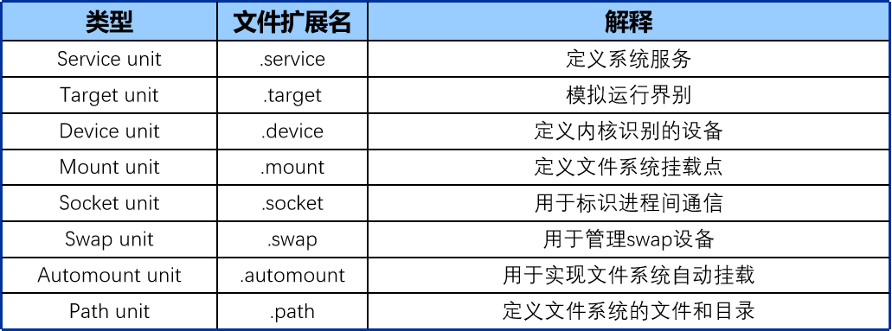
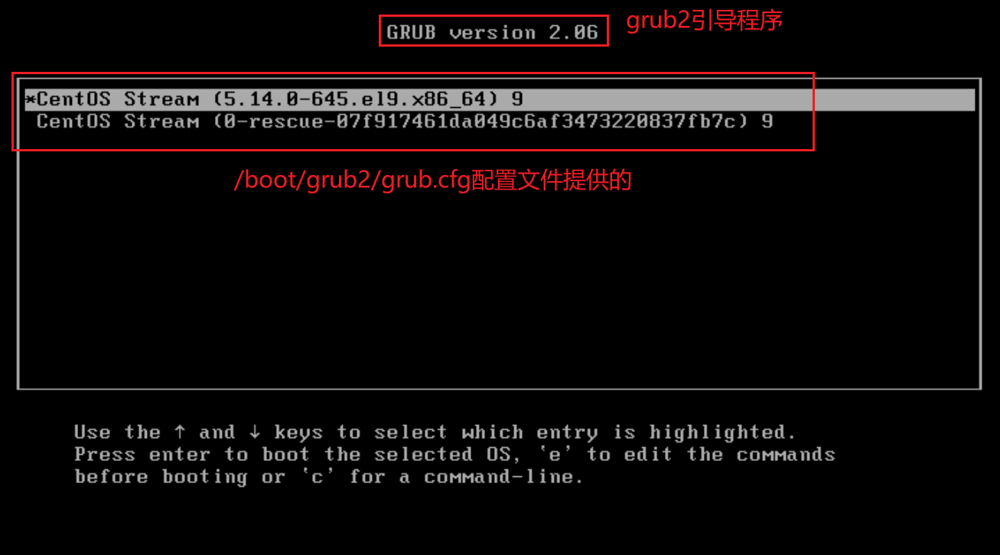
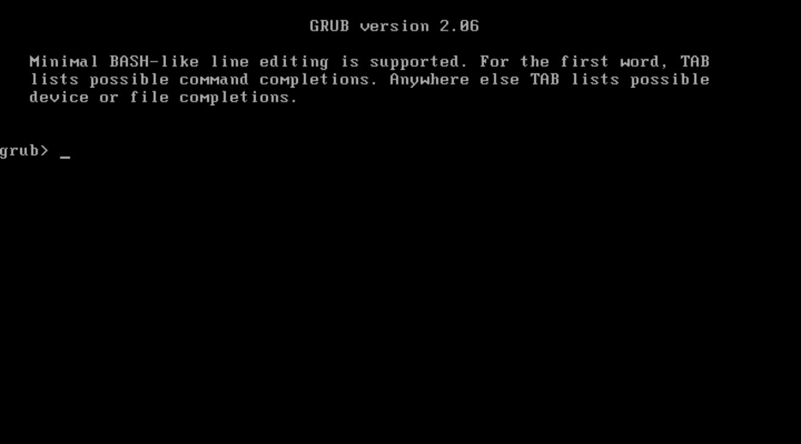
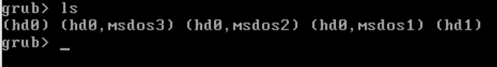
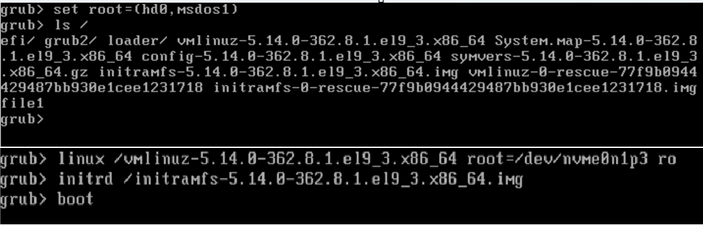

# 1. systemctl 管理服务
- service, 在Linux系统上我们所说的服务其实就是后台进程
- 当我们运行某个服务的时候, 这个程序对应的进程会在后台持续运行, 所以我们又叫他叫做**后台服务/后台进程/守护进程** 
- systemctl命令, 实际上是管理对应的服务, systemctl命令是系统中systemd的管理工具, 系统上所有的服务和进程都是systemd接管的
- systemd, d(daemon), 守护进程是在系统后台持续运行的进程, 因为这些守护进程需要和用户对接, 和程序对接, 持续监听...
- 对于Linux系统启动, 也会用到systemd, 7版本开始时**systemd** , 7版本之前是**initd** 
- **systemd 和 initd , 都是pid为1的进程, 都是属于系统的守护进程** 
	- initd 属于**串行启动** , systemd 属于**并行启动** 
	- initd 启动服务的时候是有什么脚本就启动什么, systemd 启动服务的时候属于**按需启动** 
	- initd 根据脚本启动，systemd 自动解决依赖

## 1.1 systemd 通过不同单元对象进行管理
- 服务(service) 就是 systemd 的其中一个单元对象
	- ```bash
		# 显示都有哪些单元对象, -t 指定单元对象类型
		[root@mubai632 ~]# systemctl -t # 按tab就会显示可以使用哪些类型
		automount  mount      scope      slice      swap       timer
		device     path       service    socket     target
	  ```

- 重要的是 **service 和 target** 
	- service 就是服务
	- target 启动目标/运行级别: 决定系统开机会获得什么样的操作环境
		- 如果系统想要使用图形化
			1. 选择和安装一个图形化桌面软件 GNOME / UKUI
			2. 择对应的target , graphical.target 开机会获取图形化操作环境

## 1.2 systemctl 管理服务
- ```bash
	# 列出所有已安装 .service 文件, 并显示开机是否自启
	[root@mubai632 ~]# systemctl list-unit-files -t service
	[root@mubai632 ~]# systemctl list-unit-files --type service
	
	[root@mubai632 ~]# systemctl list-units -t service
	[root@mubai632 ~]# systemctl list-units --type service
	UNIT                               LOAD   ACTIVE SUB     DESCRIPTION                            
	accounts-daemon.service            loaded active running Accounts Service
  
	LOAD: loaded正确加载的服务单元配置文件, 在 /usr/lib/systemd/system/ 目录下
	ACTIVE: 服务的高级状态  # 一般只看这个
	SUB: 服务的低级状态
	DESCRIPTION: 服务的描述信息
  ```

### 1.2.1 查看服务的状态
- ```bash
	# 最常用的查看状态的方式
	命令 : systemctl status 服务名
	[root@mubai632 ~]# systemctl status sshd
	● sshd.service - OpenSSH server daemon
	     Loaded: loaded (/usr/lib/systemd/system/sshd.service; enabled; preset: enabled)
	     Active: active (running) since Sun 2026-03-22 21:34:43 CST; 19min ago
	       Docs: man:sshd(8)
	             man:sshd_config(5)
	   Main PID: 2822 (sshd)
	      Tasks: 1 (limit: 10702)
	     Memory: 7.7M
	        CPU: 38ms
	     CGroup: /system.slice/sshd.service
	             └─2822 "sshd: /usr/sbin/sshd -D [listener] 0 of 10-100 startups"
	
	Mar 22 21:34:43 mubai632 sshd[2822]: Server listening on 0.0.0.0 port 22.
	Mar 22 21:34:43 mubai632 sshd[2822]: Server listening on :: port 22.
	
	# 其他方式查看状态
	命令 : systemctl is-active 服务名
	[root@mubai632 ~]# systemctl is-active sshd
	active # 启动状态
	inactive  # 未启动状态
	
	# 查看是否开机自启
	命令 : systemctl is-enabled 服务名
	[root@mubai632 ~]# systemctl is-enabled sshd
	enabled  # 开机自启状态
	disabled  # 开机不启动状态
  ```

### 1.2.2 启动/关闭/重启服务
- ```bash
	# 启动服务
	命令 : systemctl start 服务名
	
	# 关闭服务
	命令 : systemctl stop 服务名
	
	# 重启服务
	命令 : systemctl restart 服务名
	
	# 不重启, 读取最新配置, pid不会变化,不是所有的服务都支持reload
	命令 : systemctl reload 服务名
	
	# 使用 reload-or-restart 如果服务支持 reload 就使用 reload, 不支持就重启
	命令 : systemctl reload-or-restart 服务名
  ```

### 1.2.3 开机自启动
- ```bash
	# 设置服务开机自启动
	命令 : systemctl enable 服务名
	[root@mubai632 ~]# systemctl enable sshd 
	Created symlink /etc/systemd/system/multi-user.target.wants/sshd.service → /usr/lib/systemd/system/sshd.service.
	# 就是在/etc/systemd/system/multi-user.target.wants目录下创建了一个指向/usr/lib/systemd/system目录下的软连接文件而已, 有了这个链接文件就能开机自启动
	
	# 设置卡机不自启动
	命令 : systemctl disable 服务名
	[root@mubai632 ~]# systemctl disable sshd
	Removed "/etc/systemd/system/multi-user.target.wants/sshd.service".
	# 删除链接文件就无法自启动
	
	
	# 查看服务是否开机自启, 使用查看服务状态的命令
	命令 : systemctl status 服务名
  ```

### 1.2.4 修改服务的服务单元配置文件问题
- 服务的单元配置文件 **`/usr/lib/systemd/system`** 目录
- 我们执行的所有的systemctl start/stop/restart等操作, 都是执行的这个目录下的服务单元配置文件中的内容
- **如果你手动修改了这个服务单元配置文件, 必须要执行 `systemctl daemon-reload` 才会生效** 

### 1.2.5 systemctl mask/umask 屏蔽服务
- 服务之间是可以彼此拉活的, 如果屏蔽这个服务, 这个服务就无法被其他服务拉活
- **mask的存在是为了解决服务之间的冲突问题** 
	- ```bash
		# 屏蔽服务
		命令 : systemctl mask 服务名
		
		# 解锁服务
		命令 : systemctl umask 服务名
		
		# 查看服务的依赖
		命令 : systemctl list-dependencies 服务名
		[root@mubai632 ~]# systemctl list-dependencies sshd
		sshd.service
		● ├─system.slice
		● ├─sshd-keygen.target
		○ │ ├─sshd-keygen@ecdsa.service
		○ │ ├─sshd-keygen@ed25519.service
		○ │ └─sshd-keygen@rsa.service
		● └─sysinit.target
		●   ├─dev-hugepages.mount
		●   ├─dev-mqueue.mount
		●   ├─dracut-shutdown.service
		○   ├─iscsi-onboot.service
		......
	  ```

## 1.3 systemd管理服务命令和initd管理服务命令区别
- initd 管理服务命令
	- ```bash
		# 启动,停止,重启,查看状态
		命令 : service 服务名 start/stop/restart/status
		
		# 设置服务开机自启
		命令 : service 服务名 on/off
	  ```

## 1.4 systemctl 管理启动目标
- target: 启动目标/运行级别—>系统开机之后获取到的操作环境
	
	- 重要只有 **`graphical.target`** 和 **`multi-user.target`** 
- 运行级别命令
	- 5: 图形化桌面(前提是系统安装了桌面软件)
	- 3: 命令行页面
	- 0: 关机 poweroff
	- 6: 重启 reboot
	- ```bash
		[root@rhel9 ~]# runlevel 
		N 5
		# N表示上一次运行的级别(开机就是5, 所以没有上一次), 5表示当前的运行级别
		[root@rhel9 ~]# init 3  # 切换运行级别
		[root@mubai632 ~]# runlevel
		5 3
	  ```
- 启动目标的命令
	- ```bash
		# 查看当前的启动目标
		命令 : systemctl get-default
		[root@mubai632 ~]# systemctl get-default
		graphical.target
		
		# 设置启动目标, 永久生效(重启后生效)
		命令 : systemctl set-default 启动目标 
		[root@mubai632 ~]# systemctl set-default multi-user.target
		
		# 设置启动目标, 临时生效(立即生效)
		命令 : systemctl isolate 启动目标
		[root@mubai632 ~]# systemctl isolate graphical.target
		
		# 帮助文档
		[root@mubai632 ~]# cat /etc/inittab
		# inittab is no longer used.
		#
		# ADDING CONFIGURATION HERE WILL HAVE NO EFFECT ON YOUR SYSTEM.
		#
		# Ctrl-Alt-Delete is handled by /usr/lib/systemd/system/ctrl-alt-del.target
		#
		# systemd uses 'targets' instead of runlevels. By default, there are two main targets:
		#
		# multi-user.target: analogous to runlevel 3
		# graphical.target: analogous to runlevel 5
		#
		# To view current default target, run:
		# systemctl get-default
		#
		# To set a default target, run:
		# systemctl set-default TARGET.target
	  ```

# 2. Linux 系统的启动流程
- 基于 BIOS 模式启动
	- 系统启动的过程
		1. 上电, 开机
		2. BIOS 自检, 检查硬件是否有问题
		3. 根据 BIOS 中的设置项, 来选择一个引导启动(硬盘, 光驱, 网卡)
		4. 读取硬盘, 加载硬盘中的前**446字节**的代码(引导程序, **grub2** )到内存中
		5. grub2 引导程序会加载引导分区中的引导配置文件到内存中 **(引导配置文件: /boot/grub2/grub.cfg)** 
			
		6. 选择正常内核进入操作系统(第一个是普通内核, 第二个是救援内核)
			- 加载内核文件和initramfs文件到内存中
				- 加载内核文件目的: 是为了挂载根文件系统(需要/usr/lib/modules/5.14.0-362.8.1.el9_3.x86_64/kernel/fs/xfs/xfs.ko.xz这个文件系统驱动), 挂载根文件系统的目的是为了运行systemd程序(/usr/lib/systemd/systemd), 运行systemd程序是为了帮助我们系统启动各种服务以及根据设置好的target启动目标得到对应的操作环境
				- 加载initramfs的目的: 本身就包含很多的驱动, 目的是为了给内核提供各种各样的驱动程序, 比如这里可以为内核提供xfs文件系统驱动
			- **initramfs本身就是一个小型的根文件系统**(叫做假根)
		7. **initramfs会将真正的根文件系统(xfs驱动)挂载到自己的/sysroot目录下** 
		8. **initramfs会将自己的假根切换到真正的根文件系统(chroot命令)** 
		9. **运行systmed程序, 启动服务, 然后基于设置的target来得到对应的操作环境** 
- 基于 UEFI 模式启动
	- UEFI模式下的系统启动, 引导程序不是在磁盘的前446字节, 而是在/boot/efi分区下
- **UEFI模式的引导程序是存在/boot/efi目录下的一个文件** 
- **BIOS模式的引导程序是存在系统盘前446字节的一串代码** 
- 关于内核的命令
	- ```bash
		  # 默认是普通内核启动, 当内核损坏就需要使用救援内核来启动
		  命令 : grubby --default-kernel  # 查询当前默认内核
		  命令 : grubby --default-index  # 查看当前内核的编号
		  命令 : grubby --default-title  # 查看当前内核的标题
		  命令 : grubby --info=ALL  # 查询所有内核的详细信息, ALL可以更改为对应的内核
		  # 更改默认启动内核
		  命令 : grubby --set-default=内核路径  # 通过绝对路径设置默认启动内核
		  命令 : grubby --set-default-index=内核编号  # 通过内核编号设备默认启动内核
		  # 在内核文件中追加参数
		  命令 : grubby --args='参数' --update-kernel=内核目录  # 追加参数到内核文件中, --args : 追加参数, --update-kernel : 更新到哪个内核
		  # 在内核文件中删除参数
		  命令 : grubby --remove-args='参数' --update-kernel=内核目录
	  ```

# 3. Linux 开机故障处理
## 3.1 引导配置文件丢失
- **/boot/grub2/grub.cfg配置文件丢失** : 开机无法被grub2引导程序加载, 则无法看到内核菜单页面
	- **系统还没有关机, 是可以通过命令重新生成grub.cfg配置文件的** 
		- ```bash
			# 未重启, 使用命令恢复grub.cfg文件
			[root@mubai632 ~]# grub2-mkconfig -o /boot/grub2/grub.cfg
			Generating grub configuration file ... 
			Adding boot menu entry for UEFI Firmware Settings ... 
			done
			# -o : 将生成的配置输出到指定文件
		  ```
	- 系统被关闭后重新启动, 就会出现下面这种情况
		
		- 出现上面的情况是因为内核菜单没有了, 导致无法启动. 其原因是grub2 引导程序不知道**内核文件、initramfs文件、真正的根文件系统解在哪** 
		- 在grub2引导程序下, **通过命令的方式临时告诉grub2, 内核文件的路径、initramf文件路径、真正的根系统路径** 
		- 内核文件路径、initramfs文件路径是在 **/boot** 分区下的. 在grub2引导程序中, 虽然可以指定这些路径, 但是并不知道哪个文件系统是boot分区 
			
			- **boot分区, 一定是磁盘的第1块分区** , 如果存在多个磁盘分区, 每个磁盘的第1个分区都有可能是boot分区
		- 根文件系统在哪?
			- 如果安装系统的时候, 分区选择的是 **LVM** 类型的, 那么根分区路径就一定是这些
				- RHEL: /dev/mapper/rhel-root
				- CentOS: /dev/mapper/cs-root, /dev/mapper/centos-root
			- 安装系统分区选择的是**标准分区** , 根文件系统就和磁盘类型相关
				- 系统盘是 scsi 类型
				- /dev/sda2, /dev/sda3(不会是/dev/sda1, 因为1是boot分区)
				- 系统盘是 nvme 类型
				- /dev/nvme0n1p2, /dev/nvme0n1p2
		- 确认好这些文件的位置后, 需要进行绑定
			- ```bash
				#指定boot分区 
				set root=(boot分区) # 指定boot分区, 指定的可能不是, 只能一个一个测试
				ls /  # 指定boot分区后, 使用命令查看分区下有没有内核相关内容, 如果没有,就要指定下一个boot分区
				
				# 指定正确的boot分区后, 开始进行指定内核文件,initramfs文件和根分区
				linux /vmlinuz-xxxxxx root=/dev/nvme0n1p3 ro 
				#使用 linux 命令指定内核文件, 指定 root 分区, 最后需要个 ro
				initrd /initramfs-xxxxxx.img # 指定initramfs文件
				# 上面的两个文件的版本要一致
				boot # 启动
				
				# 成功启动后, 还是需要使用命令生成新的grub.cfg文件
			  ```
			


