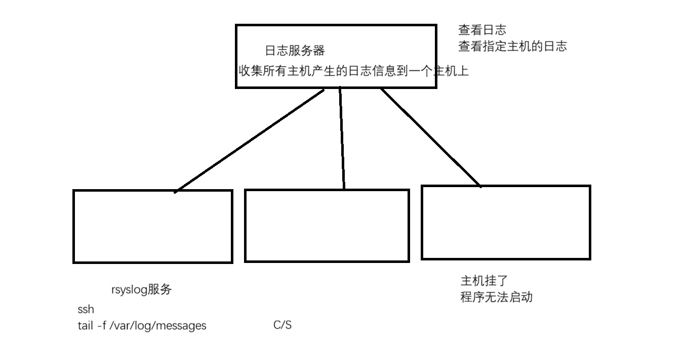
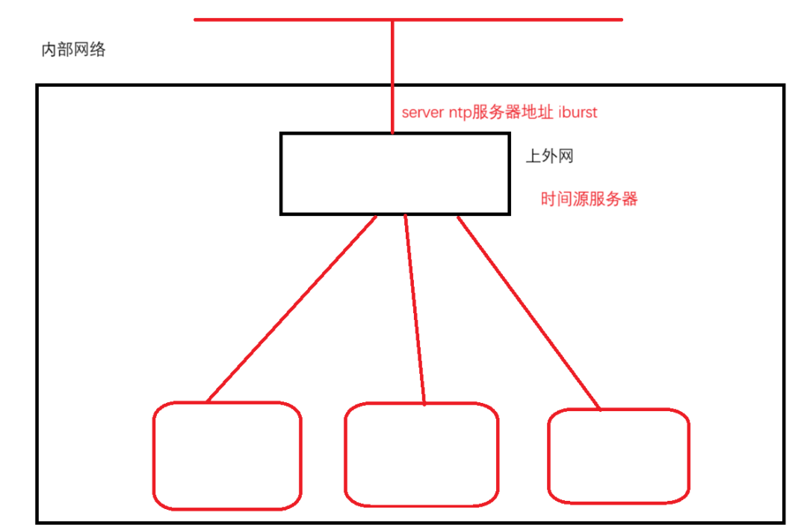

# 1. 系统日志服务
- 日志: 每一个程序运行的时候会产生日志信息, 可以根据日志信息来排查程序的故障问题来定位错误
- Linux系统有2大日志服务
	- systemd-journald
	- rsyslog
- 2个服务的区别
	- 第1个区别
		- systemd-journald 的日志文件只有一个, 所有系统上程序产生的日志都会记录到这个文件中 **`/run/log/journal`** 
		- rsyslog 服务, 会根据不同的程序将程序产生的日志信息保存到不同的文件中
	- 第2个区别
		- systemd-journald 日志, 默认是**易失性存储** , 因为它是**存放到内存中**的
		- rsyslog 日志, 都是**持久化存储**的, 因为它是**存放到磁盘中的 /var/log** 
	- 第3个区别
		- systemd-journald 日志文件, 需要通过专门的检索工具查看 **journalctl** 
		- rsyslog 日志文件, 只需要通过文本查看工具查看
- 不同的日志级别
	- ```bash
		# 通过 man syslog 查找日志级别, 数字越小, 危险级别越高
		[root@rhel9 ~]# man syslog 
		The log level
		    Every printk() message has its own log level.  If the log level is not  explicitly  speci‐
		    fied  as  part  of the message, it defaults to default_message_loglevel.  The conventional
		    meaning of the log level is as follows:
		
		    Kernel constant   Level value   Meaning
		    KERN_EMERG             0        System is unusable
		    KERN_ALERT             1        Action must be taken im‐
		                                       mediately
		    KERN_CRIT              2        Critical conditions
		    KERN_ERR               3        Error conditions
		    KERN_WARNING           4        Warning conditions
		    KERN_NOTICE            5        Normal  but  significant
		                                       condition
		    KERN_INFO              6        Informational
		    KERN_DEBUG             7        Debug-level messages
		
		    The kernel printk() routine will print a message on the console only if it has a log level
		    less than the value of console_loglevel.
	  ```

## 1.1 systemd-journald 日志服务
- 保证systemd-journald服务是正常运行的
- 默认是易失性存储, 日志文件保存到 **`/run/log/journal`** 目录下
- 所有的日志都是存放到一个日志文件中
- 必须要通过journalctl命令工具来查看日志
- 支持的选项很多
	- ```bash
		实时监控
		根据用户来查看日志，查看指定用户产生的日志
		查看指定程序产生的日志
		查看指定命令产生的日志
		查看指定的时间段产生的日志
		......
		
		journalctl -f : 实时查看journald日志
		journalctl _UID=用户id : 查看指定用户的日志
		journalctl -f _COMM=命令 : 查看指定命令的日志
		journalctl -S '09:00:00' -U '09:03:00' : 查看指定时间段的日志
	  ```

### 1.1.1 systemd-journald 实现持久化存储
- 修改配置文件, 让 systemd-journald 日志保存到磁盘上实现持久化存储
	- ```bash
		vim /etc/systemd/journald.con
		[Journal]
		#Storage=auto # 默认是auto
			auto: 当/var/log/journal目录存在，就是持久化存储, 如果不存在就是易失性存储 /run/log/journal
			none: 都不会持久化存储
			persistent: 无论/var/log/jounal目录是否存在都是持久化存储, 目录不存在会自动创建
	  ```
- 将配置文件修改为其他的模式, 需要进行重启, 并执行 `journalctl --flush` 
	- ```bash
		命令 : systemctl restart systemd-journald
		命令 : journalctl --flush
		# 执行后就会在 /var/log/journal/ 生成对应的日志文件
	  ```

## 1.2 rsyslog 日志服务
- 根据程序产生的日志放到 **`/var/log/`** 目录下不同的文件中
- 产生的日志都是持久化存储的
- rsyslog 的配置文件 **`/etc/rsyslog.conf`** 中, 给出了日志文件定义的方式: **`日志类型.日志级别`** 
	- 日志级别: 8个日志级别
	- 日志类型: 不同程序的日志
- 配置文件 **`/etc/rsyslog.conf`** 
	- ```bash
		[root@mubai632 ~]# vim /etc/rsyslog.conf
		#### RULES ####
		# Log all kernel messages to the console.
		# Logging much else clutters up the screen.
		#kern.*                                                 /dev/console
		# Log anything (except mail) of level info or higher.
		# Don't log private authentication messages!
		*.info;mail.none;authpriv.none;cron.none                /var/log/messages
		# The authpriv file has restricted access.
		authpriv.*                                              /var/log/secure
		# Log all the mail messages in one place.
		mail.*                                                  -/var/log/maillog
		# Log cron stuff
		cron.*                                                  /var/log/cron
		# Everybody gets emergency messages
		*.emerg                                                 :omusrmsg:*
		# Save news errors of level crit and higher in a special file.
		uucp,news.crit                                          /var/log/spooler
		# Save boot messages also to boot.log
		local7.*                                                /var/log/boot.log
	  ```

## 1.3 logger 命令手动发送日志
- 通过logger命令发送日志
	- ```bash
		命令 : logger -i -p '日志类型.日志级别' -t 程序名 '日志的描述信息'
		[root@mubai632 ~]# logger -i -p 'mail.info' '123456'
		[root@mubai632 ~]# tail -f /var/log/maillog
		Mar 28 14:46:56 mubai632 root[2620]: 123456
		# -i : 记录程序的PID
		# -p : 指定日志类型和日志级别
		# -t : 指定程序名, 不加就是用户名
	  ```

## 1.4 部署集中式日志服务器

- 将所有客户端产生的日志信息发送到服务端上, 集中所有主机的日志
- rsyslog服务是一个C/S架构, 对于服务端要修改配置接受客户端发送的日志信息, 对于客户端也要修改配置, 产生的日志要主动发送给服务端
	- **服务端配置** 
		- ```bash
			# 需要关闭防火墙
			[root@mubai632 ~]# vim /etc/rsyslog.conf
			# Provides UDP syslog reception
			# for parameters see http://www.rsyslog.com/doc/imudp.html
			module(load="imudp") # needs to be done just once
			input(type="imudp" port="514")
			
			# Provides TCP syslog reception
			# for parameters see http://www.rsyslog.com/doc/imtcp.html
			module(load="imtcp") # needs to be done just once
			input(type="imtcp" port="514")
			
			[root@mubai632 ~]# systemctl restart rsyslog
		  ```
	- **客户端配置** 
		- ```bash
			[root@rhel9 ~]# vim /etc/rsyslog.conf
			*.info                       @@172.10.0.129
			
				@@ 通过tcp转发
				@ 通过udp转发
		  ```

## 1.5 logrotate 日志轮询服务
- logrotate 出现的目的是为了解决日志文件越来越大的问题, 因为日志是持久化存储到磁盘上, 时间运行的越长, 产生的日志越多, 日志占据的磁盘空间越大, 可以手动定义一个脚本和计划任务来清理日志, 也可以通过logrotate日志服务自动切割日志
- logrotate 功能
	- 实现日志文件的切割
	- 自动删除过期的日志文件
- 配置 logrotate 的切割方式的位置
	- ```bash
		# 全局默认配置文件, 默认规则和全局通用策略都在这
		/etc/logrotate.conf
		
		# 各服务独立配置目录
		/etc/logrotate.d/
	  ```
# 2. 时间管理
## 2.1 timedatectl 管理系统的时间和时区
- date 命令可以管理时间
- timedatectl 命令可以管理时间和时区
	- ```bash
		[root@mubai632 ~]# timedatectl
               Local time: 六 2026-03-28 16:09:13 CST
           Universal time: 六 2026-03-28 08:09:13 UTC
                 RTC time: 六 2026-03-28 08:09:13
                Time zone: Asia/Shanghai (CST, +0800)
System clock synchronized: yes
              NTP service: active
          RTC in local TZ: no
        
        Local time : 本地时间
        Universal time : 世界统一时间
        RTC time : 硬件时钟
        Time zone : 时区
        System clock synchronized : 是否同步ntp
        NTP service : ntp服务是否运行
        RTC in local TZ : 是否使用硬件时钟
	  ```
- 使用 timedatectl 命令进行修改
	- ```bash
		# 手动修改时间, 如果开启了ntp服务, 就无法修改
		[root@mubai632 ~]# timedatectl set-time 'xxxx-xx-xx xx:xx:xx'
		
		# 关闭/开启ntp服务
		[root@mubai632 ~]# timedatectl set-ntp 0/1 
		
		# 查看时区列表
		[root@mubai632 ~]# timedatectl list-timezones
		
		# 设置时区
		[root@mubai632 ~]# timedatectl set-timezone '时区' 
	  ```

## 2.2 chronyd 服务(之前使用ntp服务)
- chronyd 服务是时间同步服务, 专门让客户端向时间源服务器同步系统时间的
- chronyd 怎么实现时间同步, 修改对应的配置文件
	- ```bash
		[root@mubai632 ~]# vim /etc/chrony.conf
		# 这就是同步的时间服务器 ntp.aliyun.com, pool和server都可以
		pool ntp.aliyun.com iburst
		server ntp.aliyun.com iburst
		# 配置好后需要重启chronyd服务
		[root@mubai632 ~]# systemctl restart chronyd
		
		# 查看时间源是否配置成功
		[root@mubai632 ~]# chronyc sources -v  # -v 显示
		  .-- Source mode  '^' = server, '=' = peer, '#' = local clock.
		 / .- Source state '*' = current best, '+' = combined, '-' = not combined,
		| /             'x' = may be in error, '~' = too variable, '?' = unusable.
		||                                                 .- xxxx [ yyyy ] +/- zzzz
		||      Reachability register (octal) -.           |  xxxx = adjusted offset,
		||      Log2(Polling interval) --.      |          |  yyyy = measured offset,
		||                                \     |          |  zzzz = estimated error.
		||                                 |    |           \
		MS Name/IP address         Stratum Poll Reach LastRx Last sample
		===============================================================================
		^* 203.107.6.88                  2   6    17     6  -2325us[-5545us] +/-   45ms
		
			^* 同步时间成功
			^? 还没有同步成功
			2 代表上面还有两个时间源服务器. 本机器向阿里同步, 阿里向国家授时中心同步
			6 代表同步的时间, 2^6=64, 重启服务也会同步
	  ```


## 2.3 通过 chronyd 配置时间源服务器
- 将某台主机通过chronyd变成时间源服务器, 让其他主机向它同步时间, 来保证局域网内部主机的时间一致

- 服务端配置
	- ```bash
		# 需要关闭防火墙
		[root@mubai632 ~]# vim /etc/chrony.conf
		# Allow NTP client access from local network. 
		allow 网段/掩码  # 允许哪个网段的机器来向我同步时间
		# Serve time even if not synchronized to a time source. 
		local stratum 10  # 让本机即使没联网、没同步到准确时间, 也依然作为 NTP 服务器给内网设备授时
		[root@mubai632 ~]# systemctl restart chronyd
		
		# 查看哪些客户端在使用时间服务器
		[root@mubai632 ~]# chronyc clients
	  ```
- 客户端配置
	- ```bash
		[root@mubai632 ~]# vim /etc/chrony.conf
		server ip/域名 iburst
		[root@mubai632 ~]# systemctl restart chronyd
		[root@mubai632 ~]# chronyc sources
	  ```

