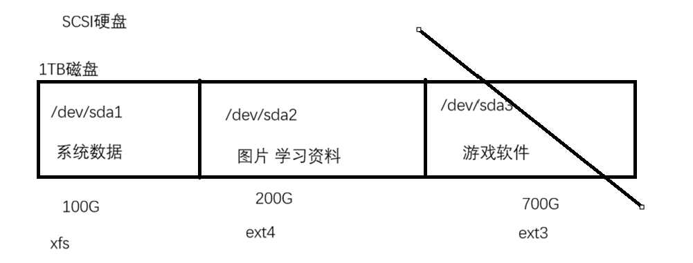
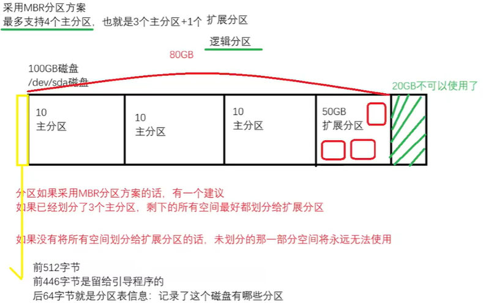
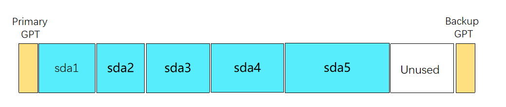

# 1. 概念
- 分区的概念
	- 将一个物理存储空间划分为多个逻辑上的存储空间
	- 分区之间互不干扰, 分区挂了不影响另外的分区的数据; 不同的分区可以创建不同的文件系统
	

- 文件系统: 文件系统是文件存储的方式和组织结构. 文件只能存储到文件系统上, 而文件系统是在分区或者磁盘上创建的
- 挂载: 将文件系统挂载给某个目录, 这个目录就是叫做挂载点, 挂载点是访问文件系统的入口

# 2. 分区工具和分区方式
- 分区方式存在两种
	- MBR 分区方式
		- MBR 分区的特点
			- 分区数量限制: **最多支持4个分区(3个主分区和1个扩展分区)** 
			- 分区类型: **主分区, 扩展分区, 逻辑分区(逻辑分区在扩展分区中)** 
			- 单个分区大小**不能超过 2TB** 
			- 如果系统盘采用MBR分区方式, 那么在磁盘的前 446 字节是它的引导程序
			- 磁盘的前 512 字节是特殊的存在, 前 446 字节是给引导程序代码留下的, 后 64 字节是分区表信息, 最后 2 字节是保留部分
		
	- GPT 分区方式
		- GPT 分区方式的特点
			- 分区数量限制: **最多支持 128 个分区** 
			- 分区类型: **主分区** 
			- 单个分区大小**可以超过 2TB** 
			- 分区表在磁盘的头部和尾部都有, 所以 GPT 有备份 
		
- 对于操作系统的系统盘来说, 它采用哪种分区方式和系统的启动模式有关
	- 如果你选择的是 **Legacy BIOS** 的话, 默认采用的分区方案是 **MBR** 
		- 是 Legacy BIOS 模式的话, 只需要划分一个 **/boot** 分区 
	- 如果你选择的是 **UEFI BIOS** 的话, 默认采用的分区方案是 **GPT** 
		- 是 UEFI BIOS 模式的话, 需要划分 **/boot** 分区和 **/boot/efi** 分区

## 2.1 fdisk 工具
- fdisk: 既可以划分 MBR 也可以划分 GPT 
- fdisk工具属于交互式, 进入fdisk命令页面中, 而且只有保存才会生效
```bash
	fdisk -l
	d   delete a partition : 删除一个分区
	n   add a new partition : 创建一个分区
	p   print the partition table : 打印分区表信息, 打印分区
	t   change a partition type : 修改分区类型 ID type
	m   print this menu : 查看有哪些命令
	w   write table to disk and exit : 保存操作并且退出
	q   quit without saving changes : 不保存直接退出
	g   create a new empty GPT partition table : 指定GPT分区方案
	o   create a new empty DOS partition table : 指定MBR分区方案
```
- 例题
	- ```bash
		针对于/dev/sda磁盘, 使用MBR分区方案, 划分2个主分区, 大小分别是1G和5G
		[root@router ~]# fdisk /dev/sda 
		Welcome to fdisk (util-linux 2.37.4).
		Changes will remain in memory only, until you decide to write them.
		Be careful before using the write command.
		Device does not contain a recognized partition table.
		Created a new DOS disklabel with disk identifier 0xbc9d6813.  # 采用MBR分区方案
		
		Command (m for help): n #创建一个分区
		Partition type
		   p   primary (0 primary, 0 extended, 4 free)
		   e   extended (container for logical partitions)
		
		Select (default p):   # 直接回车，指定的是主分区
		Using default response p.
		
		Partition number (1-4, default 1):   # 指定分区号
		First sector (2048-41943039, default 2048):   # 开始扇区，一律不要写
		Last sector, +/-sectors or +/-size{K,M,G,T,P} (2048-41943039, default 41943039): +1G  # 结束扇区，划分的分区大小
		Created a new partition 1 of type 'Linux' and of size 1 GiB.
		
		Command (m for help): n
		Partition type
		   p   primary (1 primary, 0 extended, 3 free)
		   e   extended (container for logical partitions)
		
		Select (default p): 
		Using default response p.
		
		Partition number (2-4, default 2): 
		First sector (2099200-41943039, default 2099200): 
		Last sector, +/-sectors or +/-size{K,M,G,T,P} (2099200-41943039, default 41943039): +5G
		Created a new partition 2 of type 'Linux' and of size 5 GiB.
	  ```

## 2.2 gdisk 工具
- gdisk工具的命令和fdisk基本相同
- gdisk 可以恢复分区表
	- ```bash
		使用命令 dd 破坏分区表
		dd if=/dev/zero of=磁盘 bs=666 count=1
		
		修复分区表
		gdisk 磁盘  # 进入对应的磁盘
		会自动恢复
	  ```

## 2.3 parted 工具
- fdisk 和 gdisk 属于交互式分区工具, 只要没有保存都不会生效
- parted 工具属于交互式也可以属于非交互式, 只要执行了, 立即生效
	- 交互式分区
		- ```bash
			(parted) mkpart                                              
			Partition type?  primary/extended? primary                   
			File system type?  [ext2]?                                   
			Start? 1MiB
			End? 1024MiB                                                
			(parted) print                                                            
			Model: VMware, VMware Virtual S (scsi)
			Disk /dev/sda: 21.5GB
			Sector size (logical/physical): 512B/512B
			Partition Table: msdos
			Disk Flags: 
			
			Number  Start   End     Size    Type     File system  Flags
			 1      1049kB  1024MB  1023MB  primary  ext2
		  ```
	- 非交互式分区
		- ```bash
			# 第一次使用这个命令创建一个分区
			[root@router ~]# parted /dev/sda mklabel msdos mkpart primary ext2 1MiB 1024MiB
			# 再次使用这个命令创建分区, 就会报错, 选择yes就会覆盖掉之前的分区, 也不会创建新的分区, 解决方式就是不指定分区方式就行了
			[root@router ~]# parted /dev/sda mklabel msdos mkpart primary ext2 1024MiB 2048MiB
			Warning: The existing disk label on /dev/sda will be destroyed and all data on this disk
			will be lost. Do you want to continue?
			Yes/No? NO
			[root@router ~]# parted /dev/sda mkpart primary ext2 1024MiB 2048MiB
		  ```

# 3. 文件系统
- 分区已经创建, 在分区的上面创建文件系统, 最后挂载起来才能使用这个分区的空间
- 格式化操作
	- ```bash
		mkfs -t 文件系统类型 设备路径  # 格式化系统
		mkfs.文件系统类型 设备路径  # 格式化系统
	  ```

# 4. 挂载和卸载文件系统
- 挂载命令(临时挂载)
	- ```bash
		mount 文件系统 挂载点
		mount -o remount,rw /sysroot  # 重置root密码的重挂载
	  ```
- 常用选项
	- ```bash
		-a : 将fstab文件中没有挂载的条目实现自动挂载
		-r : 只读挂载 
		-w : 读写挂载 
		-t : 指定文件系统类型
		-L : 基于标签挂载, 标签就相当于文件系统的名字
			不同的文件系统打标签命令不一样 : 
				xfs : 
					xfs_admin -L '标签名' /dev/sda1  # 创建标签
					xfs_admin -L '--' /dev/sda1  # 删除标签
				ext : 
					e2label /dev/sda2 '标签名'  # 创建标签
					e2label /dev/sda2 ''  # 删除标签
		-U : 基于UUID挂载(文件系统的UUID)
			使用命令: blkid 分区  # 列出文件系统属性信息
		-o : 支持额外的挂载选项  # 多个选项之间使用 ',' 隔开
			remount : 重新挂载
			rw : 读写挂载
			suid : 文件系统是否支持suid权限
			exec : 文件系统是否支持可执行文件
		默认挂载选项，是rw, suid, dev, exec, auto, nouser, and async的组合
	  ```
- **永久挂载** 
	- ```bash
		# 永久挂载配置需要写入到 /etc/fstab 文件中
		/dev/sda1 /data1 ext4 defaults,rw,nouser,exec 0 0
		/dev/sda2 /data2 xfs defaults  0 0
		# 不要直接重启, 使用 mount -a 选项
	  ```

- **卸载文件系统: umount** 
	- ```bash
		命令 : umount 挂载点/文件系统
		# 如果文件系统被使用中, 则文件系统是无法卸载的
	  ```
- 查看使用文件系统的进程: fuser
	- ```bash
		命令 : fuser -v 挂载点
		[root@router ~]# fuser -v /data1
		                     USER        PID ACCESS COMMAND
		/data1:              root     kernel mount /data1
		                     root       1633 ..c.. bash
	  ```
- 结束掉文件系统的所有进程
	- ```bash
		命令 : fuser -km 挂载点
		或者
		命令 : kill 进程号
	  ```

# 5. Swap交换分区
- swap分区: 把磁盘空间当作内存使用, 运行操作系统运行更多的软件
	
- 可以当做Swap分区的
	- 分区
	- 磁盘
	- 文件: 特殊情况, 比如系统没有多余的磁盘和分区, 但是某个程序运行又必须要swap, 这个时候可以创建一个指定大小的文件, 将其格式化为swap进行使用
- 查看系统的Swap分区
	- ```bash
		命令1 : swapon -s  # 专用于Swap的命令
		命令2 : lsblk
		命令3 : free -m  # 查看的是Swap容量的总和
		[root@router ~]# swapon -s  # 列出系统已经生效的Swap
		Filename        Type       Size       Used    Priority
		/dev/nvme0n1p2  partition  2097148    0       -2
		# -2 是优先级, 优先级越高, 越优先使用这个swap空间
		# 如果优先级一致的, 轮询的方式使用swap空间
	  ```
- 将分区,磁盘,文件做成Swap
	1. 将分区或者文件或者磁盘通过**mkswap**命令格式化为swap文件系统
	2. 通过mount命令将其实现挂载
	3. 如果要永久挂载swap的话, 需要写入到 **/etc/fstab** 文件
		- ```bash
			命令 : mkswap 分区/磁盘/文件
			[root@router ~]# mkswap /dev/sda3  # 创建Swap分区的命令
			Setting up swapspace version 1, size = 3 GiB (3221221376 bytes)
			no label, UUID=5189fcb3-7d3f-4529-8c0c-b2d3dcfd510e
			[root@router ~]# swapon -s 
			Filename        Type       Size       Used    Priority
			/dev/nvme0n1p2  partition  2097148    0       -2
			/dev/sda3       partition  3145724    0       -3
			[root@router ~]# free -m 
			               total        used        free      shared  buff/cache   available
			Mem:            3872        1427        2013          14         671        2444
			Swap:           5119           0        5119
		  ```
- **挂载 Swap 分区** 
	- ```bash
		命令 : swapon 分区/磁盘/文件
		命令 : swapon -p 优先级 分区/磁盘/文件
		命令 : swapon -a  # 自动挂载 /etc/fstab 文件中没有挂载的 Swap 分区
		命令 : swapoff -a  # 卸载 /etc/fstab 文件中已经挂载的 Swap 分区
	  ```
- **卸载 Swap 分区** 
	- ```bash
		# 如果swap空间已经使用了, 卸载swap的话, 里面的数据不会丢失的, 它会重新返回到内存空间中
		swapoff 分区/磁盘/文件
	  ```
- **永久挂载 Swap 分区** 
	- ```bash
		# 永久挂载swap的格式 /etc/fstab 文件
		/dev/sda3 swap swap defaults 0 0
	  ```

# 6. 文件系统检查和修复工具
- 文件系统创建之后, 文件系统本身也具备元数据和数据
- 元数据: 文件系统的类型，inode数量，block数量，单个block的大小...
- superblock 超级块(元数据) + block 块(数据)
- 如果今天文件系统的超级块故障了, 那么就无法识别文件系统类型... 你就无法实现挂载
- backup superblock 备份的超级块, 目的是为了恢复超级块的数据
- 如果文件系统的超级块故障了, 则文件系统无法挂载, 但是数据不会丢失
- ext 文件系统修复工具
	- ```bash
		# 卸载再修复
		fsck 文件系统  # 不想一直输入y, 就使用fsck -y 文件系统
		e2fsck 文件系统
	  ```
- xfs 文件系统修复工具
	- ```bash
		xfs_repair 文件系统
	  ```


