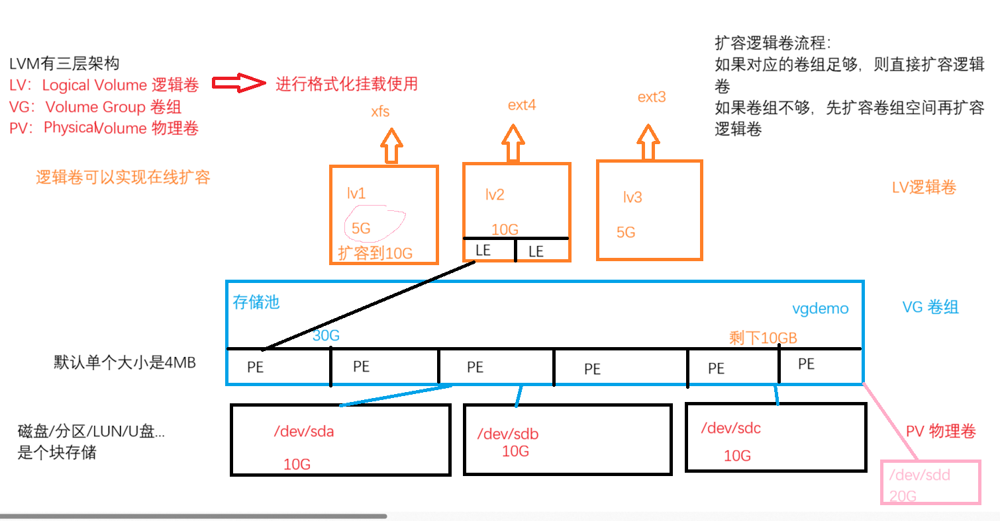
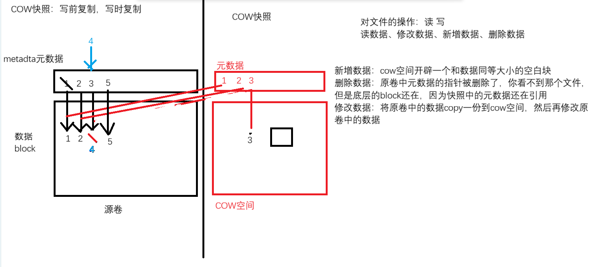
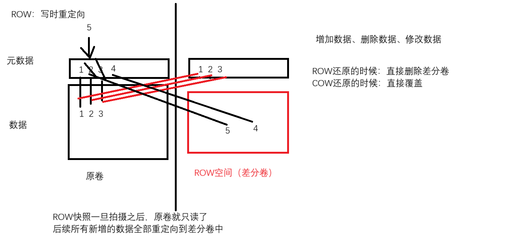

# 1. LVM 解决的问题
- LVM的出现是为了解决**普通分区扩容难**的问题
# 2. LVM 的架构和专业术语

- LV: **逻辑卷**. 操作系统使用的就是逻辑卷的空间, 需要进行**格式化和挂载**使用
- LE: 逻辑卷中**最小的寻址单元**. 默认和PE是1对1的关系
- VG: **卷组**. 一个虚拟的存储池, 卷组的空间来自于底层的物理卷
- PE: **组成卷组的单元**. 默认单个PE大小是4MB, 在创建卷组的时候可以指定PE大小的
- PV: **物理卷**. 是整个LVM架构中真正存储数据的位置, 可以是U盘、硬盘、分区、LUN...
# 3. 使用 LV (逻辑卷)的空间
- 创建LV的步骤，从下往上开始: 
	1. 将硬盘或者分区等创建为PV物理卷
	2. 将多个PV物理卷加入到一个VG卷组中
	3. 从VG卷组里面划分多个LV逻辑卷
	4. 对LV逻辑卷格式化文件系统
	5. 挂载文件系统
- 要求: 将/dev/sda、/dev/sdc、/dev/sdc三个盘制作为PV物理卷, 全部加入到vgdemo这个卷组中, 卷组单个PE大小是4MB, 在卷组上创建2个逻辑卷, 分别是大小为5G的lv1和大小为10G的lv2, 将lv1格式化为xfs, 将lv2格式化为ext4, 实现永久挂载
	- **创建PV(物理卷)** 
		- ```bash
			命令 : pvcreate 磁盘....
			[root@mubai632 ~]# pvcreate /dev/sda /dev/sdb /dev/sdc /dev/
			  No device found for /dev/.
			  Physical volume "/dev/sda" successfully created.
			  Physical volume "/dev/sdb" successfully created.
			  Physical volume "/dev/sdc" successfully created.
			  Creating devices file /etc/lvm/devices/system.devices
			  
			# 查看物理卷
			命令1 : pvs  # 简单查看
			[root@mubai632 ~]# pvs
			  PV         VG Fmt  Attr PSize  PFree
			  /dev/sda      lvm2 ---  20.00g 20.00g
			  /dev/sdb      lvm2 ---  20.00g 20.00g
			  /dev/sdc      lvm2 ---  20.00g 20.00g
			 
			命令2 : pvdisplay  # 显示详细信息
			[root@mubai632 ~]# pvdisplay
			  "/dev/sda" is a new physical volume of "20.00 GiB"
			  --- NEW Physical volume ---
			  PV Name               /dev/sda
			  VG Name
			  PV Size               20.00 GiB
			  Allocatable           NO  #不可分配
			  PE Size               0
			  Total PE              0
			  Free PE               0
			  Allocated PE          0
			  PV UUID               R0ipNa-Crjq-do7T-LCEg-eZI9-RDoe-Y9GJSp
			
			  "/dev/sdb" is a new physical volume of "20.00 GiB"
			  --- NEW Physical volume ---
			  PV Name               /dev/sdb
			  VG Name
			  PV Size               20.00 GiB
			  Allocatable           NO
			  PE Size               0
			  Total PE              0
			  Free PE               0
			  Allocated PE          0
			  PV UUID               rO9IbA-vqt6-n331-6WeX-7Bb6-68lY-jM0fYa
			
			  "/dev/sdc" is a new physical volume of "20.00 GiB"
			  --- NEW Physical volume ---
			  PV Name               /dev/sdc
			  VG Name
			  PV Size               20.00 GiB
			  Allocatable           NO
			  PE Size               0
			  Total PE              0
			  Free PE               0
			  Allocated PE          0
			  PV UUID               4xnMHI-knbe-7BzC-5o8B-rDG3-Kh7Z-3XPidx
		  ```
	- **创建VG(卷组)** 
		- ```bash
			命令 : vgcreate name 磁盘..... # -s 指定PE大小 
			[root@mubai632 ~]# vgcreate vgdmoe /dev/sda /dev/sdb /dev/sdc
			Volume group "vgdmoe" successfully created
			
			# 查看卷组
			命令1 : vgs  # 简单查看
			[root@mubai632 ~]# vgs
			  VG     #PV #LV #SN Attr   VSize   VFree
			  vgdmoe   3   0   0 wz--n- <59.99g <59.99g
			命令2 : vgdisplay  # 查看详细信息
			[root@mubai632 ~]# vgdisplay
			  --- Volume group ---
			  VG Name               vgdmoe
			  System ID
			  Format                lvm2
			  Metadata Areas        3
			  Metadata Sequence No  1
			  VG Access             read/write
			  VG Status             resizable
			  MAX LV                0
			  Cur LV                0
			  Open LV               0
			  Max PV                0
			  Cur PV                3
			  Act PV                3
			  VG Size               <59.99 GiB
			  PE Size               4.00 MiB
			  Total PE              15357
			  Alloc PE / Size       0 / 0
			  Free  PE / Size       15357 / <59.99 GiB
			  VG UUID               E9Fet2-hdrV-vJok-nT4h-Foz1-XgvA-USsbk0
			  
			# 创建卷组后查看物理卷
			[root@mubai632 ~]# pvdisplay
			  --- Physical volume ---
			  PV Name               /dev/sda
			  VG Name               vgdmoe
			  PV Size               20.00 GiB / not usable 4.00 MiB
			  Allocatable           yes  #可分配
			  PE Size               4.00 MiB
			  Total PE              5119
			  Free PE               5119
			  Allocated PE          0
			  PV UUID               R0ipNa-Crjq-do7T-LCEg-eZI9-RDoe-Y9GJSp
			
			  --- Physical volume ---
			  PV Name               /dev/sdb
			  VG Name               vgdmoe
			  PV Size               20.00 GiB / not usable 4.00 MiB
			  Allocatable           yes
			  PE Size               4.00 MiB
			  Total PE              5119
			  Free PE               5119
			  Allocated PE          0
			  PV UUID               rO9IbA-vqt6-n331-6WeX-7Bb6-68lY-jM0fYa
			
			  --- Physical volume ---
			  PV Name               /dev/sdc
			  VG Name               vgdmoe
			  PV Size               20.00 GiB / not usable 4.00 MiB
			  Allocatable           yes
			  PE Size               4.00 MiB
			  Total PE              5119
			  Free PE               5119
			  Allocated PE          0
			  PV UUID               4xnMHI-knbe-7BzC-5o8B-rDG3-Kh7Z-3XPidx
		  ```
	- **创建LV(逻辑卷)** 
		- ```bash
			命令 : lvcreate 卷组名 -n name -L size 
				-n : 指定逻辑卷的名字
				-L : 指定逻辑卷的大小
				-l : 指定逻辑卷的PE数量
			[root@mubai632 ~]# lvcreate vgdmoe -n lv1 -L 5G
			  Logical volume "lv1" created.
			[root@mubai632 ~]# lvcreate vgdmoe -n lv2 -l 2560 
			  Logical volume "lv2" created.
			  
			# 查看逻辑卷
			命令1 : lvs  # 简单查看
			[root@mubai632 ~]# lvs
			  LV   VG     Attr       LSize  Pool Origin Data%  Meta%  Move Log Cpy%Sync Convert
			  lv1  vgdmoe -wi-a-----  5.00g
			  lv2  vgdmoe -wi-a----- 10.00g
			命令2 : lvdisplay  # 查看详细信息
			[root@mubai632 ~]# lvdisplay
			  --- Logical volume ---
			  LV Path                /dev/vgdmoe/lv1
			  LV Name                lv1
			  VG Name                vgdmoe
			  LV UUID                yzIQeN-ASI0-UhjA-z2dt-1hL6-yfOJ-uWP7Zp
			  LV Write Access        read/write
			  LV Creation host, time mubai632, 2026-04-10 21:15:57 +0800
			  LV Status              available
			  # open                 0
			  LV Size                5.00 GiB
			  Current LE             1280
			  Segments               1
			  Allocation             inherit
			  Read ahead sectors     auto
			  - currently set to     256
			  Block device           253:0
			
			  --- Logical volume ---
			  LV Path                /dev/vgdmoe/lv2
			  LV Name                lv2
			  VG Name                vgdmoe
			  LV UUID                WDDFxp-UESf-ZUnF-WlWy-vD3v-uqii-Iuaneo
			  LV Write Access        read/write
			  LV Creation host, time mubai632, 2026-04-10 21:19:00 +0800
			  LV Status              available
			  # open                 0
			  LV Size                10.00 GiB
			  Current LE             2560
			  Segments               1
			  Allocation             inherit
			  Read ahead sectors     auto
			  - currently set to     256
			  Block device           253:1
		  ```
- **创建文件系统和挂载** 
	- 创建文件系统
		- ```bash
			[root@mubai632 ~]# mkfs.xfs /dev/vgdmoe/lv1
			[root@mubai632 ~]# mkfs.ext4 /dev/vgdmoe/lv2
		  ```
	- 挂载
		- ```bash
			[root@mubai632 ~]# mount /dev/vgdmoe/lv1 lv1/
			[root@mubai632 ~]# mount /dev/vgdmoe/lv2 lv2/
			[root@mubai632 ~]# lsblk
			NAME         MAJ:MIN RM  SIZE RO TYPE MOUNTPOINTS
			sda            8:0    0   20G  0 disk
			├─vgdmoe-lv1 253:0    0    5G  0 lvm  /root/lv1
			└─vgdmoe-lv2 253:1    0   10G  0 lvm  /root/lv2
			[root@mubai632 ~]# df -Th | grep lv
			/dev/mapper/vgdmoe-lv1 xfs       5.0G   68M  4.9G   2% /root/lv1
			/dev/mapper/vgdmoe-lv2 ext4      9.8G   24K  9.3G   1% /root/lv2
		  ```
	- 永久挂载写入 `fstab` 中
		- ```bash
			/dev/mapper/vgdmoe-lv1 /root/lv1 xfs defaults 0 0
			/dev/mapper/vgdmoe-lv2 /root/lv2 ext4 defaults 0 0
		  ```


# 4. LV (逻辑卷)的删除
- 删除是从上往下删除：
	1. **如果有文件系统挂载一定要先卸载** 
	2. 删除LV逻辑卷
	3. 删除VG卷组
	4. 删除PV物理卷
	- ```bash
		# 查看谁在使用逻辑卷
		命令 : fuser -v 挂载点
		
		# 卸载文件系统
		[root@mubai632 ~]# umount lv1
		[root@mubai632 ~]# umount lv2
		
		# 删除逻辑卷
		[root@mubai632 ~]# lvremove /dev/vgdmoe/lv1
		Do you really want to remove active logical volume vgdmoe/lv1? [y/n]: y
		  Logical volume "lv1" successfully removed.
		[root@mubai632 ~]# lvremove /dev/vgdmoe/lv2 -y
		  Logical volume "lv2" successfully removed.
		  
		# 删除卷组
		[root@mubai632 ~]# vgremove vgdmoe
		  Volume group "vgdmoe" successfully removed
		  
		# 删除物理卷
		[root@mubai632 ~]# pvremove /dev/sda /dev/sdb /dev/sdc
		  Labels on physical volume "/dev/sda" successfully wiped.
		  Labels on physical volume "/dev/sdb" successfully wiped.
		  Labels on physical volume "/dev/sdc" successfully wiped.
	  ```
# 5. LV (逻辑卷)的扩缩容
- 逻辑卷扩容, 只要所在的卷组空间足够就可以直接扩
- 所在的卷组空间不够, 则需要先给卷组扩容, 再给逻辑卷扩容
- 扩容
	1. 卷组空间足够
		- 扩容 LV 之后还需要进行文件系统的拉升(扩容) 
			- ```bash
				# LV 扩容
				命令 : lvextend -L 10G 逻辑卷
					-L 10G  # 扩容到10G 
					-L +10G  # 扩容10G 
				[root@mubai632 ~]# lvextend -L 10G /dev/vg0/lv1 
				  Size of logical volume vg0/lv1 changed from 5.00 GiB (1280 extents) to 10.00 GiB (2560 extents).
				  Logical volume vg0/lv1 successfully resized.
				  
				# 文件系统的拉升(扩容)
				xfs命令 : xfs_growfs 逻辑卷
				ext命令 : resize2fs 逻辑卷
				
				# 可以合并成一步, 扩容和拉升一块操作
				命令 : lvextend -r -L 10G 逻辑卷
					-r : 扩容逻辑卷的同时拉升文件系统
					
				# 缩容, 不建议使用, 会导致数据丢失
				lvreduce -L 10G 逻辑卷
			  ```
	2. 卷组空间不够
		- 先扩容卷组, 再扩容逻辑卷和文件系统拉升
			- ```bash
				vgextend 卷组名 物理卷  # 扩容
				vgreduce 卷组名 物理卷  # 缩容, 不建议使用, 会导致数据丢失
			  ```

# 6. LV 的数据迁移
- 同主机上不同磁盘的数据迁移
	- ```bash
		命令 : pvmove 需要迁移的磁盘 迁移到的磁盘
	  ```
- 不同主机上数据迁移过程
	1. 禁用卷组
	2. 将整个卷组信息导出来
	3. 从服务器设备上拔出硬盘, 放到其他服务器设备上
	4. 导入卷组信息
	5. 扫描卷组和逻辑卷
	- ```bash
		# 禁用卷组
		命令 : vgchange -an  # 禁用卷组
			-a 激活或停用逻辑卷, n禁用,y激活
		
		# 查看卷组状态
		命令 : lvscan
		
		# 导出卷组信息
		命令 : vgexport 卷组名
		
		# 导入卷组信息
		命令 : vgimport 卷组名
		#在 /etc/lvm/backup/ 下会出现一个 卷组名的文件
		
		# 扫描逻辑卷
		命令 : lvscan 
		
		# 激活卷组
		命令 : vgchange -ay  # 激活卷组
	  ```

# 7. 逻辑卷的保护机制 
# 7.1 快照技术
- COW快照: 写时复制, 写前复制(LVM的快照是基于COW的)
	- COW快照: 读性能好, 写性能差(一次写原卷, 一次写cow空间)
	
- ROW快照: 写时重定向(虚拟机的快照)
	- ROW快照: 写性能好, 读性能较差
	
- lvm的cow快照其实是一种特殊的lv逻辑卷, 类型是snap类型
	- ```bash
		# 创建COW逻辑卷
		命令 : lvcreate -n 快照名 -s -L size 逻辑卷
			-n 指定逻辑卷名
			-s 创建快照
			-L 快照大小
		# 脏数据落盘命令
		命令 : sync # 立刻写入磁盘
		
		# 恢复快照
		命令 : lvconvert --merge 快照名
		
		快照自动扩容 文件位置: /etc/lvm/lvm.conf 
		napshot_autoextend_threshold = 70 # 当cow空间使用了70% 会触发自动扩容
		snapshot_autoextend_percent = 20 # 将cow空间扩容原来的20%
	  ```
# 7.2 备份文件
- 我们对卷组的所有的操作, 都会记录到一个文件中, 对卷组上面的逻辑卷操作也是一样的
	- ```bash
		# 文件位置 /etc/lvm/archive 目录中
		
		# 直接查看指定卷组的归档信息
		命令 : vgcfgrestore -l 卷组
		
		# 回滚到某一个文件之前
		命令 : vgcfgrestore -f 归档文件 卷组
	  ```


