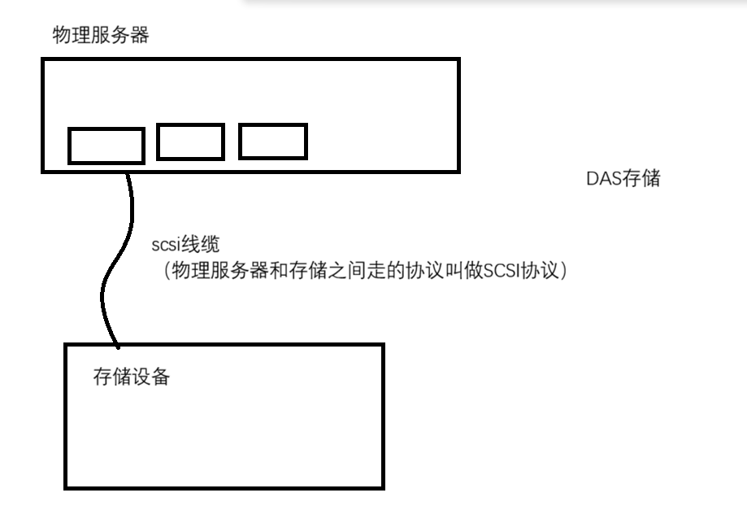
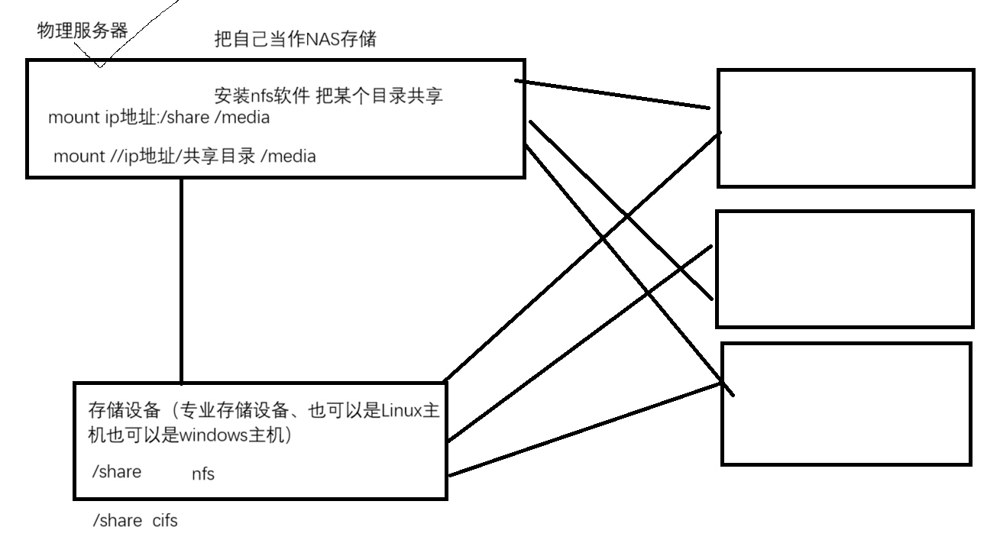
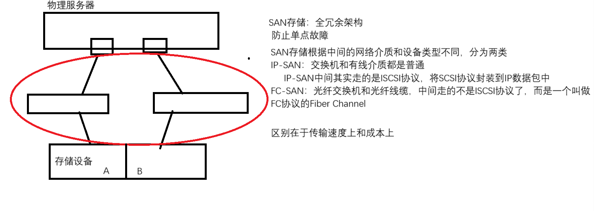

# 1. 存储的发展架构以及使用方式
- **根据存储架构分类** 
	- DAS: 直连式存储; 服务器设备和存储设备之间通过有线介质连接
		- 比如: SCSI线缆、USB接口、外接硬盘、外接U盘
		- 目的是: 为了给服务设备提供存储资源
		
	- NAS: 网络附加存储; 通过网络的形式, 将存储资源共享给物理服务器
		- 比如: nfs、cifs 协议
		- 实现nfs协议: nfs-utils软件包, nfs是在Linux和Linux之间、Unix和Linux之间实现文件共享的
		- 实现cifs协议: samba软件包, cifs-utils, cifs是Linux和windows之间实现文件系统的, 也可以实现Linux和Linux之间文件共享
		- **在服务器上看到的是一个共享目录, 只需要挂载这个目录就可以使用** 
		
	- **SAN: 存储区域网络; 在服务器设备和存储设备之间构建了一套高可用的网络** 
		- 在服务器上看到的还是一个块设备, 需要进行~~分区~~、格式化和挂载, 才能使用
		
- **根据存储使用进行分类** 
	- 块存储: DAS、SAN提供的是块存储. 在服务器上表现为一个磁盘, **需要分区, 格式化和挂载才能使用** 
	- 文件系统存储: NAS提供的就是文件系统存储. 在服务器上表现为一个目录, **直接挂载就可以使用** 
	- 对象存储
		- 对象存储中是没有文件系统概念的, 而且对象存储, 存储的也不是文件, 而是切分后的对象
		- 对象存储本身是一个扁平化的一个bucket桶
		- 对象存储不是直接给操作系统使用的, 无法像块存储和文件系统存储那样直接给操作系统来使用对象存储的空间
		- 对象存储对外提供的方式是http接口, 你想要访问这个对象存储的对象的话, 你是通过一个http地址来访问的

# 2. NFS 共享存储
- **NFS : Network FileSystem网络文件系统** 
	- 通过网络的形式, 将主机上的某个目录共享出去, 其他的主机直接挂载就可以访问这个共享目录
	- 一般是在**Linux主机和Linux主机之间**实现目录共享的
	- **如果Linux主机通过NFS将目录共享出去, 那么这台Linux主机也可以叫做NAS存储** 
	- **nfs-utils软件包: 服务端的也是客户端的软件包** 
	- 案例: 将rhel9作为nfs服务端, 将本机的/nfs通过nfs共享出去, centos作为客户端来挂载共享目录
		- ```bash
			# 安装软件包
			命令 : yum install nfs-utils -y
			
			# 修改配置文件 /etc/exports 
			命令 : 
				vim /etc/exports
				/nfs 172.10.0.0/24(ro)  # 写入配置文件的内容
				# 解释内容: 共享目录 允许哪些客户端访问(共享选项), ro代表只读
			
			# 启动重启服务
			命令 : systemctl restart nfs-server  # 需要防火墙放行端口, 将SELinux设为宽松
			# 也可以不重启服务
			命令 : exportfs -r  # 刷线nfs配置
			
			# 查看共享了哪些目录
			命令 : 
				exportfs  # 输出简略信息
				exportfs -v  # 输出详细信息
				exportfs -av  # 仅能看到允许哪些客户端访问哪个目录
			
			# 客户端挂载nfs
			命令 : mount -t nfs nfs服务器地址:共享目录 挂载点
			
			# 查看nfs服务端的共享目录
			命名 : showmount -e/--exports nfs服务端IP
			
			# 查看挂载情况
			命令 : df
			
			# 客户端使用 root 用户挂载nfs后, 客户端是以服务端的 nobody 这个用户来写文件的
			解决办法就是将共享目录的其他人给写的权限
		  ```
- 永久挂载: /etc/fstab
	- ```bash
		nfs服务器IP地址:共享目录 挂载点 文件系统类型(nfs) defaults,_netdev 0 0
			_netdev 代表网络设备, 系统启动时等待网络服务启动后才进行挂载
	  ```
## 2.1 nfs 服务端共享选项
- 共享选项
	- ```bash
		[root@mubai632 opt]# cat /etc/exports
		/opt/test 172.10.0.0/24(rw)
	  ```

- 多个选项之间使用 **`,`** 隔开 **(xx,xx,xx,...)** 
# 3. autofs 按需自动挂载
- autofs 优势
	- autofs支持本地文件系统, 也支持网络文件系统, 只要mount命令能够挂载的文件系统, autofs都支持
	- autofs配置是在客户端配置的, 不需要在服务端配置
	- autofs是以服务的方式运行在系统后台, 所以可以使用systemctl命令进行管理
	- ```bash
		# 安装autofs软件
		命令 : yum install autofs -y
		
		# 启动autofs服务并设置开机自启
		命令1 : 
			systemctl start autofs
			systemctl enable autofs
		命令2 : systemctl enable --now autofs  # 设置开机自启,并立即启动
	  ```
- **autofs 的配置文件是 `/etc/auto.master` 或者是在 `/etc/auto.master.d/` 目录下创建 `xxx.autofs` 的文件** 
- 实验1: 通过autofs实现本地的光盘文件系统的按需自动挂载和卸载, 自动挂载到/cdrom/cdrom
	- ```bash
		[root@mubai632 ~]# grep iso /etc/auto.master
		/opt   /opt/autofs.iso
		# 解释: 
			# /opt 代表挂载点的上一级目录, 我的挂载点是/opt/mount
			# /opt/autofs.iso 这个是触发文件, 文件名随便写, 但是必须是绝对路径, 之后需要编辑文件内容
		[root@mubai632 ~]# cat /opt/autofs.iso
		mount -fstype=iso9660 :/dev/sr0
		# 解释: 
			# mount 代表要挂载的目录
			# -fstype 挂载选项, 指定挂载的文件类型
			# iso9660 代表的是, 镜像文件
			# :/dev/sr0 本地的/dev/sr0设备, : 代表本地的
	  ```
- 实验2: 通过autofs实现nfs共享目录的自动挂载和卸载, 将172.10.0.130的 /opt/test 目录自动挂载到 /opt/test 
	- ```bash
		[root@mubai632 ~]# grep auto.nfs /etc/auto.master
		/opt   /opt/auto.nfs
		[root@mubai632 ~]# cat /opt/auto.nfs
		test -rw 172.10.0.130:/opt/test
	  ```
- 对于最终挂载点的上一级目录来说, 任何用户都不能够去修改, 因为这个目录已经被autofs服务接管, 它不允许所有人来修改文件