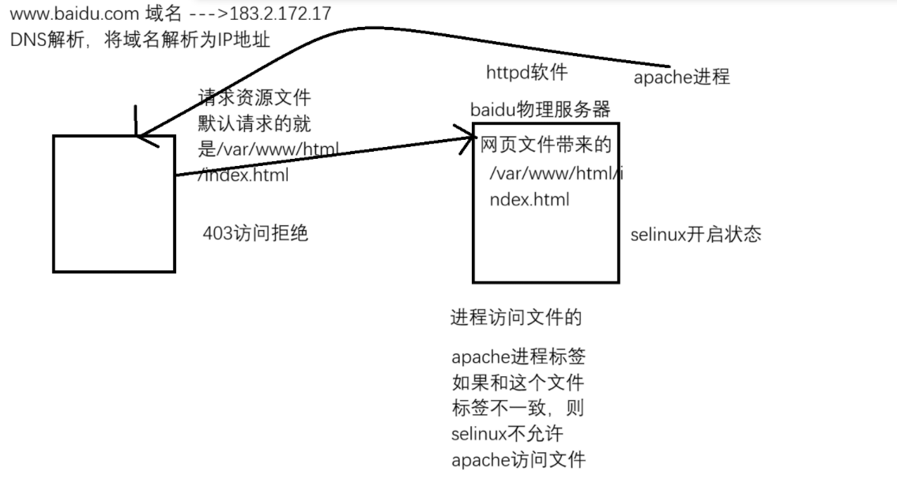
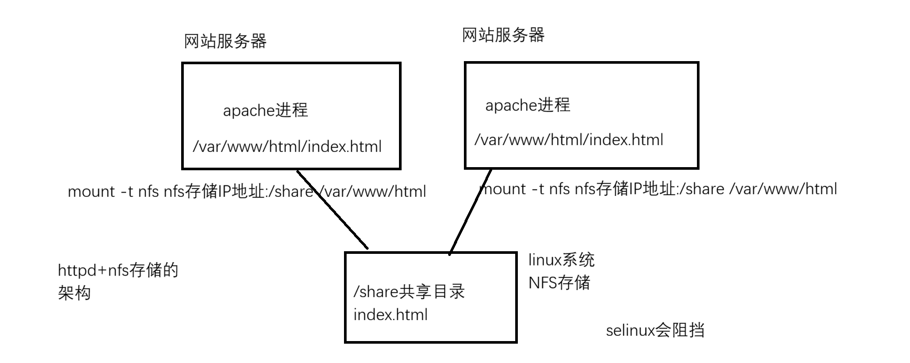

# 1. SELinux 介绍
- SELinux 是属于 Linux 内核的功能, 主要是为了保证系统的安全性
- SELinux 从**三个方面**来管理 Linux 系统
	1. **根据文件标签来管理** 
	2. **根据应用程序的行为来管理** 
	3. **根据端口标签来管理** 

# 2. SELinux 三种模式
- **强制模式(Enforcing)** 
	- **SELinux 强制执行访问控制规则**. 系统默认在该模式下运行(强制模式会限制系统)
- **许可模式(Permissive)** 
	- **SELinux 处于活动状态**, 但不强制执行访问控制规则, 而是记录违反规则的警告. 该模式主要用于测试和故障排除. (相当于关闭, 不会限制系统, 但是会记录日志, 通常进行临时关闭和测试)
- **关闭模式(Disable)** 
	- **SELinux 完全关闭, 不拒绝任何 SELinux 违规行为, 并不予记录** 
- 查看系统当前的 SELinux 模式
	- ```bash
		命令 : getenforce
		[root@centos7 ~]# getenforce 
		Enforcing
	  ```
- 更改系统当前的 SELinux 模式
	- **临时生效** 
		- ```bash
			命令 : setenforce 1/0  # 1强制模式, 0许可模式
		  ```
	- **永久生效** `/etc/selinux/config` 或者 `/etc/sysconfig/selinux` , 修改完配置文件需要重启 reboot 
		- ```bash
			SELINUX=enforcing  # 强制模式, 默认的
			SELINUX=permissive  # 许可模式
			SELINUX=disabled  # 关闭
		  ```

# 3. SELinux 根据文件标签管理系统(fcontext)
- 如果**文件的标签**和**进程标签**不匹配, 那么SELinux就会阻挡这个进程来访问这个文件
	- ```bash
		# 查看目录或文件默认标签
		命令 : matchpathcon 文件/目录
		
		# 查看 SELinux 标签
		ps -efZ
		ll -Z
		ll -dZ
		-rw-r--r--. root root unconfined_u:object_r:httpd_sys_content_t:s0 index.html
		  SELINUXTYPE=targetd
		  httpd_sys_content_t 文件的标签类型
	  ```

- 实验模拟
	1. 安装和启动httpd软件
		- ```bash
			[root@mubai632 ~]# yum install httpd -y 
			[root@mubai632 ~]# systemctl enable --now httpd 
			[root@mubai632 ~]# systemctl stop firewalld 
		  ```
	2. 编写一个测试网页文件
		- ```bash
			[root@mubai632 ~]# echo rhel9999 > /var/www/html/index.html
		  ```
	3. 修改文件的标签类型
		- ```bash
			命令 : chcon -t 标签类型 文件
			[root@mubai632 ~]# chcon -t admin_home_t /var/www/html/index.html 
		  ```
- **修改文件的标签类型** 
	- **chcon** (临时生效, **重启不会导致标签重置**, 只有通过 **restorecon** 命令才会导致 chcon 修改的标签失效) 
		- ```bash
			命令 : chcon -t 标签类型 文件
		  ```
	- **semanage** (永久生效, 是因为它将标签写入到了文件中) 
		- ```bash
			命令 : semanage fcontext -a -t 标签类型 文件的绝对路径
				-a : 添加文件标签
				-t : 指定标签类型
				-m : 修改文件标签, 添加之后才能修改
			[root@mubai632 ~]# semanage fcontext -a -t admin_home_t /var/www/html/index.html
			[root@mubai632 ~]# ll -Z /var/www/html/index.html 
			-rw-r--r--. 1 root root unconfined_u:object_r:httpd_sys_content_t:s0 9  4月 11 09:17 /var/www/html/index.html
			
			semanage修改的标签不会立即生效，需要重新刷新标签才会生效
			命令 : restorecon -v 文件的绝对路径
				-v : 打印出哪个文件的 SELinux 类型被改了
			[root@mubai632 ~]# restorecon -v /var/www/html/index.html
			
			# 完整给目录打标签的方式
			[root@mubai632 ~]# semanage fcontext -a -t httpd_sys_content_t "/var/www/html/demo(/.*)?"
		  ```
- s**emanage 打标签后保存在 `/etc/selinux/targeted/contexts/files` 目录下的 `file_contexts.local` 中** 

# 4. SELinux 根据应用程序行为管理(boolean)

- **查看SELinux行为状态** 
	- ```bash
		# 列出SELinux的行为状态和下一次开机的状态
		命令 : semanage boolean -l  
		[root@mubai632 ~]# semanage boolean -l
		# 列出当前状态
		命令 : getsebool -a  
	  ```
- **设置当前和下一次开机的状态** 
	- ```bash
		命令1 : semanage boolean -m 标签类型 --on/--off  开启或关闭
		[root@mubai632 ~]# semanage boolean -m httpd_use_nfs --on
		
		命令2 : setsebool 程序行为 -P 1/0  开启或关闭
		[root@mubai632 ~]# setsebool httpd_use_nfs -P 1
		
		[root@mubai632 ~]# semanage boolean -l | grep httpd | grep nfs 
		httpd_use_nfs (开 , 开) Allow httpd to use nfs
	  ```
- 修改当前状态
	- ```bash
		命令 : setsebool 程序行为 1/0  开启或关闭
		[root@mubai632 ~]# setsebool httpd_use_nfs 0 
	  ```

# 5. SELinux 根据端口标签管理(port)
- 查看端口标签
	- ```bash
		命令 : semanage port -l 
		[root@mubai632 ~]# semanage port -l | grep ssh_port
		ssh_port_t                        tcp      22
	  ```
- 添加和删除端口标签
	- ```bash
		命令 : semanage port -a -t 标签类型 -p 传输协议 端口  # 添加
			-a : 添加端口标签
			-t : 指定标签类型
			-p : 指定传输协议
		[root@mubai632 ~]# semanage port -a -t ssh_port_t -p tcp 2222
		
		# 查看
		[root@mubai632 ~]# semanage port -l | grep ssh_port
		ssh_port_t                     tcp      2222, 22
		
		# 删除端口标签
		命令 : semanage port -d -t 标签类型 -p 传输协议 端口  # 删除
			-d : 删除端口标签
		[root@mubai632 ~]# semanage port -d -t ssh_port_t -p tcp 2222
	  ```

# 6. SELinux 的日志
- 默认情况下 SElinux 产生的日志是不会记录到 rsyslog 或者 journald 日志中
- 也就是说无法通过 `/var/log/messages` 和 journalctl 命令去查看selinux的日志
- **安装了一个服务setroubleshoot-server, 会读取审计日志, 然后转化为更加简单明了的日志信息到rsyslog中和journald日志中** 