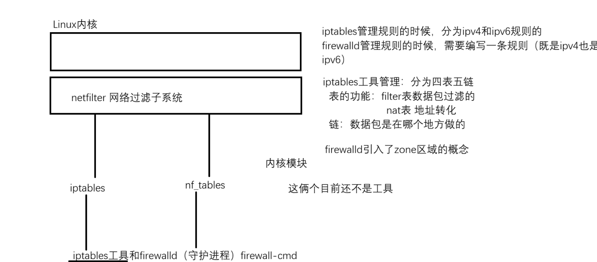
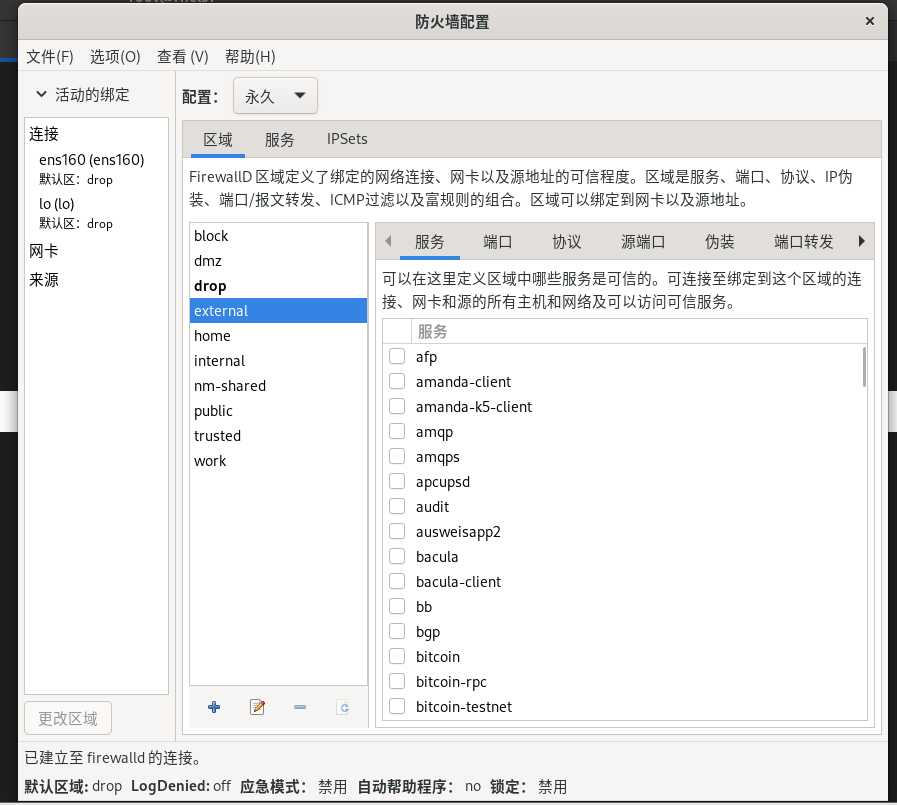
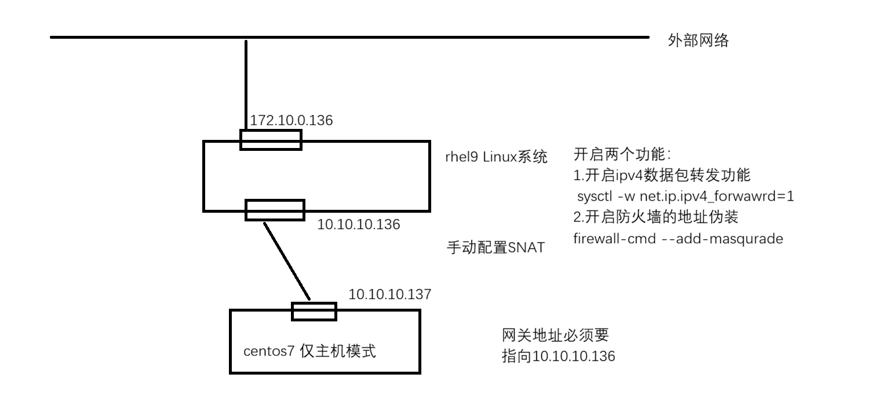

# 1. 防火墙介绍
- 防火墙
	1. 数据包过滤: 可以实现数据包的进出管理. 大部分场景下, 出数据包都是允许的, **限制的都是入数据包** 
	2. NAT, 地址转换
		1. SNAT: 源地址转换, 源IP地址转成另外一个IP地址, 内网主机出去上网
		2. DNAT: 目标地址转换, 目的IP地址转成另外一个IP地址, 内网主机对外暴露服务
- firewalld 和 iptables不是防火墙, 它们是属于防火墙的管理工具, 通过工具来管理防火墙
- 真正实现防火墙功能的是Linux的内核
- 子系统 netfilter: 网络数据包过滤子系统
	

- **firewalld中引入的zone概念, 和表差不多. 不同的zone里面自带的规则也是不一样的** 
- **查看主机上有哪些 zone** 
	- ```bash
		[root@mubai632 ~]# firewall-cmd --get-zones
		block dmz drop external home internal nm-shared public trusted work
	  ```
- 查看 zone 的策略
	- ```bash
		# 查看默认 zone 的策略
		命令 : firewall-cmd --list-all
		[root@mubai632 ~]# firewall-cmd --list-all
		public (active)  # zone 
		  target: default  # 决定了 zone 中是丢弃还是放行
			  # DROP : 全部丢弃
			  # ACCEPT : 全部放行
			  # default : 除了 icmp 协议之外, 全部丢弃
			  # REJECT : 全部丢弃, 但会有返回值
		--------------- 下面只要有内容就是放行, 与上面无关 -------------
		  icmp-block-inversion: no  # no 代表开启黑名单, yes 代表开启白名单
		  interfaces: ens160 ens224 ens256  # 从哪个网卡进的数据
		  sources:  # 放行的源IP地址
		  services: cockpit dhcpv6-client ssh  # 放行什么服务
			  放行服务就是放行服务的默认端口
		  ports:  # 放行的端口
		  protocols:
		  forward: yes  # 是否开启转发数据包, 网络地址转换的东西
		  masquerade: no  # 是否开启地址伪装
		  forward-ports:  # 端口转发
		  source-ports:  # 源端口
		  icmp-blocks:  # 与黑白名单连用, 写什么拒绝/放行什么, 什么都不写,就都不拒绝/不放行
		  rich rules:  # 富规则
			  # 类似于rwx和acl权限的关系
			  # 富规则可以针对于指定的来源地址访问指定的端口, 放行指定的来源IP访问指定的端口
		
		# 查看指定 zone 的策略
		[root@mubai632 ~]# firewall-cmd --list-all --zone=drop  # 区域里面没有放行任何规则，意思就是所有的数据包都会丢弃掉
		drop
		  target: DROP
		  icmp-block-inversion: no
		  interfaces:
		  sources:
		  services:
		  ports:
		  protocols:
		  forward: yes
		  masquerade: no
		  forward-ports:
		  source-ports:
		  icmp-blocks:
		  rich rules:
	  ```


# 2. 管理防火墙的多种方式
- 防火墙规则的优先级: **rich > source > interface > zone** 
- 管理防火墙的方式
	1. 通过cockpit控制台管理(不推荐)
	2. 通过图形化工具管理
		- 需要安装存在图形化界面, 并且安装图形化管理工具
			- ```bash
				[root@mubai632 ~]# yum install -y firewall-config.noarch
			  ```
		
	3. **通过命令行工具 `firewall-cmd` 工具(常用)** , **一切修改之后都必须重载防火墙 `firewall-cmd --reload` 才不会出现问题**
		- 防火墙的规则配置分为两种
			- 临时生效(重启防火墙服务或者执行 firewall-cmd --reload 会失效)
			- 永久生效(重载防火墙生效 firewall-cmd --reload ): 永久生效必须使用 --permanent 参数
		- **查看和修改默认的 zone** 
			- ```bash
				# 查看主机有哪些 zone
				命令 : firewall-cmd --get-zones
				
				# 查看默认 zone 规则
				命令 : firewall-cmd --list-all
				
				# 查看指定 zone 规则
				命令 : firewall-cmd --list-all --zone=zone名
				
				# 查看所有 zone 规则
				命令 : firewall-cmd --list-all-zones
				
				# 修改默认的 zone
				命令 : 
					firewall-cmd --set-default-zone=zone名  # 修改zone
					firewall-cmd --reload  # 重载防火墙
			  ```
		- 修改 zone 的 target 策略 
			- ```bash
				#修改target, 临时修改, 重载或重启防火墙后失效
				命令 : firewall-cmd --set-target=DROP
				
				# 修改target, 永久修改, 重载后生效
				命令 : 
					firewall-cmd --permanent --set-target=DROP 
					firewall-cmd --reload  # 重载防火墙
			  ```
		- 管理 interface 网卡, 修改interface到哪个 zone 中, 如果 interface 不在任何的zone中, 则匹配的是默认的zone的规则, **手动永久指定网卡后, 会在网卡的配置文件中出现一个 zone=xxx 的行, 如果删除这行需要重启NetworkManager服务** 
			- ```bash
				# 临时修改, 重载或重启防火墙后失效
				#从某个zone中移动interface到另外一个zone
				命令 : firewall-cmd --change-interface=网卡名称 --zone=zone名
				#删除zone中的interface 
				命令 : firewall-cmd --remove-interface=网卡名称
				#新增zone中的interface 
				命令 : firewall-cmd --add-interface=网卡名称
				
				# 永久修改,需要在命令中加入 --permanent 参数, 再重载防火墙后生效
			  ```
		- 管理 service 服务, 在 zone 中新增或删除
			- ```bash
				# 临时修改, 重启或重载防火墙后失效
				#从zone中删除service-->阻挡服务对应的端口流量
				命令 : firewall-cmd --remove-service=服务名
				#从zone中新增service-->放行服务对应的端口流量
				命令 : firewall-cmd --add-service=服务名
				
				# 永久修改,需要在命令中加入 --permanent 参数, 再重载防火墙后生效
			  ```
		- **管理 port 端口, 在 zone 中新增或者删除** 
			- ```bash
				# 临时修改, 重启或重载防火墙后失效
				# 添加 port 到 zone 中, 放行端口
				命令 : firewall-cmd --add-port=端口/协议
				# 删除 zone 中的 port
				命令 : firewall-cmd --remove-port=端口/协议
				# 批量添加和删除
				命令 : firewall-cmd --add-port=端口-端口/协议
				命令 : firewall-cmd --remove-port=端口-端口/协议
				
				# 永久修改,需要在命令中加入 --permanent 参数, 再重载防火墙后生效
			  ```
		- 管理端口转发
			- ```bash
				# 开启端口转发, 临时修改, 重启或重载防火墙后失效
				命令 : firewall-cmd --add-forward-port=port=8888:proto=tcp:toport=22:toaddr=172.10.0.135
					port=8888  # 将本地的8888端口的流量进行转发
					proto=tcp  # 协议是什么
					toport=22  # 转发到的端口
					toaddr=172.10.0.135  # 远端主机, 如果不写就是将本地8888端口的流量转发到本地的22端口, 加了就是将本地的8888端口的流量转发到远端的22端口
				firewall-cmd --add-masquerade  # 开启地址伪装, 不开启无法进行转发
				
				# 永久修改,需要在命令中加入 --permanent 参数, 再重载防火墙后生效
			  ```
		- 管理地址伪装(开启NAT)
			
			- ```bash
				命令 : 
					# 临时修改, 重启或重载防火墙后失效
					firewall-cmd --add-masquerade  # 开启防火墙中的地址伪装
					# 永久修改,需要在命令中加入 --permanent 参数, 再重载防火墙后生效
					sysctl -w net.ipv4.ip_forward=1  # 开启内核的数据包转发
			  ```
		- **管理富规则** 
			rich 富规则, 是建立在防火墙规则之上的, 能够更加精细化的管理. 涉及到来源IP访问指定端口、访问指定服务、开启端口转发都可以使用富规则实现
			- ```bash
				# 查看富规则的案例
				命令 : man firewalld.richlanguage
				搜索  example 就能看到对应的案例
				
				# 临时修改, 重启或重载防火墙后失效
				firewall-cmd --add-rich-rule='rule family="ipv4" source address="IP地址" port port="端口" protocol="协议" 动作'
					动作: 
						允许 : allow
						拒绝 : reject
						丢弃 : drop
						
				# 永久修改,需要在命令中加入 --permanent 参数, 再重载防火墙后生效
			  ```

- 以上的所有内容除了修改默认 zone 不需要加 --permanent 参数, 就是永久修改, 但是其他内容都需要添加 --permanent 参数, 才是永久修改, 不添加就是临时修改
- 防火墙中的每一个 zone 和每一个 service 都有对应的配置文件 **`/usr/lib/firewalld`**  