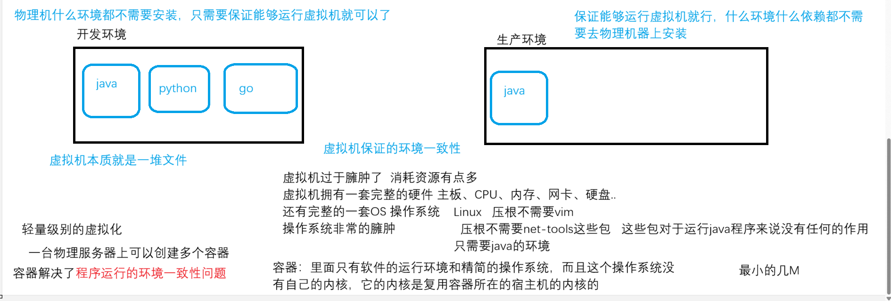
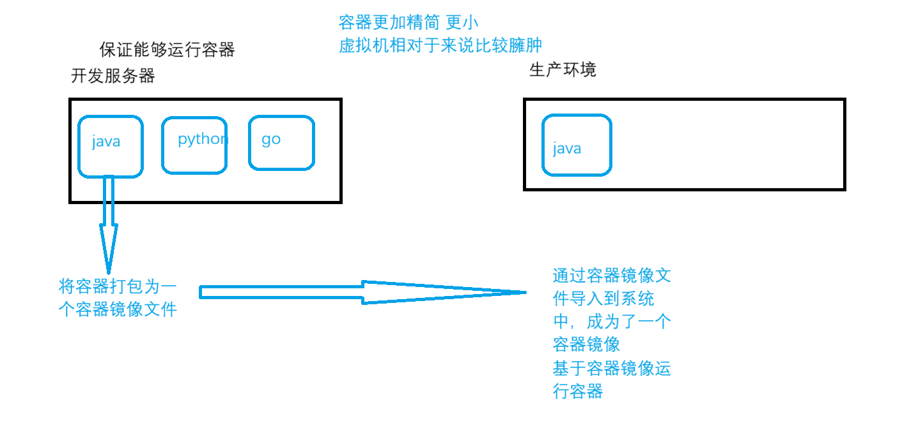
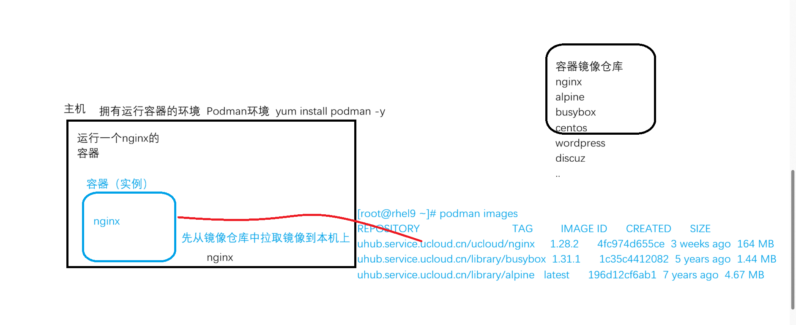
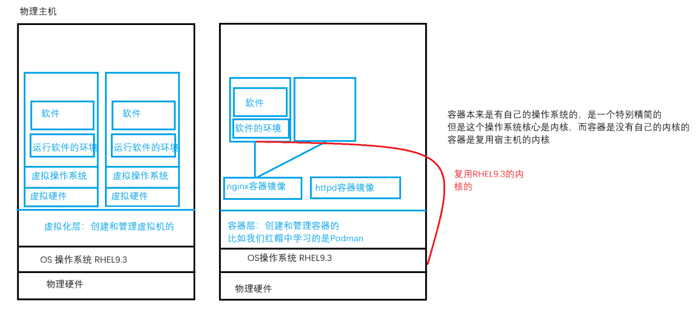
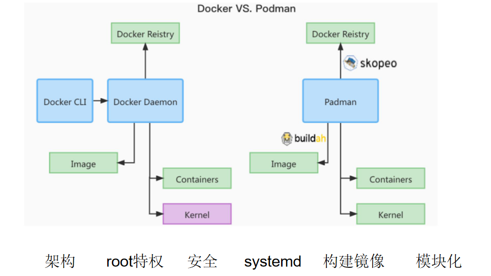
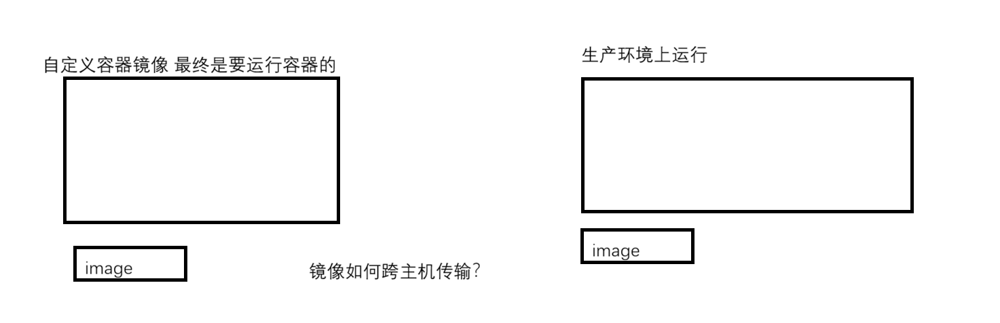
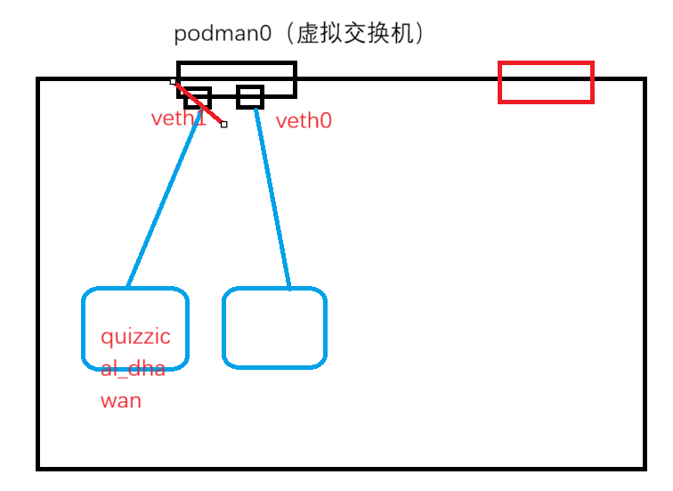
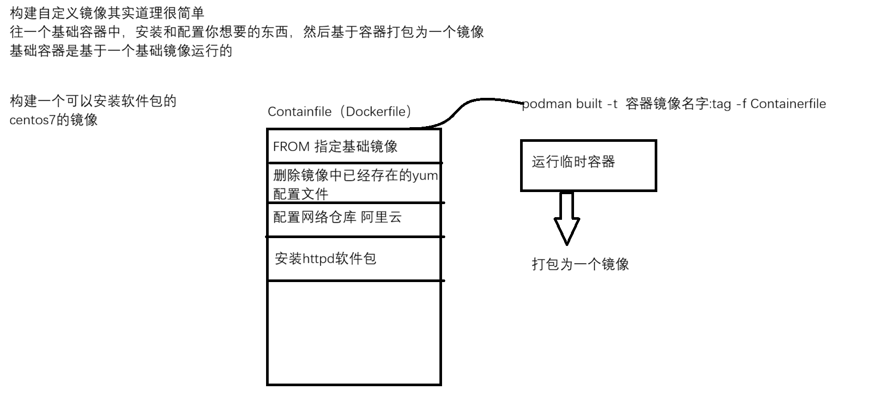

- 容器的核心概念: 容器, 容器镜像, 容器镜像仓库
- 容器核心技术: cgroup、chroot、namespace

# 1. 容器解决的问题
- 容器的出现是为了解决业务的环境一致性问题, 解决了虚拟机臃肿的问题
- 容器你可以理解为一个包装箱, 包装箱是用来转物品的
	- 使用包装箱装了这个物品, 物品装之前是什么样的, 你拆开了这个包装箱之后就是什么样的




# 2. 容器的三大核心概念
- 容器属于轻量级别的虚拟化, 所以一台物理服务器上是可以同时运行多个容器的
- 容器的核心概念
	- **container(容器)** : 运行的实例, 基于容器镜像来运行的. 一个容器就是一个进程
	- **image(容器镜像)** : 是一个模板, 这个模板包含了精简版本的操作系统和运行程序必备的环境
	- **registry(镜像仓库)** : 容器镜像保存的位置; 私有镜像仓库/公有镜像仓库
	- 
		- 用户先从容器镜像仓库将容器镜像拉取到本机上, 然后基于容器镜像运行一个容器实例
		- 容器实例里面的服务、操作系统、数据都是来自于容器镜像这个模板的

# 3. 容器和虚拟机之间的对比

- **从隔离上对比** 
	- 虚拟机拥有单独的**完整的操作系统**, 每个虚拟机都有自己的内核 
	- 容器复用宿主机的内核, 每个容器不管是基于什么容器镜像运行的, 全部都是使用宿主机的内核
- **从占用空间上对比** 
	- 虚拟机拥有完整的操作系统, 操作系统占据几个GB的空间, 所以**虚拟机是GB级别的** 
	- 容器没有完整的操作系统, 容器中只运行软件和软件必备的环境, 所以**容器一般都是MB级别的** 
- **从镜像格式上对比** 
	- 所有的容器镜像格式标准都是遵循docker的容器镜像标准, 仅有一种格式
	- 虚拟机的镜像格式非常的多, 也存在一个统一的格式: ovf/ova
		- ISO镜像格式 : 一般是来安装系统的
		- qcow2镜像格式 : KVM虚拟机磁盘文件格式
		- vmdk镜像格式 : vmware虚拟机磁盘文件格式
		- vhd镜像格式 : windows的hyper-v虚拟机磁盘文件格式
- **从创建速度和启动速度上对比** 
	- 容器要远远超过虚拟机, 无论是创建还是启动远远超过虚拟机

# 4. podman 和 docker 的区别
- podman 和 docker 的区别在于**架构上的区别** 
	
	- docker 容器是有守护进程的, 就是必须要启动一个dockerd的服务, 才能使用docker的命令
	- podman 容器是没有守护进程, 它不需要启动服务, 直接管理容器

	- podman是一个模块化管理, 比如管理容器镜像使用skopeo工具, 构建镜像buildah工具等...但实际上, 一个podman工具就可以管理这些
	- docker管理所有的对象都是docker命令

	- docker必须是管理员才能去执行
	- podman支持无根容器, 所谓的无根容器指的就是普通用户也可以管理容器

# 5. podman 的安装
- 安装 podman 
	- ```bash
		# 仅安装 podman 
		yum -y install podman
		
		# 也可以安装容器软件包
		yum -y install container-tools
	  ```

# 6. 实现容器的三大核心技术
- 容器技术的核心在于 Linux 的内核
- 三大核心技术
	- namespace : 命名空间. 作用是资源隔离, 不同的命名空间无法互相访问
	- chroot : 切换根文件系统. 每个容器都有自己的根文件系统, A容器的根文件系统故障是不影响B容器的
	- cgroup : 控制组. 限制进程的使用资源的, 容器就是进程

# 7. 容器, 容器镜像, 容器镜像仓库
## 7.1 容器镜像
- 容器镜像: 就是一个模板, 包含了操作系统以及软件运行的环境
- **从容器仓库拉取镜像到本地** 
	- ```bash
		命令 : podman pull 容器镜像地址
		[root@mubai632 ~]# podman pull uhub.service.ucloud.cn/ucloud/nginx:1.28.2
		
		# 容器镜像的组成: 容器镜像仓库地址/仓库名/镜像名:tag
	  ```
- **列出系统中存在的容器镜像** 
	- ```bash
		命令 : podman images
	  ```
- 搜索镜像
	- ```bash
		命令 : podman search 关键字
	  ```
- 从私有仓库拉取镜像
	- ```bash
		# 拉取私有镜像的时候, 会报错无法拉取, 需要登录私有仓库的账号
		# 登录远程镜像仓库
		命令 : podman login 容器镜像仓库地址
		Username: 账号
		Password: 密码
		Login Succeeded!
		
		# 退出登录
		命令 : podman logout 容器镜像仓库地址
		Removed login credentials for uhub.service.ucloud.cn
	  ```
- 
	- 跨主机传输镜像的方式
		- 将镜像打包为一个文件, 传输给其他主机, 其他主机基于文件导入镜像到系统中
			- ```bash
				# 将容器镜像打包为一个文件, 将镜像导出为文件
				命令 : podman save -o 文件名.tar 镜像名
				
				# 将文件导入为镜像
				命令 : podman load -i 文件名.tar
			  ```
		- 将镜像推送到到容器镜像仓库中, 其他主机直接podman pull xxx 拉取镜像即可
			- ```bash
				# 推送镜像到仓库中, 需要更改镜像的名称为你要推送的仓库地址'
				命令 : podman tag 镜像名 仓库地址/仓库名/镜像名:tag
				[root@mubai632 ~]# podman tag uhub.service.ucloud.cn/ucloud/nginx:1.28.2 uhub.service.ucloud.cn/要推送的仓库/nginx:1.28.2
				
				# 先登录账户, 再进行推送
				命令 : podman push 镜像名
			  ```
- **删除容器镜像** 
	- 前提: 这个镜像一定不能正在使用的
		- ```bash
			命令 : podman rmi 镜像名
		  ```
- **查看容器镜像的详细信息** 
	- ```bash
		命令 : podman inspect 镜像名
	  ```
- 总结容器镜像的常用命令
	- ```bash
		# 拉取容器镜像
		命令 : podman pull 镜像名
		# 推送镜像
		命令 : podman push 镜像名
		# 更改 tag 
		命令 : podman tag 镜像名 仓库地址/你要推送的仓库名/镜像名:tag 
		# 删除镜像
		命令 : podman rmi 镜像名
		# 导出为文件
		命令 : podman save -o 文件名.tar 镜像名
		# 导入为镜像
		命令 : podman load -i 文件名.tar
		# 查看镜像的详细信息
		命令 : podman inspect 镜像名
		# 搜索镜像
		命令 : podman search 关键字
		# 登录和退出仓库
		命令 : 
			podman login
			podman logout
	  ```
## 7.2 容器
-  容器是基于镜像运行的一个实例. 无法直接访问容器镜像中的内容, 必须先运行容器才能访问其中的服务和数据文件
- **列出容器** 
	- ```bash
		# 列出正在运行的容器
		命令 : podman ps
		
		# 列出所有状态的容器
		命令 : podman ps -a
		
		# 列出所有容器的ID
		命令 : podman ps -aq 
			-q : 列出ID
	  ```
- **查看容器的详细信息** 
	- ```bash
		# 查询容器/镜像的详细信息
		命令 : podman inspect 容器ID/镜像名
	  ```
- **容器的状态可能是 UP / Exited (0) / Exited (1) ......** 
	- 出现 Exited 状态是退出状态, 这是因为**容器是为了服务而生, 如果容器中的服务结束了, 那么容器的生命周期也结束了, 容器就会退出** 
	- ```bash
		[root@rhel9 ~]# podman ps -a 
		CONTAINER ID  IMAGE                                         COMMAND               CREATED             STATUS                         PORTS       NAMES
		9b38577e7001  uhub.service.ucloud.cn/library/alpine:latest  /bin/sh               About a minute ago  Exited (0) About a minute ago              keen_shirley
		ddc3ccf1f410  uhub.service.ucloud.cn/ucloud/nginx:1.28.2    nginx -g daemon o...  6 seconds ago       Up 7 seconds                               ecstatic_hopper
		
		# COMMAND : 指的是容器运行的时候执行的命令是什么
	  ```
	- **在容器中保持前台运行的(容器是处于运行状态), 在容器的后台运行(容器是会处于退出状态)** 
- **运行容器** 
	- ```bash
		# 只适用于镜像运行的容器执行的命令是/bin/sh或者/bin/bash, 这条命令可以让这些容器持续运行
		命令 : podman run -it 镜像名
			-i 和 -t 选项是一块使用的
			-i 表示交互式
			-t 表示分配终端
		默认情况下, podman run 会进入容器中, 但使用 exit 退出容器会导致容器进入Exited 状态
		
		# -d 放入后台运行, 不会进入容器中
		命令 : podman run -d -it 镜像名
		这条命令会保持容器为运行状态, 进入容器后退出也不会导致容器变为 Exited 状态, 仅使用 -d 选项, /bin/bash和/bin/sh都会直接进入 Exited 状态
		
		# --name给容器命名, --hostname给容器中的主机命名
		命令 : podman run -d --name 容器名 --hostname 容器主机名 镜像
		
		# --rm, 运行一个临时容器, 退出容器后会删除容器
		命令 : podman run -it --rm 镜像名
	  ```
- **进入容器** 
	- ```bash
		# 通过 exec 进入容器
		命令 : podman exec -it 容器名/容器ID /bin/bash
		命令 : podman exec -it 容器名/容器ID /bin/sh
		
		# 通过attach进入容器, 正常使用 exit 命令退出会导致容器变成退出状态. 使用 ctrl p 配合 ctrl q 就可以退出, 这种方式的退出不会导致容器变成 Exited 状态
	  ```
- **删除容器** 
	- ```bash
		命令 : podman rm 容器名/容器ID   # 删除
		命令 : podman rm -f 容器名/容器ID  # 强制删除
		
		# 正常情况下需要先将运行的容器停止掉, 再删除
		命令 : 
			podman stop 容器名/容器ID
			podman rm 容器名/容器ID
		
		# 删除指定状态的容器 
		命令 : podman ps -q -f status=状态  # 查询指定状态的容器并显示器ID
		命令 : podman rm `podman ps -q --filter status=状态`
		
		# 删除所有容器
		命令 : podman ps -aq  # 显示所有容器的ID
		命令 : podman rm `podman ps -aq`
	  ```

## 7.3 容器镜像仓库
- **容器镜像仓库配置文件是 `/etc/containers/registries.conf` ,  其中可以配置对应的容器镜像仓库的地址** 
- 作用是, 当用户搜索容器镜像的时候如果没有指定镜像仓库地址, 则默认使用文件中定义的仓库中去搜索镜像. 当用户拉取镜像的时候没有指定仓库仓库地址, 默认也会从文件中定义的仓库去拉取
	- ```bash
		[root@mubai632 ~]# cat /etc/containers/registries.conf
		unqualified-search-registries = ["uhub.service.ucloud.cn", "registry.access.redhat.com", "registry.redhat.io", "docker.io"]
			registry.access.redhat.com：红帽的开放的公有镜像仓库 
			registry.redhat.io：红帽的私有镜像仓库，需要你登录红帽账户 
			docker.io：docker官网镜像仓库 dockerhub
		
		[[registry]]  # 针对于一个指定镜像仓库的配置
		prefix = "example.com/foo"  # 匹配的镜像前缀
		insecure = false  # 是否忽略安全性, false基于https拉取, true基于http拉取
		blocked = false  # 是否禁用当前镜像仓库
		location = "mubai632.top/mubai632"  # 实际上镜像的前缀
		# podman pull example.com/foo/nginx:v1 --> podman pull mubai632.top/mubai632/nginx:v1  其实就是这样
	  ```

## 7.4 容器的存储
- 默认情况下, 容器的存储是临时的, 容器的根会挂载到宿主机上
- 当删除容器的时候, 这个宿主机上的目录也会随之删除, 所以数据是临时的
- 为了实现容器的持久化存储, 通过容器卷的方式来实现容器数据持久化存储
- 所谓的容器卷, 这个卷其实就是宿主机的某个目录, 我们需要将容器卷挂载给容器的某个目录, 当容器将文件保存到这个挂载的目录的时候, 实际上是将文件存储到了宿主机的某个目录, 这个目录是不会随着容器的删除而删除的, 它会随着容器卷的删除而删除
	- ```bash
		# 列出容器卷
		命令 : podman volume ls
		
		# 查看指定容器卷的详细信息
		命令 : podman volume inspect 容器卷名/容器卷ID
	  ```
- **创建和挂载容器卷** 
	- **容器卷是不能挂载给容器的根目录的, 只能挂载给其他目录** 
	- ```bash
		# 创建容器卷
		命令 : 
			podman volume create 容器卷名  # 创建指定名的容器卷
			podman volume create  # 创建不指定名的容器卷
		[root@mubai632 ~]# podman volume create test
		[root@mubai632 ~]# podman volume ls
		DRIVER      VOLUME NAME
		local       test
		[root@mubai632 ~]# podman volume inspect test
		[
		     {
		          "Name": "test",
		          "Driver": "local",
		          "Mountpoint": "/var/lib/containers/storage/volumes/test/_data",   # 代表的是宿主机的目录
		          "CreatedAt": "2026-04-15T16:35:39.835088585+08:00",
		          "Labels": {},
		          "Scope": "local",
		          "Options": {},
		          "MountCount": 0,
		          "NeedsCopyUp": true,
		          "NeedsChown": true,
		          "LockNumber": 1
		     }
		]
		
		# 挂载目录, 需要在创建容器的时候指定挂载点, 如果挂载点不存在会自动创建挂载点
		命令 : podman run -d -v 容器卷名/容器卷ID:容器内的挂载点 容器镜像
		[root@mubai632 ~]# podman run -d -v test:/usr/share/nginx/html uhub.service.ucloud.cn/mubai632/nginx:v1
		# 正确挂载后, 在容器的挂载点创建文件, 都会保存到宿主机的容器卷中, 删除容器不会导致文件被删除, 只有删除容器卷的时候才会导致文件被删除
	  ```
- **删除容器卷** 
	- ```bash
		# 删除容器卷的时候确保容器卷未被使用
		# 查看容器卷被哪个容器使用
		命令 : podman ps -a --filter volume=容器卷名/容器卷ID
		# 查看容器是挂载的是哪个容器卷
		命令 : podman inspect 容器名/容器ID | grep HostConfig -A 5
			-A 显示所在行及后面几行
		[root@mubai632 ~]# podman inspect 96742b19c6a6 | grep HostConfig -A 5
          "HostConfig": {
               "Binds": [
                    "test:/123456:rw,rprivate,nosuid,nodev,rbind"
               ],
               "CgroupManager": "systemd",
               "CgroupMode": "private",
        # 删除容器卷
        命令 : podman volume rm 容器卷名/容器卷ID
	  ```
- **除了通过容器卷实现数据持久化存储, 还可以在运行容器的时候将宿主机的某个目录映射给容器的目录** 
	- ```bash
		# 映射宿主机目录到容器中
		命令 : podman run -d -v 宿主机目录:容器目录 容器镜像
		
		创建好后可能会出现类似问题, 是因为SELinux导致的, 目录只有是标签类型为container_file_t, 容器才能使用
		[root@mubai632 ~]# podman exec -it 123 /bin/bash
		root@044e93dde2c0:/# cd /ttttt/
		root@044e93dde2c0:/ttttt# touch 123
		touch: cannot touch '123': Permission denied
		
		解决办法, 在运行容器挂载目录的时候, 在后面加上一个Z或者一个z
		命令 : podman run -d -v 宿主机目录:容器目录:z/Z 容器镜像
		# 大Z 表示这个目录只能给一个容器使用, 当一个容器正在使用这个目录, 又有容器指定这个目录, 会导致之前的容器无法访问这个目录
		# 小z 表示可以同时给多个容器使用
		是临时修改, 但是无法被 restorecon 恢复, 因为 container_file_t 是通用容器数据类型, 被允许出现在任何目录中, 所以 restorecon 认为这个标签是合理的, 所以不会更改
	  ```

## 7.5 容器的网络

- 容器的三种网络模式
	- Bridge : **默认模式, 容器存在自己的网络, 可以出去访问外部网络, 但外部网络无法访问容器网络(最常使用的)** 
	- Host : 主机模式, 容器复用的是主机的网络
	- None : 无网络模式, 容器没有网卡, 只有一个lo网卡
- 宿主机和容器进行端口映射
	- ```bash
		# 端口映射, 只能在创建容器的时候进行指定
		命令 : podman run -d -p 宿主机端口:容器端口 --name 容器名 容器镜像
		将宿主机的某个端口映射到容器的某个端口, 让外部网络可以访问容器的业务
	  ```

# 8. 无根容器 rootless
- 使用一个普通用户来创建和管理容器 
- 直接切换到普通用户, 就可以使用podman命令管理了
- **重要!!!!!!! 不能通过 `su -` 切换到普通用户, 必须是ssh登录** 
	- ```bash
		# 使用 su - 切换用户
		[user@rhel9 ~]$ podman images 
		WARN[0000] The cgroupv2 manager is set to systemd but there is no systemd user session available 
		WARN[0000] For using systemd, you may need to log in using a user session 
		WARN[0000] Alternatively, you can enable lingering with: `loginctl enable-linger 1001` (possibly as root) 
		WARN[0000] Falling back to --cgroup-manager=cgroupfs    
		REPOSITORY  TAG         IMAGE ID    CREATED     SIZE
		WARN[0000] Failed to add pause process to systemd sandbox cgroup: Process org.freedesktop.systemd1 exited with status 1 
	  ```
	- **出现上述问题, 虽然不耽误用户正常使用容器, 但是用户是无法让容器与 systemd 集成, 无法将容器做成 systemd 服务的** 
- cgroup驱动采用的是systemd, 通过systemd来实现cgroup功能的, 还有一个驱动就是cgroupfs
- su - 切换用户是无法获得到完整的systemd环境, 只有SSH登录才能获取到完整的systemd环境

# 9. 容器和 systemd 集成
- 容器和systemd集成: 就是将运行中的容器制作为systemd服务单元配置文件 **`/usr/lib/systemd/systemd/xxxx.service`**  
- 通过 systemctl start/stop/restart/enable/disable/status xxxx.service 来管理容器
- **如果容器是通过服务的方式来管理, 那么对容器的管理就不要使用podman工具了, 要使用systemctl工具** 
- 查看man手册 podman-generate-systemd
- **root 的容器集成 systemd**  
	- ```bash
		# 为正在运行的容器创建.service文件
		命令 : podman generate systemd 容器ID/容器名 --files --name
			--files 输出到一个文件, 默认是使用容器ID创建.service文件
			--name 使用容器的名字创建.service文件
			--new 创建和删除容器, 当停止的时候是删除容器, 当启动的时候是创建新的容器
			
		# 将文件移动到 systemd 服务单元配置文件目录下
		命令 : 
			mv xxx.service /usr/lib/systemd/system/  # 移动
			systemctl daemon-reload  # 重新加载单元配置文件
		# 可能需要修改配置文件的标签类型为
			移动后使用 restorecon 更改一下默认标签
			命令 : restorecon -v 文件
	  ```
- **rootless 的容器(无根容器)集成 systemd** 
	- ```bash
		# 将创建的 .service 文件存放在 /home/用户/.config/systemd/user
		[mubai632@mubai632 user]$ pwd
		/home/mubai632/.config/systemd/user
		命令 : 
			mv xxx.service 用户家目录/.config/systemd/user/
			systemctl --user daemon-reload
			systemctl --user status xxx.service
	  ```
	- 系统开机之后, 只会运行root用户的服务. 即使是普通用户设置了服务开机自启动, 也不会运行, 只有登录到用户才开始运行
	- **设置普通用户开机自启服务** 
		- ```bash
			# 首先设置服务开机自启
			systemctl --user enable xxx.service
			
			# 在 root 用户中设置用户退出后仍保持运行用户服务
			命令 : 
				loginctl enable-linger 用户名  # 仍保持运行用户服务
				loginctl show-user 用户名  # 查看用户的登录状态
					Linger=yes  # 设置
		  ```

# 10. 自定义容器镜像

- Containerfile 文件中的固定语法格式
	- ```bash
		FROM: 指定基础镜像
		RUN: 指定在镜像中要执行的命令
		ENTRYPOINT: 指定基于镜像运行的容器运行的命令
		CMD: 指定基于镜像运行的容器运行的命令
		  如果文件中同时存在CMD和ENTRYPOINT，那么CMD会作为ENTRYPOINT的参数使用
		  如果运行容器的时候，传入了参数，那么这个参数会覆盖CMD的内容
		  如果运行容器的时候，传入了参数，那么这个参数会放到ENTRYPOINT的后面使用
		  如果一个文件中同时存在多个CMD，则最后一个CMD生效
		EXPOSE: 对外暴露的端口是什么。这个仅仅是标识，没有实际意义
		VOLUME: 容器中挂载点是什么
		WORKDIR: 指定登录容器默认所在的工作目录。默认是/
		COPY: 拷贝宿主机的文件到容器镜像中，原封不动的拷贝文件
		ADD: 拷贝宿主机的文件到容器镜像中，如果拷贝的是压缩包，ADD会自动解压缩
		MINTAINER: 指定作者信息
		LABEL: 指定作者信息
		...
	  ```
- 构建镜像
	- ```bash
		命令 : podman build -t 仓库地址/仓库名/镜像名:标签 -f containerfile文件 .
			其中的 . 代表 COPY 能用的文件范围
			-f 指定 containerfile 文件位置, 不加-f 默认在 . 所在的目录中找
	  ```