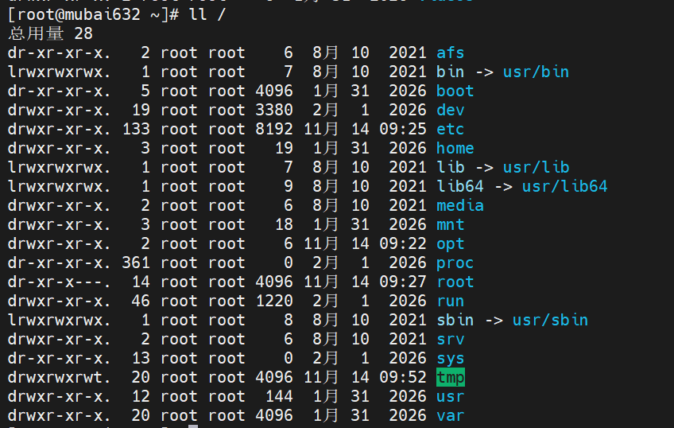
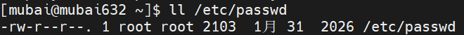
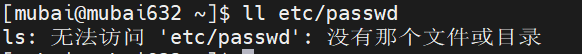

# RHCSA-Linux文件系统结构和文件管理命令

### 文件系统结构

- Linux系统: 单根倒树状结构(/)
  - **linux所有文件都是从根目录开始的**
  - **Linux一切皆文件**(磁盘,网络,光驱.....)
- windows系统: 多根多树结构

### Linux文件系统的文件命名方式

- 文件的名称不能超过255字符
- 给文件命名的时候, 文件名中最好不要包含特殊字符, 例如% | / 等等
- 对于/来说, 有2层含义, 一个是/根目录, 一个是路径分隔符

#### Linux系统中常用的目录



- ## afs: 特殊的空目录, 红帽说这个目录是作为某个文件系统的挂载使用
- **bin: 目录保存的是系统可以执行的二进制文件(命令文件), 普通用户可以执行的二进制文件**
  - **/bin目录是/usr/bin目录的快捷方式**
- **boot: 安装系统进行划分的一个分区, 这个目录下保存的是Linux内核文件以及系统开机的时候引导的文件**
- **dev: device(设备)，目录保存的是系统的设备文件, 比如磁盘设备,外接设备(如果误删除了, 重启之后会重新加载这个目录下的文件)**
- **etc: 目录保存系统的配置文件, 包含系统配置,软件配置,系统主机名,网卡配置文件,时间同步文件......**
  ```bash 
  [root@mubai632 ~]# cat /etc/hostname #查看系统主机名
  [root@mubai632 ~]# cat /etc/redhat-release #查看系统版本


  ```

- **home: 普通用户的家目录. 此目录下会创建和普通用户名同名的子目录作为用户的家目录**
- lib,lib64: 库文件
  - lib: 目录下保存的都是二进制文件会调用的一些库文件, 32位操作系统
  - lib64: 目录下保存的都是二进制文件会调用的一些库文件, 64位操作系统
  ```bash 
  [root@mubai632 ~]# ldd /bin/ls #ldd命令查询使用ls命令需要哪些库文件
          linux-vdso.so.1 (0x00007ffec01ab000)
          libselinux.so.1 => /lib64/libselinux.so.1 (0x00007fdfabba3000)
          libcap.so.2 => /lib64/libcap.so.2 (0x00007fdfabb99000)
          libc.so.6 => /lib64/libc.so.6 (0x00007fdfab800000)
          libpcre2-8.so.0 => /lib64/libpcre2-8.so.0 (0x00007fdfabafd000)
          /lib64/ld-linux-x86-64.so.2 (0x00007fdfabc00000)

  ```

- media: 空目录, 用做光盘的临时挂载点
- mnt: 空目录, 用做文件系统的临时挂载点
- opt: 空目录, 一般是保存第三方的软件的, 下载第三方软件
- proc: process(进程), 保存的是系统运行时的状态, 系统的所有的进程都在这个目录下
  - 这个目录下有一些文件, 可以查看系统的信息, 包含cpu 内存 磁盘 分区 文件系统
  - 系统关机, proc目录会清空
- **root: root用户的家目录**
- run: 保存的是系统运行时的状态, 一些程序的套接字文件和pid文件也会存储这个目录下
  - 系统关机, run目录会清空
- **sbin: 保存的是超级管理员可以执行的二进制文件（命令）**
- srv: 空目录, 翻译过来是叫做servcie, 一般情况下这个目录保存的是web服务的测试文件
- sys: 反应的系统运行时的状态, cgroup控制组(限制资源), 内核加载的一些内核模块, 内核参数
- tmp: 临时目录, 程序产生的一些临时文件会存储到这个目录下
- **usr: bin和sbin目录都是这个usr目录下的快捷方式**
  - **用户执行的所有的二进制文件都存储在这里**
  - **所有的二进制文件调用的库文件都存储在这里**
  - **/usr/local目录: 第三方软件的安装位置**
- var: 保存的是系统的日志文件, 还有网站服务器,ftp服务器的一些文件的目录

### 文件路径

- 文件路径的两种表示方式:
  - 绝对路径: 文件路径是从/根开始, 在系统上任意地方都可以使用
    
  - 相对路径: 文件路径前面没有/, 以当前目录为起始目录
  ```bash 
  [mubai@mubai632 ~]$ ll ./Desktop/
  [mubai@mubai632 ~]$ ll Desktop/
  [mubai@mubai632 ~]$ ll ../mubai/Desktop/
  # ./ 和不带./ 的结果相同, ./代表的是当前目录, ../代表的是上一级目录


  ```

  
- 文件目录创建的注意事项
  1. 文件名严格区分大小写
  2. 文件名不能重名, 文件夹和文件也不能重名
  3. 文件名尽量不要包含特殊字符, 具备特殊符号一定要使用单引号进行包裹
  4. 文件名不要包含 / 这样的关键字,  / 代表的是路径分隔符和根目录的意思
  5. 文件名长度不要超过255字符

### 文件相关的管理命令

#### pwd命令

pwd: 打印当前的工作目录→查看你在哪个目录

```bash 
[mubai@mubai632 ~]$ pwd
/home/mubai
[root@mubai632 ~]# pwd
/root

```


#### cd命令

cd: 更改工作目录→目录切换, cd后面只能接目录不能接其他的文件

```bash 
[root@mubai632 ~]# pwd
/root

# 通过绝对路径进入其他目录
[root@mubai632 ~]# cd /etc/
[root@mubai632 etc]# pwd
/etc

# 通过相对路径进入其他目录
[root@mubai632 ~]# cd ../etc/
[root@mubai632 etc]# pwd
/etc

cd ~ 或者 cd 切换到用户的家目录
cd ~username 切换到指定用户的家目录
cd - 切换到上一次所在的目录
cd .. 切换到当前目录的上一级目录
```


#### ls命令

ls: 列出文件和目录

- ls 后面接的是文件, 文件存在会显示文件的路径, 文件不存在则会报错
- ls后面接的是目录, 会显示指定目录下的所有内容, 想显示目录, 就要添加 -d 的参数
- ls常用选项
  ```bash 
  ls -d :后面接目录, 显示目录下的信息
  ls -a :显示目录下的全部文件, 包括隐藏文件
    每一个目录都存在一个 . 目录和 .. 目录
  ls -l :列出详细信息
  ls -l h  :自动换算单位, 配合 -l 选项使用
  ls -l t  :根据时间戳进行倒序排序, 配合 -l 选项使用
  ls -lt r  :根据时间戳进行升序排序, 配合 -l 选项使用, 还需要配合 -t 选项使用

  ```

- ls -l 命令
  ```bash 
  [root@mubai632 ~]# ls -l /etc/passwd
   - rw- r-- r-- . 1 root root 2103  1月 31  2026 /etc/passwd
  ```

  - \- 代表的是文件的类型
    - \- 代表普通文件
    - d 目录文件
    - b 设备文件
    - l 链接文件
    - s socket套接字文件, 进程之间通信方式之一
  - rw-r--r-- 代表的是文件的权限
    - rw- 表示拥有者对文件的权限
    - r-- 表示所属组对文件的权限
    - r-- 表示其他人对文件的权限
  - . 表示此文件受到SElinux的保护, 如果关闭SElinux, 重启之后创建文件就不会存在 .&#x20;
  - 1 表示硬链接的数量
    - 硬链接: 文件在操作系统上有几个副本
    - 硬链接数量为2, 说明在系统上这个文件有2个副本, 这2个副本的内容都是一模一样的, 无论删除或者修改哪个文件, 这些副本的内容都是同步变化的
    - 目录则不同, 目录表示的是当前目录下有几个子目录
  - root root 2103  1月 31  2026
    - 第1个root 表示文件的拥有者, 文件是谁创建的, 拥有者就是谁
    - 第2个root 表示文件的所属组
    - 2103 表示文件的大小, 单位是字节
    - 1月31 2026 表示文件的时间戳
      ```bash title="时间戳: "
      [root@mubai632 ~]# stat 1.txt
        文件：1.txt
        大小：0               块：0          IO 块：4096   普通空文件
      设备：10303h/66307d     Inode：101732949   硬链接：1
      权限：(0644/-rw-r--r--)  Uid：(    0/    root)   Gid：(    0/    root)
      环境：unconfined_u:object_r:admin_home_t:s0
      最近访问：2026-11-14 12:38:24.166726024 +0800
      最近更改：2026-11-14 12:38:24.166726024 +0800
      最近改动：2026-11-14 12:38:24.166726024 +0800
      创建时间：2026-11-14 12:38:24.166726024 +0800

      [root@mubai632 ~]# stat 1.txt
        File: 1.txt
        Size: 0               Blocks: 0          IO Block: 4096   regular empty file
      Device: 10303h/66307d   Inode: 101732949   Links: 1
      Access: (0644/-rw-r--r--)  Uid: (    0/    root)   Gid: (    0/    root)
      Context: unconfined_u:object_r:admin_home_t:s0
      Access: 2026-11-14 12:38:24.166726024 +0800
      Modify: 2026-11-14 12:38:24.166726024 +0800
      Change: 2026-11-14 12:38:24.166726024 +0800
       Birth: 2026-11-14 12:38:24.166726024 +0800

      ```

      - Access(最近访问): 文件最后一次被访问内容的时间
      - Modify(最近更改): 文件最后一次被修改内容的时间
      - Change(最近改动): 文件属性最后一次被修改的时间
        - 文件属性包括: 文件名,文件权限,文件拥有者和所属组,文件的大小......
      - Birth(创建时间): 文件创建的时间(RHEL9之前不存在)

#### touch命令

touch: 创建空文件以及更新文件的时间戳

- 如果文件touch命令后面接的是普通文件, 文件存在就会更新时间戳, 文件不存在就会创建文件
- 如果文件touch命令后面接的是目录文件, 目录文件存在则更新时间戳, 不存在就会创建一个普通文件
- 同一个目录下, 不能同时存在相同名字的文件(普通文件和目录文件都属于文件, 只是类型不同)
- 可以同时创建多个文件
  ```bash 
  [root@mubai632 test]# touch 1 2 3 4
  [root@mubai632 test]# ls -l
  总用量 0
  -rw-r--r--. 1 root root 0 11月 14 14:05 1
  -rw-r--r--. 1 root root 0 11月 14 14:05 2
  -rw-r--r--. 1 root root 0 11月 14 14:05 3
  -rw-r--r--. 1 root root 0 11月 14 14:05 4

  ```


#### mkdir命令

mkdir: 创建空目录

- 语法格式
  ```bash 
  [root@mubai632 test]# mkdir --help
  用法：mkdir [选项]... 目录...
  -p , --parents 递归创建目录, 如果父目录不存在则一并创建
  ```


#### rm命令

rm: 删除文件

- 语法格式
  ```bash 
  [root@mubai632 test]# rm --help
  用法：rm [选项]... [文件]...

  rm -f :忽略交互式, 强制删除
  rm -i : 以交互是删除文件, rm = rm -r
  rm -rf :强制递归删除目录及其内容

  问题: 有一个目录叫 /opt/ansible
  rm -rf /opt/ansible 和 rm -rf /opt/ansible/* 有什么区别?
    rm -rf /opt/ansible :删除的是/opt/ansible 目录和目录下的所有文件
    rm -rf /opt/ansible/* : 删除的是/opt/ansible 目录下的所有文件
  ```


#### rmdir命令

rmdir: 删除空目录

- 如果目录下有文件, rmdir无法删除
- 但是有个特例: &#x20;
  ```markdown title="这个目录下文件只能通过rmdir删除"
  # 在这个目录中新建目录, 会发现新建的目录中有内容, 里面的内容存放的是进程资源的限制情况
  [root@mubai632 cgroup]# pwd
  /sys/fs/cgroup

  ```


#### cp命令

cp: 复制

- 语法格式
  ```bash 
  [root@mubai632 cgroup]# cp --help
  用法：cp [选项]... [-T] 源文件 目标文件
  　或：cp [选项]... 源文件... 目录
  　或：cp [选项]... -t 目录 源文件...
  ```

- cp命令在拷贝的时候, 可以保留文件名称不改变,  也可以在拷贝的时候更改文件名称
- 因为设计到文件的拷贝，肯定要将A路径的文件拷贝到其他路径下，那么cp命令中，肯定会涉及到不同的目录
- **当拷贝文件时, 其文件属性是会发生变化的**, **拥有者,所属组,时间戳等都会发生变化**, RHEL9之前的版本文件的权限也是会改变的
  ```bash 
  [mubai632@mubai632 ~]$ ll /opt/
  drwxr-xr-x. 133 root root 8192 Feb  4 09:43 backup
  [mubai632@mubai632 ~]$ cp -r /opt/backup/ .
  [mubai632@mubai632 ~]$ ll
  drwxr-xr-x. 133 mubai632 mubai632 8192 Feb  4 09:47 backup

  ```

- 例子
  ```bash 
  #需求一：备份/etc/passwd文件的到/opt目录，不更改文件名称
  [root@mubai632 ~]# cp /etc/passwd /opt/
  [root@mubai632 ~]# ls -l /opt/
  总用量 4
  -rw-r--r--. 1 root root 2103 11月 14 15:19 passwd

  #需求二：备份/etc/bashrc文件到/opt目录下，备份之后的文件名称叫做bashrc.bak
  [root@mubai632 ~]# cp /etc/bashrc /opt/bashrc.bak
  [root@mubai632 ~]# ls -l /opt/
  总用量 8
  -rw-r--r--. 1 root root 2658 11月 14 15:20 bashrc.bak
  -rw-r--r--. 1 root root 2103 11月 14 15:19 passwd

  #需求三：将多个/etc目录下的文件同时备份到/opt目录下
  [root@mubai632 ~]# cp /etc/group /etc/gshadow /opt
  [root@mubai632 ~]# ls -l /opt/
  总用量 16
  -rw-r--r--. 1 root root 2658 11月 14 15:20 bashrc.bak
  -rw-r--r--. 1 root root  812 11月 14 15:21 group
  ----------. 1 root root  653 11月 14 15:21 gshadow
  -rw-r--r--. 1 root root 2103 11月 14 15:19 passwd

  #拷贝整个目录时, 需要添加 -r 选项
  [root@mubai632 ~]# cp -r  /etc /opt
  [root@mubai632 ~]# ll /opt/
  total 12
  drwxr-xr-x. 133 root root 8192 Feb  4 09:41 etc

  #拷贝整个目录, 并更改文件夹的名字
  [root@mubai632 ~]# cp -r /etc/ /opt/backup
  [root@mubai632 ~]# ll /opt/
  total 24
  drwxr-xr-x. 133 root root 8192 Feb  4 09:43 backup
  drwxr-xr-x. 133 root root 8192 Feb  4 09:41 etc


  ```

- 常用选项
  ```bash 
  cp -r : -R = -r 递归复制目录及其子目录内的所有内容
  cp -a :等于-dR, 多个选项的集合, 拷贝目录及保留文件属性, -d 与 -P 相同, 但 -d 多一个会保留硬链接关系
  cp -p :保留文件属性信息
  cp -P :仅拷贝链接文件, 不会拷贝源文件
  ```


#### mv命令

mv: 移动文件和重命名文件

- 语法格式
  ```bash 
  [root@mubai632 ~]# mv --help
  用法：mv [选项]... [-T] 源文件 目标文件
  　或：mv [选项]... 源文件... 目录
  　或：mv [选项]... -t 目录 源文件...

  ```

- 在相同目录下执行mv操作，是重命名（看的是源文件的路径和目标文件的路径）
  ```bash 
  #把/root目录下的passwd文件重命名为root-passwd
  [root@mubai632 ~]# mv passwd root_passwd
  [root@mubai632 ~]# ll  #相对路径
  -rw-------. 1 root root 1316  1月 31 02:16 anaconda-ks.cfg
  -rw-r--r--. 1 root root 2149  2月  4 14:06 root_passwd

  [root@mubai632 ~]# mv /root/passwd /root/root_passwd
  [root@mubai632 ~]# ll  #绝对路径
  -rw-------. 1 root root 1316  1月 31 02:16 anaconda-ks.cfg
  -rw-r--r--. 1 root root 2149  2月  4 14:06 root_passwd

  ```

- 在不同目录下执行mv操作，是移动, 也可以移动并改名
  ```bash 
  #将/root/passwd文件移动到/opt/目录下，并且修改文件名称为abc
  [root@mubai632 ~]# mv passwd /opt/
  [root@mubai632 ~]# ll /opt/  #相对路径
  -rw-r--r--.   1 root root 2149  2月  4 14:06 passwd

  [root@mubai632 ~]# mv /root/passwd /opt/
  [root@mubai632 ~]# ll /opt/  #绝对路径
  -rw-r--r--. 1 root root 2149  2月  4 14:09 passwd

  #移动并改名
  [root@mubai632 ~]# mv passwd /opt/root_passwd
  [root@mubai632 ~]# ll /opt/  #相对路径
  -rw-r--r--. 1 root root 2149  2月  4 14:09 root_passwd

  [root@mubai632 ~]# mv /root/passwd /opt/root_passwd
  [root@mubai632 ~]# ll /opt/  #绝对路径
  -rw-r--r--. 1 root root 2149  2月  4 14:09 root_passwd


  ```


#### file命令

file: 查看文件类型

```bash 
[root@mubai632 ~]# file /etc/passwd
/etc/passwd: ASCII text

```
