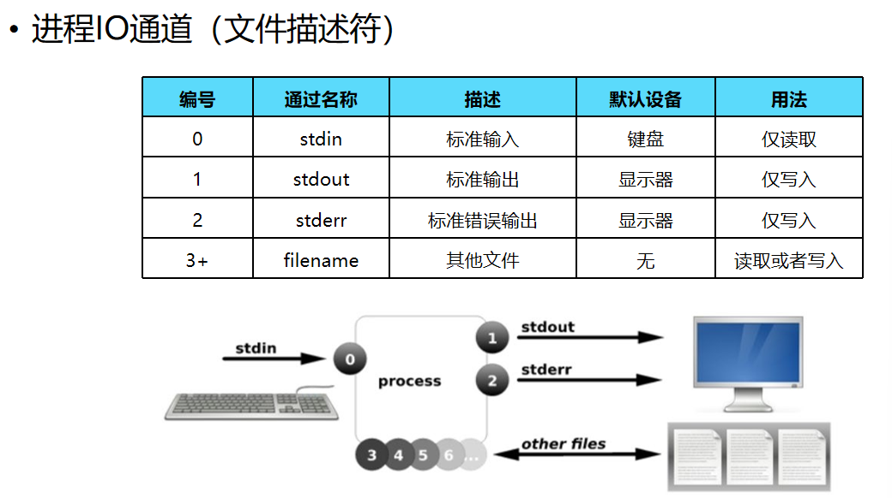
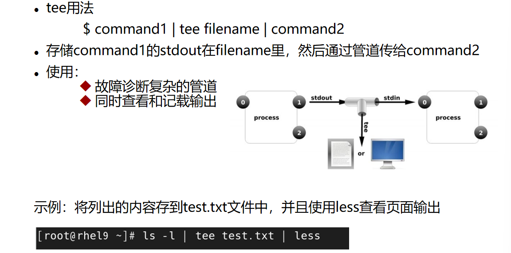

# RHCSA-Linux IO重定向和管道符

## 重定向

- IO设备：
  - I Input输入设备
  - O Output 输出设备
- 对于操作系统来说, 对于机器来说, 哪些属于输入设备, 哪些属于输出设备？
  - 键盘是一个典型的输入设备, 管理Linux系统的时候, 是从键盘上接受用户的输入命令, 然后系统根据命令执行对应的操作
  - 屏幕/显示屏是一个典型的输出设备, 当你从Linux系统执行命令的时候, 无论是正确的输出信息还是错误的输出信息都是从显示屏上展现给你看的
- 进程IO通道

  
  - stdin 标准的输入，从键盘上接受输入
  - stdout 标准的正确输出信息，从显示屏上输出的（正确输出）
  - stderror 标准的错误输出信息，从现实上输出的（错误输出）
- 重定向
  - 重定向的作用
    1. 可以快速清空文件的内容
    2. 不需要编辑器, 可以快速追加新的内容到文件中
    3. 在脚本文件中使用, 将不必要的输出信息重定向到文件中
  - 输出重定向: 将正确输出或者错误输出从显示屏上重定向到文件中
    ```bash 
    #输出重定向的符号
      > : 将标准的正确输出以 覆盖的 方式重定向到文件中(命令的执行结果可以使用)
      >> : 将标准的正确输出以 追加的 方式重定向到文件中
      2> : 将标准的错误输出以覆盖的方式重定向到文件中(命令的执行结果可以使用)
      2>> : 将标准的错误输出以追加的方式重定向到文件中
      &> ：正确输出和错误输出全部重定向到文件中(覆盖)
      &>> ：正确输出和错误输出全部重定向到文件中(追加)
    #输出命令
     echo : 你想输出的内容打印到屏幕上, 或者文件中
     语法格式 : echo 内容 [>|>>] [文件名]
     快速清理文件内容 echo  > 文件名

    #下面命令的目的是, 从/目录开始, 搜索文件名为selinux的文件
    [root@mubai632 ~]# find  / -name 'selinux' 2> aaa.txt #将错误的信息重定向到aaa.txt中
    [root@mubai632 ~]# find  / -name 'selinux' 2> aaa.txt > bbb.txt #将错误的信息重定向到aaa.txt中, 将正确的信息重定向到bbb.txt中
    以上的命令会将错误信息保存到aaa.txt中, 但随着错误信息越来越多, 写到为文件中的内容会越来越多, 导致文件越来越大, 会占据磁盘空间
    一般会使用一个特殊设备来存放错误信息: 
      /dev/null : 空洞文件, 将错误信息重定向到这个文件中(类似于垃圾桶)
      /dev/zero : 零字符设备, 配合dd命令使用, 专门创建一个指定大小的文件来进行测试

    dd 命令 : 输入输出的命令
      dd [操作数] ...
      操作数 : if=文件 从指定文件进行读取
      操作数 : of=文件 写入到指定文件
      操作数 : bs=字节数 一次读写的比特数(默认512)
      操作数 : count=块数 复制指定数量的输入块
    [root@mubai632 ~]# dd if=/dev/zero of=1.txt bs=1M count=100
    记录了100+0 的读入
    记录了100+0 的写出
    104857600字节（105 MB，100 MiB）已复制，0.181306 s，578 MB/s
    [root@mubai632 ~]# ll -h 1.txt
    -rw-r--r--. 1 root root 100M  2月 22 19:18 1.txt

    ```

  - 输入重定向: 将键盘上接收的输入重定向到文件中
    ```bash 
    < 文件名 从文件中读取内容

    [root@mubai632 ~]# cat 1.txt
    123456
    123456
    [root@mubai632 ~]# passwd mubai123 < 1.txt
    更改用户 mubai123 的密码 。
    新的密码： 无效的密码： 密码是一个回文
    重新输入新的密码： passwd：所有的身份验证令牌已经成功更新。

    ```


## 管道符

- 管道符号 : |&#x20;
  - 作用: 进行传参, 将前面命令的执行结果当做后面命令的参数进行使用(**仅能传输正确的输出, 错误输出无法经过管道符**)
  - 语法格式
    ```markdown 
    命令1|命令2|命令3....

    ```

  - 例子
    ```bash 
    #无交互式更改密码(不安全, 明文会显示在历史记录中)
    [root@mubai632 ~]# echo 123456 | passwd --stdin mu
    更改用户 mu 的密码 。
    passwd：所有的身份验证令牌已经成功更新。

    --stdin : 表示从键盘上接收输入
    ```

- 三通管道
  - 所谓的三通管道其实就是在管道的基础之上, 将内容保存到文件中
    
  ```bash 
  [root@mubai632 ~]# ll |  tee  test.1 | grep cfg
  -rw-------. 1 root root 1316  1月 31 02:16 anaconda-ks.cfg
  [root@mubai632 ~]# ll
  -rw-------. 1 root root 1316  1月 31 02:16 anaconda-ks.cfg
  -rw-r--r--. 1 root root   72  2月 22 20:11 test.1
  ```
