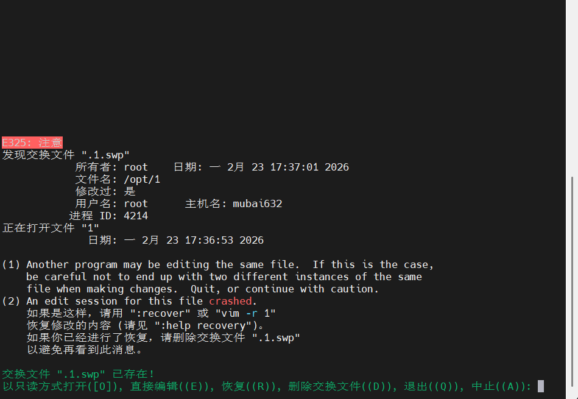

# RHCSA-Linux vim编辑器高级特性

## 文本编辑器

编辑文件内容的

- 在Linux中常见的文本编辑工具:&#x20;
  - vi : 所有的Linux发行版本自带的编辑工具, 默认已经安装
  - vim : vi编辑器的高级版本, 支持颜色高亮和语法检测功能, 来自于vim-enhanced软件包

## vim文本编辑工具基本使用

- 使用vim编辑文本过程
  ```markdown 
  1. 使用vim打开文件
  2. 按 i 键进入编辑模式
  3. 按 ESC 键退出编辑模式
  4. 按 shift : 组合键, 输入 wq 回车保存并退出
  ```


## vim的三种常用工作模式

- 命令模式: 对文本进行简单的操作, 移动光标,复制行和粘贴行,删除行(vim打开文件就是命令模式)
- 编辑模式/插入模式: 编辑文本内容, 必须处于编辑模式才能修改文件内容
- 退出模式/末行模式: 替换文本关键字内容, 另存为文本内容, 删除行, 保存和退出

## vim使用和保护机制

- 语法格式:&#x20;
  ```bash 
  vim 文件名(一般都是普通文件)
  ```

  - 如果文件存在, 则会打开这个文件
  - 如果文件不存在, 则会打开一个新的文件, 如果保存并退出, 则会创建这个文件
- 保护机制

  

  当你使用vim打开文件的时候可能会出现上图报错, 出现这种情况的原因是以下两种
  - 当用户编辑了文件, 但是没有保存, 意外退出的时候; 再次打开这个文件就会提示swp文件—>**为了防止文件没有保存导致数据丢失**
  - 如果此时有用户已经打开了这个文件, 另外一个用户再次打开也会出现这种情况—>**典型的锁机制, 防止多个用户同时写一个文件**
    解决办法: 删除swp文件

## vim的编辑模式使用和切换

- ## 各种快捷方式来切换到编辑模式：
  | 快捷键    | 说明                   |
  | ------ | -------------------- |
  | **i**​ | 在光标所在处切换到编辑模式        |
  | **I**​ | 在光标所在行的第一个字符切换到编辑模式  |
  | **a**​ | 在光标后一个字符切换到编辑模式      |
  | **A**​ | 在光标所在行的最后一个字符切换到编辑模式 |
  | **o**​ | 在光标所在行的下一行切换到编辑模式    |
  | **O**​ | 在光标所在行的上一行切换到编辑模式    |

## vim的命令模式的使用和快捷键

### 光标的切换

- ## 切换光标
  | 快捷键                             | 说明                               |
  | ------------------------------- | -------------------------------- |
  | \*\*↑↓←→\*\* / KLHJ             | 光标移动单个字符                         |
  | ^                               | 光标移动到行首                          |
  | \\\$                            | 光标移动到行尾                          |
  | **G**​                          | 跳转到文件的末行                         |
  | **gg**​                         | 跳转到文件的首行                         |
  | **nG(n代表数字)** ​                 | 跳转到指定行                           |
  | ctrl ← \| ctrl →                | 光标在一行中更急单词进行跳(单词的构成是由 数字、字母、下划线) |
  | ctrl f \| ctrl b / PgDn \| PgUp | 上翻页\|下翻页                         |

### 复制, 粘贴, 删除, 撤销...

#### 删除

- ## 删除
  | 快捷键              | 说明                    |
  | ---------------- | --------------------- |
  | **x/del**​       | 删除光标后单个字符             |
  | **dd**​          | 删除光标所在行               |
  | **ndd(n代表数字)** ​ | 删除光标所在行之后的n行(包括光标所在行) |
  | dG               | 删除光标所在行以及后面的所有行       |
  | dgg              | 删除光标所在行以及后面的所有行       |
  | d^               | 删除光标所在位置到行首的内容        |
  | d\\\$            | 删除光标所在位置到行尾的内容        |

#### 复制和粘贴

- ## 复制和粘贴
  | 快捷键      | 说明                      |
  | -------- | ----------------------- |
  | **yy**​  | 复制光标所在行的内容              |
  | **nyy**​ | 复制光标所在行之后的n行内容(包括光标所在行) |
  | **p**​   | 在光标所在行的下一行粘贴            |
  | **np**​  | 在光标所在行的下一行粘贴n次          |
  | P        | 在光标所在行的上一行粘贴            |
  | nP       | 在光标所在行的上一行粘贴n次          |

#### 关键字搜索和跳转关键字

- ## 关键字搜索和跳转关键字
  | 快捷键       | 说明                             |
  | --------- | ------------------------------ |
  | **/关键字**​ | 从上往下过滤关键字                      |
  | ?关键字      | 从下往上过滤关键字                      |
  | **n/N**​  | n按照使用的符号同向进行跳转  N按照使用的符号反向进行跳转 |

#### 撤销操作

- ## 撤销
  | 快捷键         | 说明         |
  | ----------- | ---------- |
  | **u**​      | 撤销上一次操作    |
  | **.** ​     | 重复执行上一次操作  |
  | **ctrl r**​ | 撤销上一次撤销的操作 |

## vim的退出模式使用和快捷键

### 保存和退出

- ## 保存和退出
  | 快捷键             | 说明                    |
  | --------------- | --------------------- |
  | **:wq / :x**​   | 保存并退出                 |
  | **:w**​         | 保存                    |
  | **:q**​         | 不保存退出                 |
  | **:wq!** ​      | 强制保存并退出(只有文件拥有者才可以使用) |
  | **:q!** ​       | 强制不保存退出               |
  | **:w 文件名**​     | 将当前的文件内容另存到其他文件       |
  | **:n,n w 文件名**​ | 将当前选中的起始行到结束行另存到其他文件中 |

### 替换

- 替换关键字
  - 特殊替换, 若想要"/bin/bash→/sbin/bash", 就无法使用 / 作为分隔符了. 需要使用别的符号代表 / , 例如":%s%/bin/bash%/sbin/bash%g"; 也可以使用 \ (转义字符), ":%s//bin/bash//sbin/bash/g"

### 显示行号

- ## 退出模式显示行号
  | 关键字                | 说明     |
  | ------------------ | ------ |
  | **:set number**​   | 显示行号   |
  | **:set nonumber**​ | 取消显示行号 |

## vim的特殊模式-可视化模式

可视化模式：可以选择多个区域实现操作

- ctrl v：最为常用，可以选中一个块
- v：选择字符
- V：行的选择
- 使用可视化模式删除每行的第一个#字符：
  ```markdown 
  1.vim打开文件
  2.ctrl v，通过方向键选择要删除的每行的字符
  3.按x
  ```

- 使用可视化模式实现批量注释：
  ```text 
  1.vim打开文件
  2.ctrl v 选择要注释的行
  3.按I切换到编辑模式
  4.按ESC退出
  ```


## vim的特殊模式-多窗口模式

多窗口模式：在一个终端中打开多个窗口，每个窗口可以打开不同的文件

因为没有桌面图形化情况下，在命令行页面中，一个控制台只能打开一个文件查看，如果想要对比不同文件的内容，咱们就需要使用多窗口模式

- 可以将一个文件打开多个窗口
  ```text 
  ctrl w s 横向切割
  ctrl w v 综合切割
  ```

- 在不同的窗口打开不同的文件
  ```markdown 
  :sp filename -->横向切割
  :vsp filename -->纵向切割
  ```

- 窗口之间的跳转：
  ```markdown 
  ctrl w ，然后按方向键
  ```
