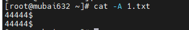
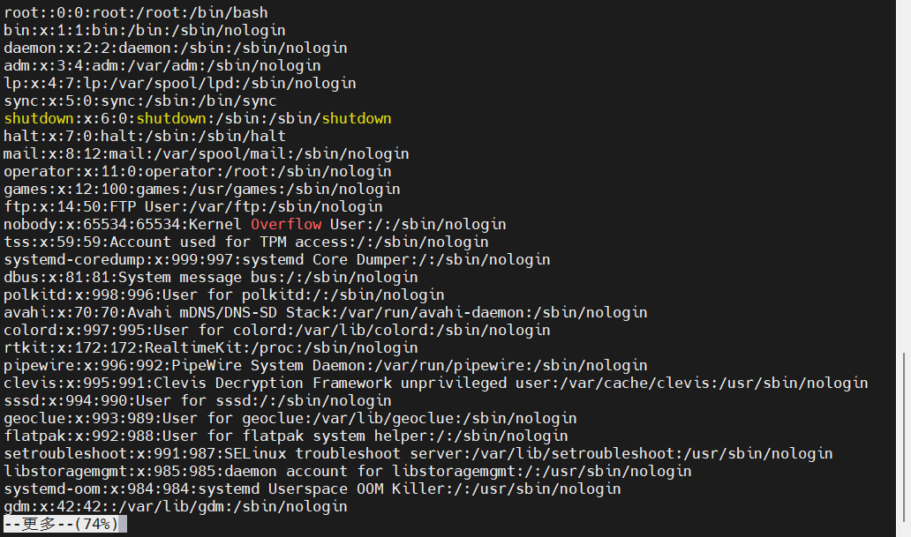
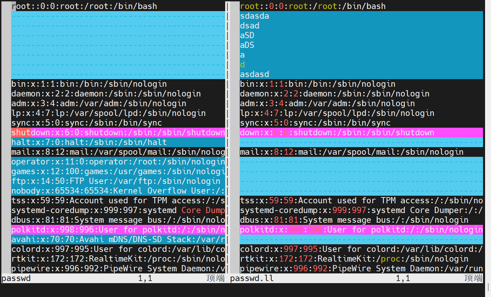
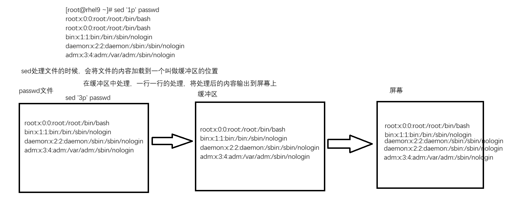

# RHCSA-Linux 文本处理工具

文本处理工具, 就是对文本进行操作的一些命令工具

对文本可以做的操作:&#x20;

- 查看文本内容
- 编辑文本内容
- 过滤文本内容

过滤文本内容, 对文本内容进行编辑, 对文本内容进行处理（统计、截取..）

- 过滤出包含root关键字的行有哪些？
- 统计root关键字出现的行的数量？
- 统计Linux系统中可以登录系统的用户有哪些？
- 截取系统上所有可以登录系统的用户名称？

## 文本查看工具

### cat命令

cat命令: 一次性查看文本内容

- **cat命令查看文本内容**
  ```bash 
  [root@mfb ~]# cat /etc/passwd
  root::0:0:root:/root:/bin/bash
  bin:x:1:1:bin:/bin:/sbin/nologin
  daemon:x:2:2:daemon:/sbin:/sbin/nologin
  adm:x:3:4:adm:/var/adm:/sbin/nologin
  lp:x:4:7:lp:/var/spool/lpd:/sbin/nologin
  ......
  ```

- cat 命令整合多个文本为一个文件
  ```bash 
  [root@mfb ~]# cat /etc/passwd /etc/shadow > 111.txt
  ```

- **cat命令配合多行输入, 创建带有内容的文件**
  ```bash 
  格式：EOF可以自定义，以什么开头就以什么结尾
  cat > 文件路径 <<EOF
  文件内容
  EOF
  ```

- cat常用选项
  ```bash 
  cat -A , --show-all : 查看文件中的特殊字符, 等效于 -vET
    -v , --show-nonprinting   使用^ 和M- 引用，除了LFD和 TAB 之外
    -E , --show-ends          在每行结束处显示"$"
    -T , --show-tabs          将跳格字符显示为^I
  cat -n , --number : 显示行号
  ```

  
  - 这里的\$表示结尾部分
  - 很多人喜欢在windows主机上编写文件内容, 然后上传到Linux系统中—>导致文件具有一些特殊字符
  - 比如shell脚本→如果你在windows上写脚本, 上传到Linux中, 内容肉眼查看是没有问题的, 但是无论怎么执行都会报错!
  - 因为上传之后, 文件中具备了一些特殊字符, cat命令是看不到的, 必须是cat -A才能看到

### more命令分页查看文本内容

- cat命令在读取的时候, 会将内容全部读取一遍, 如果文件比较大的话, 会卡顿而且会消耗服务器的资源
- 如果more命令把一个文件内容查看完了，more会自动退出



### less命令分页查看文本内容

less是高级的more命令

- less与more命令的区别就是:&#x20;
  - 分页查询, 看多少加载多少, 不会全部加载
  - 可以一页的一页的查询, 也可以一行一行的查询(more命令不行)
    - ctrl b 向下翻页
    - ctrl f 向上翻页
    - ↑ 向上一行一行翻
    - ↓ 向下一行一行翻
  - 查看的过程可以通过v命令, 切换到vim编辑器
  - 查看的过程中可以通过/或者?进行关键字的过滤（过滤的时候建议从第一行开始过滤, 不要翻页到后面过滤. 因为它不像vim编辑器那样, vim编辑器过滤的时候, 过滤到末尾的时候, 下一次过滤会重新从开始, 而less不会）
- more和less不方便的问题
  - 不是很好查看文件的前3行内容, 或者前指定行数量的内容
  - 不是很好查看文件的末尾3行内容, 或者末尾N行数量的内容

### head/tail命令

- head命令: 默认查看文件的头10行内容, 也可以通过选项查看指定头N行内容
  - 语法格式
    ```bash 
    head [选项]... [文件]...
    #如果指定了多于一个文件，在每块输出之前附加文件名称作为头部
    #如果没有指定文件，或者文件为"-"，则从标准输入读取
    常用选项: 
      -n : 查看指定的行数
        -n 3和 -n +3 都是表示查看文件的头3行内容
        -n -3 去掉末尾3行，其他全部查看

    ```

- tail命令: 默认查看文件的末尾10行内容, 也可以通过选项查看指定末尾N行内容
  - 语法格式
    ```bash
    tail [选项]... [文件]...
    #如果指定了多于一个文件，在每块输出之前附加文件名称作为头部
    #如果没有指定文件，或者文件为"-"，则从标准输入读取
    常用选项: 
      -n 指定行数
         -n +3 从第3行开始查看
         -n 3 和 -n -3 表示查看末尾3行
       -f 实时监控文件的追加情况-->使用排错情况，根据日志文件的信息进行排错
    ```

    举例：某天你发现启动sshd服务失败了，怎么排错？
    1. 开俩窗口，左边一个 右边一个
    2. 左边的窗口通过tail -f命令实时监控日志文件的追加情况
    3. 右边的窗口去执行启动sshd服务
- 例题
  - 通过head命令和tail命令查看/etc/passwd文件的第5行内容到第12行内容
    ```bash 
    [root@mubai632 ~]# head -n 12 /etc/passwd | tail -n +5
    lp:x:4:7:lp:/var/spool/lpd:/sbin/nologin
    sync:x:5:0:sync:/sbin:/bin/sync
    shutdown:x:6:0:shutdown:/sbin:/sbin/shutdown
    halt:x:7:0:halt:/sbin:/sbin/hal
    mail:x:8:12:mail:/var/spool/mail:/sbin/nologin
    operator:x:11:0:operator:/root:/sbin/nologin
    games:x:12:100:games:/usr/games:/sbin/nologin
    ftp:x:14:50:FTP User:/var/ftp:/sbin/nologin

    [root@mubai632 ~]# head -n 12 /etc/passwd | tail -n 8
    lp:x:4:7:lp:/var/spool/lpd:/sbin/nologin
    sync:x:5:0:sync:/sbin:/bin/sync
    shutdown:x:6:0:shutdown:/sbin:/sbin/shutdown
    halt:x:7:0:halt:/sbin:/sbin/halt
    mail:x:8:12:mail:/var/spool/mail:/sbin/nologin
    operator:x:11:0:operator:/root:/sbin/nologin
    games:x:12:100:games:/usr/games:/sbin/nologin
    ftp:x:14:50:FTP User:/var/ftp:/sbin/nologin

    head -n 最大行 /etc/passwd | tail -n +最小行
    head -n 最大行/etc/passwd | tail -n 最大行-最小行+1

    ```


### grep命令

grep文本过滤工具：根据用户写的关键字， 过滤关键字所在行

- 语法格式:&#x20;
  ```bash title="grep [选项]... 模式 [文件]..."
  grep [选项]... 关键字 [文件]...

  ```

  - 常用选项
    ```bash 
    grep -v : 取反, 输出不存在指定关键字的行
    grep -i : 忽略关键字大小写
    grep -o : 仅打印关键字内容, 不会打印关键字所在的行
    grep -q : 不输出过滤出来的信息, 应用在脚本文件中
      通过$?判断上一个命令是否执行成功
        $? 返回值是0, 执行成功
        $? 返回值非0, 执行失败
    grep -An : 将匹配行以及其后n行打印
    grep -Bn : 将匹配行以及其前n行打印
    grep -Cn : 将匹配行以及其前后n行打印(是AB的结合体)
    grep -r : 根据关键字, 查看关键字所在的文件(语法格式: grep -r 关键字 [目录]...)
    grep -l : 表示过滤关键字的文件名字
      grep -rl : 仅显示存在关键字的文件名


    不常用: 
    grep -c : 统计关键字出现的行的次数(无论一行有多少关键字, 就记一次)
      grep -oc : 统计关键字出现多少次
      grep -ioc : 不区分大小写统计关键字出现多少次

    ```

- 例子
  - 列出系统上登录shell是/sbin/nologin的用户信息
    ```bash 
    [root@mubai632 ~]# grep '/sbin/nologin' /etc/passwd
    bin:x:1:1:bin:/bin:/sbin/nologin
    daemon:x:2:2:daemon:/sbin:/sbin/nologin
    adm:x:3:4:adm:/var/adm:/sbin/nologin
    lp:x:4:7:lp:/var/spool/lpd:/sbin/nologin
    mail:x:8:12:mail:/var/spool/mail:/sbin/nologin
    operator:x:11:0:operator:/root:/sbin/nologin
    ......

    ```


### 正则表达式

过滤出root用户信息的行, 想要过滤出以bash结尾的行, 这些要求grep命令自身无法实现, 所以引入了正则表达式来帮助grep实现过滤

所谓的正则表达式，就是通过不同的元字符实现不同规律的过滤

比如：过滤出以某某某关键字结果的行，借助\$元字符

比如：过滤出以root关键字开头的行，借助^元字符

- 
  | 字符                       | 作用                                                          |
  | ------------------------------ | ----------------------------------------------------------- |
  | **^** 关键字                | 以关键字开头的                                                     |
  | 关键字 **\$**               | 以关键字结尾的                                                     |
  | **.** ​                  | 匹配任意字符, 每一个 \*\*. \*\*仅匹配一个字符                               |
  | **\[ABC]** ​             | 匹配列表中的任意单个字符, 可以匹配A也可以匹配B也可以匹配C                             |
  | **\[^ABC]** ​            | 不匹配列表中的字符, 除了ABC其他都行                                        |
  | **\[a-z]\[A-Z]\[0-9]** ​ | a到z，A到Z，0到9, (-i \\\[a-z], 忽略了大小写)                          |
  | **\\** ​                 | 转义字符, 去掉后面单个字符的特殊意义                                         |
  | 关键字 **\***            | 前一个字符出现 0 次或多次                                              |
  | **\\<** 关键字              | 匹配字的开头(字就是单词, 以数字,下划线,字母组成的)                                |
  | 关键字 **\\>**              | 匹配字的结尾(字就是单词, 以数字,下划线,字母组成的)                                |
  | **\\<**关键字 **\\>** ​          | 只匹配关键字(字就是单词, 以数字,下划线,字母组成的)  grep -w 关键字 文件名(与前面的写法结果是相同的) | 
  |**^$**|匹配空行|
### 扩展正则表达式
扩展正则表达式, 支持的元字符包含基本正则元字符, 同时也支持更多的元字符
- grep -E 或者 egrep 才支持扩展正则表达式
- 
  |字符|作用||
  |---|---|---|
  | 关键字 **+** | 对前一个字符匹配1次或多次 |
  | 关键字 **?** | 对前一个字符匹配0次或1次 |
  | 关键字 **{n}** | 对前一个字符匹配n次 |
  | 关键字 **{n,m}** | 对前一个字符最少匹配n次, 对前一个字符最多匹配m次 |
  | 关键字 **{n,}** | 对前面一个字符最少匹配n次 |
  | 关键字 **{,m}** | 对前面一个字符最多匹配m次 |
  | 关键字1 \| 关键字2 | 匹配关键字1或者关键字2 |
  | **(关键字)** | 把括号中所有内容当做一项 |
综合实战：要求你通过grep命令以及正则表达式，过滤出当前操作系统除了lo网卡之外的所有网卡的ipv4地址
- ```bash
	[root@mubai632 ~]# ifconfig | grep netmask | grep -Eo '([0-9]{1,3}\.){3}[0-9]{1,3}' | grep -Ev '^255|255$|^127'
	192.168.23.128
  ```
## 文本截取工具
所谓的截取: 指的就是截取字符串, 截取某一列
### cut截取字符串或者截取列(字段)
数据库中关系型数据库：分为列和行的
列 字段
行 记录（数据）
**例题: 截取当前Linux系统上所有可以登录的系统用户名称, 将其保存到/opt/login-user文件中**
- ```bash
	[root@mubai632 ~]# grep '/bin/bash$' /etc/passwd | cut -d: -f1 > /opt/login-user
	[root@mubai632 ~]# cat /opt/login-user
	root
	mubai
  ```
- 语法格式及常用选项: 
	- ```bash
		cut [选项]... [文件]...
		常用选项: 
			cut -d ':' -f 1 : 命令 
			cut -d : 指定分隔符
			cut -f : 指定列
				-f 1 : 提取第1列
				-f 1,6 : 提取第1列和第6列
				-f 1-6 : 提取第1列到第6列
			cut -c : 提取字符
				-c 1 : 提取第1个字符
				-c 1,4 : 提取第1个字符和第4个字符
				-c 1-4 : 提取第1个字符到第4个字符
	  ```
- **例题: 通过cut命令提取网卡的ipv4地址**
	- ```bash
		[root@mubai632 ~]# ifconfig ens160 | grep -w 'inet' | cut -d ' ' -f 10
		192.168.23.128
	  ```
## 文本分析工具
示例
```bash
	[root@mubai632 ~]# lastb | cut -d ' ' -f 1 | head -n -2 | uniq -c
	2 mubai
```
### sort 命令(排序/去重)
sort命令默认是根据字符标进行排序, 先比较第1 个字如果是一样的, 则比较第2个, 以此类推
**sort命令在排序或者去重的时候, 对源文件是不会操作的**
- 语法格式: 
	- ```bash
		sort [选项]... [文件]...
		常用选项: 
			sort -n : 根据数字排序
			sort -r : 倒序, 默认升序
			sort -t : 指定分隔符
			sort -k : 指定列
			sort -u : 去掉重复的行
	  ```
- 排序
	**例题: 如果根据用户的UID大小进行排序, 要求你排序的时候, UID最小的那个用户信息排序到第一行, UID最大的那个用户信息排序到最后一行**
	- ```bash
		[root@mubai632 ~]# sort -t ':' -k 3 -n /etc/passwd | cut -d ':' -f 3
	  ```
- 去重
	**例题: 去掉的是重复的行内容，只有当多行内容是一模一样的，才能进行去重操作** 
	- ```
		[root@mubai632 ~]# sort -u  1.txt
	  ```
### uniq 命令(去重)
uniq命令可以去重(**仅去掉相邻重复的行**), 也可以统计重复行的次数
如果想去掉不相邻的重复行, 则需要配合sort命令进行排序后再去重
- 语法格式:
	- ```bash
		uniq [选项]... [文件]
		常用选项: 
			uniq -c : 统计重复的行
	  ```
- 去重
	- ```bash
		[root@mubai632 ~]# cat 1.txt
		444
		333
		444
		[root@mubai632 ~]# sort -n 1.txt | uniq
		333
		444
	  ```
- 统计重复行
	- ```bash
	  [root@mubai632 ~]# sort -n 1.txt | uniq -c
      1 333
      2 444
	  ```
### wc 命令(统计行数)
统计文件的行数→wc 命令
统计文件的行数→wc 命令
wc: **统计行数** 字符数量 字节数
- 语法格式
	- ```bash
		wc [选项]... [文件]...
		常用选项
			wc -l 统计输出行数(文件数)
	  ```

wc 做统计的时候, 通常是统计文件的数量, 不是文件内的行数
- ```bash
	[root@mubai632 ~]# ls
	1.txt  Desktop  Downloads  Pictures  Templates  Videos
	anaconda-ks.cfg  Documents  Music  Public  test
	[root@mubai632 ~]# ls | wc -l #文件数量11个
	11
  ```
	- 统计系统登录成功的次数
		- ```bash
			[root@mubai632 ~]# last | wc -l
			49
		  ```
## 文本比较工具
对比文件之间的差异性
- diff: 一般不直接使用, 只用来简单判断文件是否有变化(免交互式, 适用于脚本文件)
	- echo $? == 0 文件无变化
	- echo $? != 0 文件有变化
- vimdiff: 带有颜色高亮的比较工具, 并且会进入vim编辑器中
	
## 文本编辑工具
sed 和 vim 作用相同, 都是用来进行文件内容操作的, 编辑内容,删除内容,新增内容
- vim 和 sed 之间最大的区别在于: 
	- vim 是一个交互式的编辑工具
	- sed 是一个非交互式的编辑工具
所以sed 命令工具在自动化脚本中最为场景, 只要脚本中涉及到文件内容的编辑, 一定用的是sed 而不是vim
**sed: 流编辑器(Stream Edit)** 处理文件内容的时候, 从上往下一行一行依次处理
- sed 如何处理一个文件的: 
	- ```bash
		[root@mubai632 ~]# sed '1p' passwd
		#'1p': 1代表第一行, p代表打印输出
		root::0:0:root:/root:/bin/bash #打印的内容
		#下面的是缓冲区的内容
		root::0:0:root:/root:/bin/bash
		bin:x:1:1:bin:/bin:/sbin/nologin
		daemon:x:2:2:daemon:/sbin:/sbin/nologin
		adm:x:3:4:adm:/var/adm:/sbin/nologin
	```
	
	- 默认情况下, 缓冲区的内容是会显示到屏幕上的, 如果想要隐藏, **可以使用 -n 选项不输出缓冲区内容**
	- sed无论是打印,删除,编辑文件, 源文件都不会发生改变, 因为sed处理这些内容的时候处理的是缓冲区的内容, **可以借助 -i 选项来操作源文件**
	- 如果通过sed命令处理文件的时候, 没有指定是第几行, 那么**默认会对所有行操作**
- 语法格式:
	- ```bash
		sed [选项] '地址定界 处理动作' 文件
		常用选项: 
			-n 不输出缓冲区的内容(模式空间)
			-i 对源文件做操作
			-e 同时接多个 地址定界/处理动作
			-r 支持扩展正则，默认是支持基本正则的
	  ```
	- **地址定界: 告诉sed要处理哪一行或者哪几行**
		- ```bash
			sed '1,3p' /etc/passwd
			1,3 就是地址定界, 告诉sed要处理第几行或某行到某行
			
			#基于数字, 直接选择操作第几行, 选择要处理的指定行的范围
			sed '1p' 文件名 : 1表示处理第1行
			sed -n '1,3p' 文件名 : 1,3表示处理第1行到第3行
			sed -n '$p' 文件名 : $表示文件最后一行. 输出文件最后一行
			
			#基于关键字过滤，处理关键字所在的行, 有几行就输出几行
			sed -n '/关键字/p' 文件名 : 以/开头就要以/结尾, '/关键字/'就是要匹配的内容
			sed -n '/^关键字/p' 文件名 : 匹配以关键字开头的行
			
			#基于关键字过滤，忽略关键字大小写
			sed -n '/root/Ip' 文件名 : I表示忽略关键字大小写, 一定要在的动作前面
			
			#基于关键字过滤，使用其他的字符代替/
			sed -n '\%/bin/bash%p' 文件名 : %代替/, 第1个字符一定要加\进行转义, 后面符号不需要加(这个是sed的特点)
					
			#基于数字和关键字过滤联合匹配
			sed -n '1,/关键字/p' 文件名 : 从第1行开始匹配, 一直到匹配到第1个关键字所在的行截止
			sed -n '/关键字/,5p' 文件名 : 从第1个匹配到关键字所在行开始, 一直到第5行结束匹配
		  ```
	- **处理动作: 对匹配到的行做什么操作**
		- 删除匹配的行: **d**
			- ```bash
				sed '1d' 文件名 : 仅删除缓冲区的内容, 使用-i参数对文件进行操作
				#-i 参数很危险, 但可以使用sed -i.后缀 '1d' 文件名 这样会生成一个 源文件.后缀 的备份文件 
			  ```
		- 打印: **p**
			- ```bash
				sed '1p' 文件名
			  ```
		- 在匹配行的后面一行新增一行: **a\\**
			- ```bash
				#在/etc/ssh/sshd_config配置文件中的#Port 22这一行后面新增Port 2222 
				sed -i.bak '/#Port 22/a\Port 2222' /etc/ssh/sshd_config
			  ```
		- 在匹配的行的前面一行新增：**i\\**
			- ```bash
				#在/etc/ssh/sshd_config配置文件中的#Port 22这一行前面新增Port 8888
				sed -i.bak '/#Port 22/a\Port 8888' /etc/ssh/sshd_config
			  ```
		- 替换匹配的行的内容：**c\\**
			- ```bash
				#替换/etc/selinux/config中的SELINUX=enforcing
				sed -i '/^SELINUX=/c\SELINUX=disabled' /etc/selinux/config
			  ```
	- **替换关键字：s/要替换的关键字/替换后的关键字/特性**
		- ```bash
			#下面默认替换每一行第一个匹配到的关键字
			sed -i.bak 's/要替换的关键字/替换后的关键字/' 文件名
			
			#下面表示全局替换, g表示全局替换, 每一行无论有多少个关键字, 都会被替换掉
			sed -i.bak 's/要替换的关键字/替换后的关键字/g' 文件名
			
			#/可以用其他符号代替
			sed -i.bak 's%要替换的关键字%替换后的关键字%g' 文件名
			
			#忽略大小写
			sed -i.bak 's/要替换的关键字/替换后的关键字/gi' 文件名
		  ```
## 文本转换工具
tr命令: 将字符之间进行转换
- 文件内容转换: 通过输入重定向, 对源文件
- 输出信息转换: 通过管道符 | 配合tr命令进行转换
```bash
[root@mubai632 ~]# df | grep -w '/' | cut -d ' ' -f 7 | tr -d '%'
10
```
## Linux三剑客(grep, awk, sed)
### [grep](#grep命令)
### awk(后期再学)
### [sed](#文本编辑工具)
