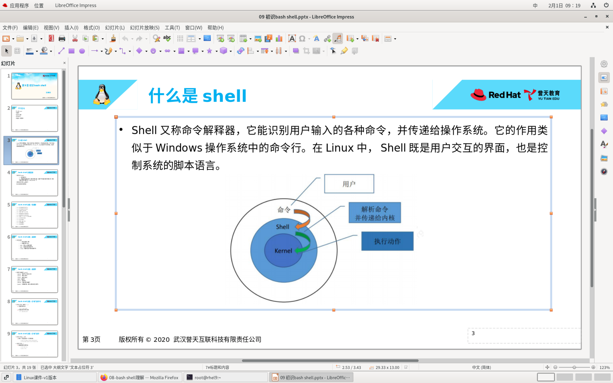
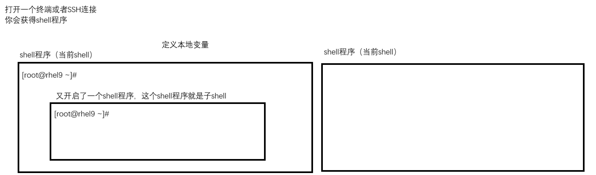
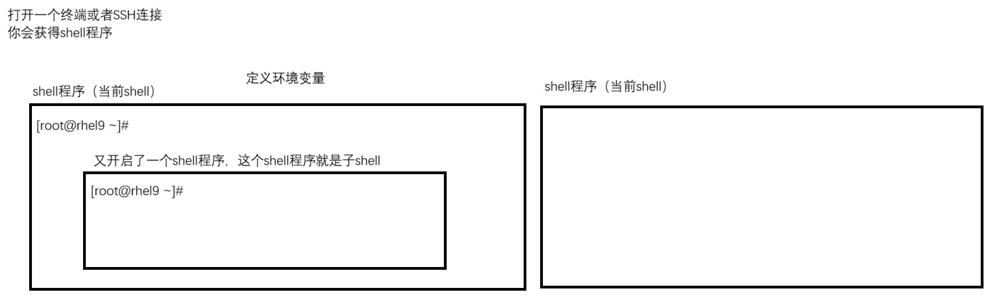
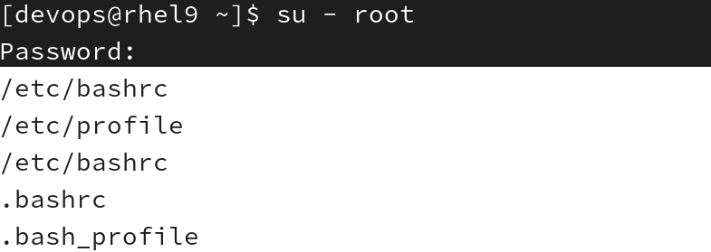

# shell家族
shell: 是一个命令解释器, 也是一门编程语言
- 用户执行的命令, 系统的kernel(内核)是无法理解的, shell的作用就是将用户执行的命令翻译成内核看的懂的语言, 来执行操作
- 系统分为两层
	- 用户态: 应用程序就是用户态的
	- 内核态: 
		

- 编写的shell脚本就是利用shell这门编程语言写的, 专门实现自动化操作→解释性语言
	- 低级语言: 汇编语言
	- 高级语言: 编译型语言/编译型语言
		- 编译: 开发的源码文件之后, 需要进行编译为二进制文件, 才能使用
			- 看不到源码
			- 只需要编译一次, 即可执行, 执行效率要高
		- 解释: 开发的源码文件之后, 直接执行
			- 看的见源码
			- 通过解释器来执行, 一边解释一边执行

- 查看系统的shell是什么
	- ```bash
		[root@mubai632 ~]# echo $SHELL
		/bin/bash
	  ```
- 查看系统支持的shell是什么
	- ```bash
		[root@mubai632 ~]# cat /etc/shells
		/bin/sh
		/bin/bash
		/usr/bin/sh
		/usr/bin/bash
		#虽然看起来是支持4种shell, 其实/bin/sh和/usr/bin/sh就是安装在不同目录下的同一个shell, 另一个同理
		#现在的操作系统上, 仅仅只有一个shell 那就是bash shell, 因为你看到的sh其实是bash shell的快捷方式了
		[root@mubai632 ~]# ll /usr/bin/sh
		lrwxrwxrwx. 1 root root 4 11月 24  2022 /usr/bin/sh -> bash
		[root@mubai632 ~]# ll /usr/bin/bash
		-rwxr-xr-x. 1 root root 1388904 11月 24  2022 /usr/bin/bash
	  ```

- 补充history命令用法
	- ```bash
		#清空历史条目
		[root@mubai632 ~]# history -c #清空内存中的历史条目
		#一段时间历史命令会自动保存在用户家目录下的.bash_history文件中, 正常关机也会写入这个文件
		#想彻底清空历史条目的话就要先清空内存中的历史条目, 再清空文件中的内容
		[root@mubai632 ~]# echo > .bash_history
	  ```

- **shell 中的快捷键**
	- ```bash
		ctrl A : 把光标移动到命令行开头
		ctrl E : 把光标移动到命令行结尾
		ctrl C : 强制终止当前的命令
		ctrl L : 清屏，相当于 clear 命令
		ctrl U : 删除或剪切光标之前的命令
		ctrl K : 删除或剪切光标之后的内容
		ctrl Y : 粘贴 ctrl U 或 ctrl K 剪切的内容
		ctrl R : 在历史命令中搜索
		ctrl D : 退出当前终端
		ctrl Z : 暂停，并放入后台
		ctrl S : 暂停屏幕输出
		ctrl Q : 恢复屏幕输出
	  ```

通配符和正则表达式有相同的符号, 但是他们的作用不一样
	正则表达式是用来匹配**文本内容**的; 通配符是用来**匹配文件名**的
- **shell 中的通配符: 通过不同的符号来实现对文件名的过滤**
	
	- **\*** : 表示匹配所有
		- ```bash
			#列出etc目录下以 .conf 结尾的文件
			[root@mubai632 ~]# ls /etc/*.conf
			/etc/appstream.conf   /etc/kdump.conf 
			......
			
			#删除 opt 目录下的所有文件
			[root@mubai632 opt]# rm -rf /opt/*
		  ```
	
	- **?** : 表示匹配任意单个字符
		- ```bash
			[root@mubai632 opt]# ls ?????
			group  login
		  ```
	
	- **`[abc]`** : 表示匹配列表中的任意单个字符
		- ```bash
			[root@mubai632 opt]# ls [a-z][a-z][a-z][a-z][a-z]
				group  login
		  ```

	- **`[^abc]`** : 表示不匹配列表中的任意单个字符
		- ```bash
			[root@mubai632 opt]# ls [^0-9][^0-9][^0-9][^0-9][^0-9]
			group  login
		  ```
	- 其他通配符
		- ```bash
			#以下通配符需要用一个 [] 给括起来, 就是[[:alpha:]]
			[:alpha:]: 匹配字母(不区分大小写)
			[:lower:]: 匹配小写字母
			[:upper:]: 匹配大写字母
			[:digit:]: 匹配数字
			[:space:]: 匹配空格
			[:alnum:]: 匹配任意字母或数字
			[:punct:]: 除空格和字母、数字以外的任何可打印字符
			
			#案例
			[root@mubai632 opt]# ll file[[:digit:]]
			-rw-r--r-- 1 root root 0 Mar  6 19:48 file1
			-rw-r--r-- 1 root root 0 Mar  6 19:48 file2
			-rw-r--r-- 1 root root 0 Mar  6 19:48 file3
		  ```

- 命令扩展符号

	- **~** : 波浪符号, 指向用户的家目录
		- ```bash
			ls ~ :列出自己的家目录下的文件
			ls ~用户名 : 列出指定用户的家目录下的文件 
		  ```

	- **$(命令)和\`命令\`** : 引用命令的执行结果
		- ```bash
			[root@mubai632 opt]# which useradd
			/usr/sbin/useradd
			[root@mubai632 opt]# ll /usr/sbin/useradd
			-rwxr-xr-x. 1 root root 141144 Jul 12  2023 /usr/sbin/useradd
			[root@mubai632 opt]# ll `which useradd`
			-rwxr-xr-x. 1 root root 141144 Jul 12  2023 /usr/sbin/useradd
			[root@mubai632 opt]# ll $(which useradd)
			-rwxr-xr-x. 1 root root 141144 Jul 12  2023 /usr/sbin/useradd
		  ```

	- **{}** : 批量重复匹配括号的内容, 一般用来快速创建文件

		- ```bash
			#连续性范围使用..
			[root@mubai632 test]# touch file{1..20}
			[root@mubai632 test]# ls
			file1   file12  file15  file18  file20  file5  file8
			file10  file13  file16  file19  file3   file6  file9
			file11  file14  file17  file2   file4   file7
			
			#不连续使用,
			[root@mubai632 test]# touch file{ls,fa,456}
			[root@mubai632 test]# ls
			file456  filefa  filels
			
			#特殊用法
			[root@mubai632 test]# cp file456{,.bak}
			[root@mubai632 test]# ls
			file456  file456.bak
			#解释: 括号会拆开成为file456 file456.bak, 前面还存在一个cp命令, 所以会成为这样 cp file456 file456.bak
		  ```

# 变量
变量: 是一个随时变化的量
组成: **变量名=变量值**
变化的是值, 不变的是名字
**变量占据的是内存中的空间**, 所以所有的变量都是临时生效的
**任何系统上的东西想要永久生效和永久保存, 最终一定是写入到磁盘中的文件里面的**
- 变量的定义
	- 变量名=变量值
	- 变量名组成: **字母, 数字, 下划线, 不能够使用数字开头**

- 变量的分类
	- 本地变量
		- 作用域: **当前shell中使用**
			
		- 定义本地变量(临时生效): **变量名=变量值**
		- 查看本地变量命令: **set**
			- ```bash
				[root@mubai632 test]# set | grep '^A1'
				A1=100
			  ```
		- 取消本地变量命令: **unset 变量名**
		- 引用变量: **$变量名 / ${变量名}**
			- **$变量名** : 正常情况下使用
			- **${变量名}** : 如果后面要加内容, 使用这种方式echo ${A1}00
	- 环境变量
		- **系统变量(特殊的环境变量)**
		- 作用域: **当前shell和子shell中使用**
			
		- 定义环境变量的两种方式: 
			- 定义新的环境变量(临时生效): **export 变量名=变量值**
			- 将本地变量转为环境变量(临时生效): **export 本地变量名**
			- 查看环境变量: **env / set(本地和环境都可以查看)**
				- ```bash
					[root@mubai632 test]# env | grep -w '^A'
					A=500
					[root@mubai632 test]# set | grep -w '^A'
					A=500
				  ```
			- 取消环境变量命令: **unset 变量名**
			- 引用变量: **$变量名 / ${变量名}**
				- **$变量名** : 正常情况下使用
				- **${变量名}** : 如果后面要加内容, 使用这种方式echo ${A1}00
	- 特殊的环境变量: **系统变量**
		所谓的系统变量就是系统已经定义好的变量, 这些变量对于系统来说具备特殊意义, 一般不会去随便修改
		可以配置的变量: 
		- **PS1: 提示符变量**
		- **==PATH: 用户可执行文件所在目录==**
			- 所有的可执行文件(命令), 都是放在PATH变量下, 不放在PATH变量下, 就需要你写出绝对路径才能执行
				- ```bash
					[root@mubai632 test]# echo $PATH
					/root/.local/bin:/root/bin:/usr/local/sbin:/usr/local/bin:/usr/sbin:/usr/bin
					#/root/.local/bin:/root/bin 是根据用户来决定的
					#/usr/local/sbin:/usr/local/bin:/usr/sbin:/usr/bin 这些都是可执行文件(命令)的存放目录
					#在原变量的基础上添加可以写成: export $PATH=$PATH加上变量值
				  ```
		- HISTSIZE: 历史记录条目数
		用户查看的变量: 
		- HOME: 用户家目录
		- UID: 用户的i

- 永久定义变量
	变量的定义是临时生效的, 需要将其写入到文件中才可以永久生效
	- 需要写入以下文件: 
		- **/etc/profile文件** : 系统全局环境变量配置文件
		- **/etc/bashrc文件** : bash shell 全局配置文件
		之所以写入到这两个文件, 是因为登陆用户的时候, 是会读取这两个文件的内容的. 如果你把变量定义在这里, 每次你登陆用户的时候, 会读取变量(所有用户登陆都会读取这两个文件, 称之为**全局变量文件**)
	- 还有两个文件, 是属于用户读取的文件, 登陆对应用户的时候, 用户也会读取自己家目录下的这俩变量文件(**用户变量文件**)
		- **~/.bash_profile文件** : 当前用户登录时执行的配置文件
		- **~/.bashrc文件** : 当前用户 bash shell 配置文件
		写入这两个文件, 只有当登录这个用户的时候变量才会生效
		**不同的登录方式, 变量读取的优先级是不同的, 读取的变量文件也是不同的, 后读取的会覆盖掉先读取的**

- 登录系统用户的方式: 
	- **登录shell** : **ssh** , **su -**
		- 读取的环境变量文件：**/etc/bashrc**  **/etc/profile**  **~/.bashrc**  **~/.bash_profile**
	- **非登录shell** : **su** , **图形化界面打开标签页** 
		- 读取的环境变量文件：**/etc/bashrc**  **~/.bashrc**
	如果写永久定义的变量, 最好写到 **/etc/bashrc** 文件中, 因为无论哪种方式登录都会读取这个文件
	- 环境变量读取的优先级: 
		
		读取顺序: /etc/bashrc → /etc/profile → .bashrc → .bash_profile
		为什么会出现两次 /etc/bashrc , 因为 /etc/profile 文件中会调用一次 /etc/bashrc , 所以才会出现这种情况

- **alias 别名**: 别名就是给linux的命令起的一个名字
	- ```bash
		alias rm='rm -i'
		alias cp='cp -i'
		alias mv='mv -i'
	  ```
	- 作用: 简化命令的执行
	- **定义别名**, 别名是临时生效的, 如果要求**永久定义的话需要写入到环境变量文件中**
		- **alias 别名=执行的命令**
	- **删除别名** : **unalias 别名**
	- **查看别名** : **alias**
		- ```bash
			alias 别名=执行命令
			unalias 别名 : 删除别名
			alias 别名 : 查看别名
			alias : 查看所有别名
		  ```
	- 案例
		- ```bash
			#要求定义一个别名cpetc, 执行此命令将会把/etc目录备份到/opt目录下, 备份后的文件名字为/opt/etc-backup-年-月-日
			[root@mubai632 ~]# alias cpetc="cp -r /etc/ /opt/etc-backup-$(date +%F)"
			[root@mubai632 ~]# alias cpetc
			alias cpetc='cp -r /etc/ /opt/etc-backup-2026-03-06'
			#上面的日期被写死了, 原因是因为"", 下面是使用''
			[root@mubai632 ~]# alias cpetc='cp -r /etc/ /opt/etc-backup-$(date +%F)'
			[root@mubai632 ~]# alias cptec
			alias cpetc='cp -r /etc/ /opt/etc-backup-$(date +%F)'
		  ```

	- 上面的例子中出现了日期被写死的情况, 这种情况和转义字符""有关
		- 转义字符: 
			- **\\** : 表示去掉后面单个字符的特殊意义
			- **""** : 表示去掉引号内部所有字符的特殊意义, 有4个字符无法去掉特殊意义, 称之为**弱引用**
				- **$**
				- **\\**
				- **!**
				- **\`\`**
			- **''** : 表示去掉引号内部所有字符的特殊意义, 称之为**强引用**